# Class 01 — How Backend Systems Work: Study Guide

# Section 01 — Shapes of Software

## 1.1 Four shapes of software

**What it is.** Four things people call "an app" look nothing alike on the outside, but underneath they are nearly the same:

- **Web** — runs in a browser, nothing to install, updates the moment you deploy (Gmail, Figma)
- **Mobile** — installed on a phone through a store, so updates are slow and optional (WhatsApp, Uber)
- **Desktop** — installed on a computer, gets real access to files and hardware (VS Code, Photoshop)
- **Device / IoT** — a thing with a chip in it, tiny screen or none at all, often on a flaky network (smart bulb, car)

Different shapes, different rules — how fast you can push an update, how much you can trust the local hardware, how reliable the network connection is.

**Try it.** See the diagram of the four shapes and what makes each one different:

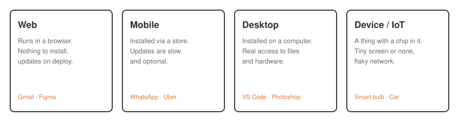

**Exercises.**
1. Pick one app you use daily from each of the four shapes. For each, name one consequence of its shape (e.g. "mobile — I can't force everyone onto the new version today").
2. A smart thermostat has a companion phone app. Which shape is the thermostat itself? Which shape is the app? Are they the same client, or two different clients talking to the same backend?
3. Why can a web app update "the moment you deploy" but a mobile app can't?

**Go deeper.**
- [web.dev — What is a Progressive Web App?](https://web.dev/explore/progressive-web-apps) — where the web/mobile line blurs
- [Apple App Review Guidelines](https://developer.apple.com/app-store/review/guidelines/) — why mobile updates are slow and gated

---

## 1.2 What every client actually does

**What it is.** Underneath their different shapes, all four kinds of software do the same three things:

1. Do things on the device (run code locally)
2. Save things on the device (local storage)
3. Do and save things somewhere that is **not** the device

Steps 1 and 2 need nothing but the device itself. Step 3 is the only one that needs a second machine — and that second machine is the backend, the subject of the rest of this course.

**Try it.** Trace it on a real app:

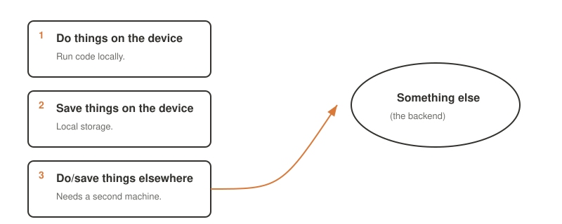

Open any app on your phone and watch what happens the instant you lose signal (airplane mode). Whatever still works is step 1 and 2. Whatever breaks or shows a spinner is step 3.

**Exercises.**
1. Put your phone in airplane mode and try three different apps. Sort each one's core feature into bucket 1, 2, or 3.
2. A calculator app never needs step 3. Name two other apps that never need it either, and explain why.
3. Why is step 3 "the only one that needs a second machine"? What would have to be true for step 1 or 2 to also need one?

**Go deeper.**
- [MDN — Offline and background operation](https://developer.mozilla.org/en-US/docs/Web/Progressive_web_apps/Guides/Offline_and_background_operation) — what "local only" really means for a web client

---

# Section 02 — Client and Server

## 2.1 Client and server are roles, not machines

**What it is.** Client and server are not products you install — they are **roles**. Whoever starts the conversation and asks for something is the client. Whoever waits, listens, and hands back an answer is the server. The same device can be a server in one conversation and a client in the very next one.

Example: a phone (client) asks your server for data. Your server, while answering, turns around and asks Stripe (its own server) to process a payment — making your server a client of Stripe's, at the same time it is still a server to the phone.

**Try it.** Follow one machine playing both roles:

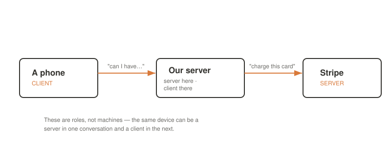

**Exercises.**
1. Your server calls a weather API to enrich a response before sending it back to the phone. List every client/server relationship in that sentence.
2. Is a printer a client or a server when your laptop sends it a document? What is it when it later reports its ink level back to a monitoring dashboard?
3. "Client is not a place — it's whoever is asking, right now." Rewrite that sentence in your own words for someone who has never coded.

**Go deeper.**
- [MDN — Client-Server Overview](https://developer.mozilla.org/en-US/docs/Learn_web_development/Extensions/Server-side/First_steps/Client-Server_overview) — the request/response model from the ground up

---

## 2.2 Frontend and backend: a different split

**What it is.** Client/server describes a single conversation. Frontend/backend describes something else entirely: which parts of the product a user is ever shown.

- **Frontend** — everything the user can open, look at, and tap (the part they see)
- **Backend** — a machine somewhere else that does the work and keeps the data (the part they never see)

The two splits don't line up. The frontend is *always* a client, because it only ever asks. The backend is the server whenever the frontend asks it for something — but that same backend becomes a client the moment it asks a third party (like Stripe) for something. Client/server changes conversation to conversation; a backend stays "the backend" even while it's someone else's client.

**Try it.**

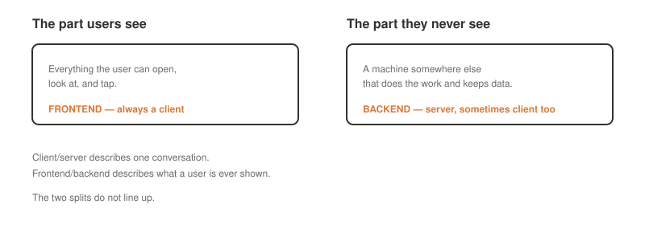

**Exercises.**
1. Give an example of code that is frontend but *not* a client of anything (hint: a purely offline calculator UI).
2. Can the backend ever be shown directly to a user? Why or why not?
3. A teammate says "the backend is down." What two different things could they mean given everything above?

**Go deeper.**
- [freeCodeCamp — Frontend vs Backend](https://www.freecodecamp.org/news/back-end-vs-front-end-development/) — a plain-language breakdown

---

## 2.3 Why do we need a backend at all

**What it is.** A backend earns its cost for four concrete reasons:

- **One shared truth** — everybody sees the same answer because the data lives in one place instead of on every device
- **A place for secrets** — anything a user must never hold (API keys, prices, business rules) sits safely on a machine they can't look inside
- **Work a device can't do** — heavy computation runs on a rented machine, because a phone would drain its battery long before finishing
- **Change without shipping** — a rule can change on the server and reach everyone immediately, without waiting for anyone to update their app

**Try it.**

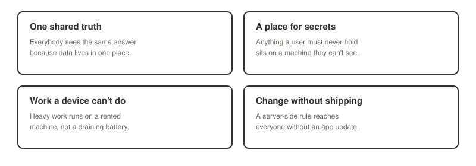

**Exercises.**
1. For a to-do list app that only you ever use, on only one device, which of the four reasons (if any) still applies?
2. Name a secret that must never be sent to a client, and explain what happens if it is.
3. Your team wants to change a discount percentage used across the app. Walk through what changes with a backend, versus what would have to happen without one.

**Go deeper.**
- [OWASP — Sensitive Data Exposure](https://owasp.org/www-project-top-ten/) — what happens when secrets leak to the client

---

## 2.4 One more rule for the whole course

**What it is.** Anything sent to a client can be read by whoever holds that device — decompiled apps, browser devtools, and intercepted traffic all expose it eventually. So anything that must stay secret belongs on the backend, because users cannot directly look inside it.

**Try it.** Open any website's browser devtools (F12 → Network tab), reload the page, and inspect a response. Everything you see there was sent to the client — meaning it is not, and never was, a secret.

**Exercises.**
1. Find a website where you can view an API response in devtools. Is there anything in it that looks like it shouldn't be there?
2. A mobile app hardcodes an API key inside its compiled code. Is that key a secret? Why or why not?
3. Where *should* a payment provider's secret key live: in the mobile app, in the web frontend, or on the backend? Justify it using this rule.

**Go deeper.**
- [OWASP Mobile Top 10 — Insecure Data Storage](https://owasp.org/www-project-mobile-top-10/) — what "the client can't be trusted" means in practice

---

# Section 03 — Do We Even Need a Backend?

## 3.1 Three buckets every app falls into

**What it is.** Now that "backend" has a name, sometimes the honest answer is that you don't need one:

- **Works alone** — everything it needs is already on the device (a calculator, a camera filter, a single-player game with no scoreboard). **Backend needed? No.**
- **Needs the network** — the screen is only a window; the thing you came for lives on a machine the client doesn't own (chat, a feed, banking, ride-hailing). **Backend needed? Yes.**
- **Works alone, syncs later** — writes to the device first so nothing ever blocks, then sends changes up when the network comes back (notes across devices, a document edited on a plane, a fitness tracker with no signal). **Backend needed? Yes — and the hardest kind, because you now have two copies of the truth that must agree later.**

**Try it.**

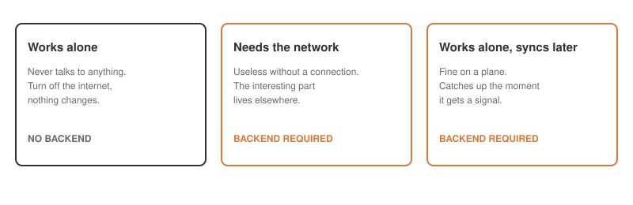

**Exercises.**
1. Sort these into the three buckets: a flashlight app, Instagram, a note-taking app that works offline and syncs when reconnected, a unit converter, online banking.
2. Why is "works alone, syncs later" called the hardest kind of backend to build? What has to happen when two copies disagree?
3. Could an app move from one bucket to another over its lifetime? Give a real example.

**Go deeper.**
- [Martin Kleppmann — Local-first software](https://www.inkandswitch.com/local-first/) — the deep version of "works alone, syncs later"

---

## 3.2 How to decide

**What it is.** Five yes/no questions settle it:

1. Do two different people need to see the same thing?
2. Must the data survive a lost or wiped device?
3. Is there a secret the user must never hold — a key, a price, a rule?
4. Does something need to happen while nobody has the app open?
5. Do we need to change behaviour without shipping an update?

**One yes means you need a backend. Five nos means you don't.**

**Try it.**

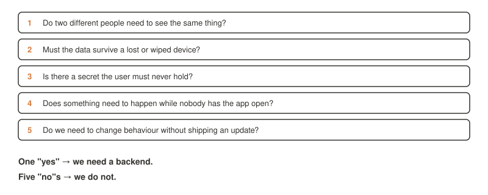

**Exercises.**
1. Run a habit-tracking app that only stores data on-device through all five questions. What's the verdict?
2. Now imagine that same app adds "share your streak with a friend." Which question flips to yes, and why?
3. Write your own app idea and run it through the checklist out loud to someone who doesn't code — the PDF's own advice for "the real test."

**Go deeper.**
- [12factor.net](https://12factor.net/) — once you know you need a backend, this is a widely used checklist for building one well

---

# Section 04 — Breaking the Backend Apart

## 4.1 The component shelf

**What it is.** "Backend" is not one program — it's a shelf of components, most of which you don't need on day one:

| Component | Job |
|---|---|
| Web server | Answers the door, hands the request inward |
| Application | Our rules — the part we write |
| Database | The memory; survives restarts and crashes |
| File storage | Big things — photos, video, PDFs |
| Cache | A fast copy of an answer already worked out |
| Queue + workers | Jobs too slow to make someone wait for |
| Scheduler | Jobs nobody asked for, run at 3am anyway |
| External services | Email, payments, maps — other people's backends |

This shelf is never complete — a real backend can have many more components than these, and each one shows up only when a problem asks for it.

**Try it.**

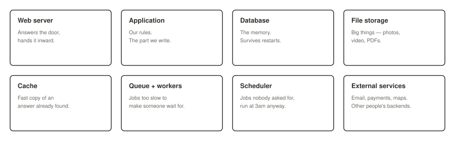

**Exercises.**
1. Match each component above to a real feature you've used recently (e.g. "cache — Google showing me search results instantly").
2. Which two components would a brand-new to-do list app need on day one? Which ones should it explicitly *not* add yet?
3. What does "each one shows up only when a problem asks for it" protect you from?

**Go deeper.**
- [The Twelve-Factor App — Backing Services](https://12factor.net/backing-services) — treating each shelf component as an attached resource

---

## 4.2 The smallest backend that is still a backend

**What it is.** Strip everything down and three components are enough to call it a real backend:

1. **Web server** — takes connections from the internet, passes them on, hands back what comes out
2. **Application** — our code, deciding who is asking and whether they're allowed, and what the answer is
3. **Database** — the only one that remembers anything, because everything else can be thrown away and rebuilt

**Try it.**

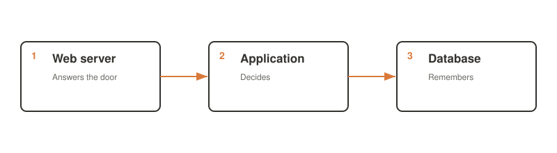

**Exercises.**
1. If your application server crashes and you redeploy it from source, what do you lose? What if the database crashes instead?
2. Why is the database "the only one that remembers anything" when the web server and application also hold state while running?
3. Draw (on paper) the smallest backend for an app you use daily. Where does each of the three pieces likely live?

**Go deeper.**
- [AWS — What is a three-tier architecture?](https://aws.amazon.com/what-is/three-tier-architecture/) — the industry name for this exact shape

---

## 4.3 Each component solves one named problem

**What it is.** A useful discipline: add a component only when you can name the specific problem it solves.

| The problem | The component | What it costs |
|---|---|---|
| The same slow answer, again and again | Cache | Two copies, and one can go stale |
| Users waiting 30 seconds | Queue + workers | One more moving piece to watch |
| People uploading video | File storage | Files and records can drift apart |
| Something must run at 3am | Scheduler | It fails quietly unless somebody watches |

If you cannot name the problem, you do not need the component yet.

**Try it.** Pick a real app and try to justify every extra component (beyond web server / app / database) it must be using, by naming the problem each one solves.

**Exercises.**
1. A junior developer wants to add a cache "just in case it gets slow later." Using this rule, what should you ask them first?
2. Name the problem that a queue solves that a database alone cannot.
3. What's the risk of adding a component *before* you can name its problem? What's the risk of waiting too long to add it?

**Go deeper.**
- [Martin Fowler — YAGNI](https://martinfowler.com/bliki/Yagni.html) — "You Aren't Gonna Need It," the general version of this rule

---

# Section 05 — The Life of One Request

Somebody taps a button, and eight things happen before the screen changes. This section walks through them in order — you can also step through the whole journey interactively: open [`request-lifecycle-walkthrough.html`](request-lifecycle-walkthrough.html) in a browser to step through all eight stages one at a time.

## 5.1 A name becomes a number

**What it is.** People remember `chatapp.com`, but machines only route to numbers, so a **DNS server** translates the name every single time a request goes out. DNS is a whole system of its own, with servers and caches all over the world — but all you need today is: a name goes in, an address comes out.

**Try it.**

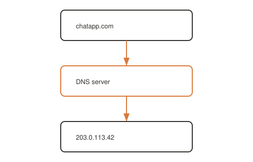

```bash
# Ask DNS directly for a name's address
dig +short example.com
# or
nslookup example.com
```

**Exercises.**
1. Run the `dig` command above against a site you use daily. What address comes back?
2. Run it again a minute later. Does the answer change? What does that tell you about caching?
3. What would happen to every app on the internet if DNS stopped working, even though every server itself was perfectly healthy?

**Go deeper.**
- [Cloudflare — What is DNS?](https://www.cloudflare.com/learning/dns/what-is-dns/) — the full system behind "name goes in, address comes out"

---

## 5.2 Opening a line

**What it is.** Before anything useful is sent, both sides say hello and agree they're ready — a TCP handshake. Over plain HTTP the line is then open and readable by anyone watching. HTTPS adds one more round where both sides agree how to scramble everything — that agreement is the padlock icon in your browser.

**Try it.**

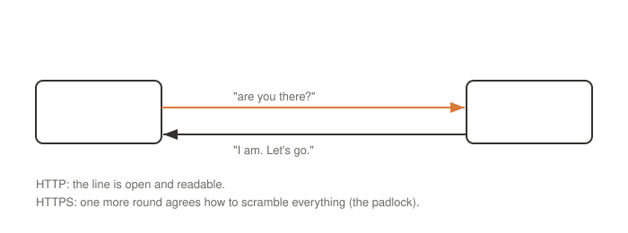

```bash
# Watch the handshake happen (verbose mode shows TLS negotiation)
curl -v https://example.com
```

**Exercises.**
1. Run the `curl -v` command above. Find the lines that show the TLS handshake happening before any HTTP data is exchanged.
2. Why does HTTPS need an *extra* round trip compared to plain HTTP? What is being agreed on in that extra step?
3. What can someone watching an HTTP (not HTTPS) connection see that they cannot see over HTTPS?

**Go deeper.**
- [Cloudflare — What happens in a TLS handshake?](https://www.cloudflare.com/learning/ssl/what-happens-in-a-tls-handshake/)

---

## 5.3 The request is just text

**What it is.** Every request, whatever kind of client sent it, carries the same four parts as plain text:

```
POST /v1/messages HTTP/1.1
Host: api.chatapp.com
Authorization: Bearer eyJhbGciOi…
Content-Type: application/json

{ "to": "ayesha", "text": "on my way" }
```

- **The verb** — what should happen to it (`POST`)
- **The address** — which thing it happens to (`/v1/messages`)
- **The proof** — who is allowed to ask (the `Authorization` header)
- **The payload** — the actual stuff being sent (the JSON body)

**Try it.**

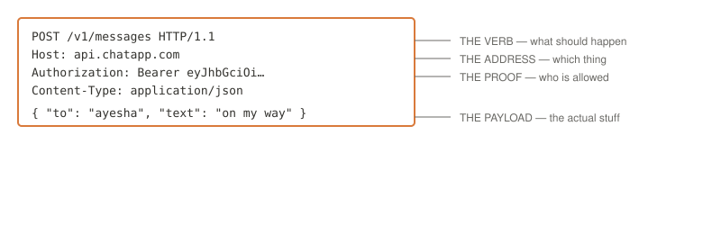

```bash
# See real request/response headers for a live site
curl -v https://example.com 2>&1 | head -30
```

**Exercises.**
1. In the example request above, identify the verb, the address, the proof, and the payload.
2. Rewrite that request as a `GET` instead of a `POST`. What would you expect to change about whether it has a payload?
3. Why does the request need "proof" (the `Authorization` header) as a separate part from the payload?

**Go deeper.**
- [MDN — HTTP Messages](https://developer.mozilla.org/en-US/docs/Web/HTTP/Guides/Messages) — the full anatomy of requests and responses

---

## 5.4 The web server opens the door

**What it is.** The web server holds no business rules and decides nothing about the answer — its only job is to pass the request to the application. It can hand back a logo or a stylesheet straight from disk on its own, but anything whose answer depends on *who is asking* gets forwarded inward.

**Try it.**

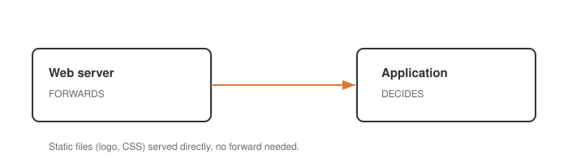

**Exercises.**
1. Why can a web server safely serve a logo file without forwarding it, but not a "your account balance" page?
2. What would go wrong if the web server tried to make business decisions itself?
3. In the interactive walkthrough (`request-lifecycle-walkthrough.html`), which step is this?

**Go deeper.**
- [Nginx — Beginner's Guide](https://nginx.org/en/docs/beginners_guide.html)

---

## 5.5 What the application does

**What it is.** Once the request reaches the application, five things happen in order:

1. **Who is asking?** — authentication
2. **Are they allowed?** — authorization
3. **Does the request make sense?** — validation
4. Do the work
5. Send back an answer

Steps 1–3 are only checks, and they usually take more code to write than the real work in step 4.

**Try it.**

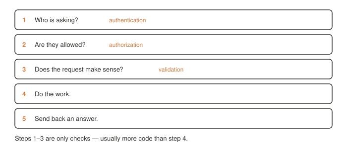

**Exercises.**
1. Give a concrete example of a request that passes authentication but fails authorization.
2. Give a concrete example of a request that passes both authentication and authorization but fails validation.
3. Why might steps 1–3 take more code than step 4, the "real work"?

**Go deeper.**
- [OWASP — Authentication vs Authorization](https://owasp.org/www-community/Broken_Authentication) — where these checks most often go wrong

---

## 5.6 The database is the memory we need

**What it is.** Our code asks a question in writing and waits for rows to come back:

```sql
SELECT text, sent_at
FROM messages
WHERE conversation_id = 4021;
```

Our code can always be redeployed from source, but the data only lives here — which is exactly why backups matter.

**Try it.**

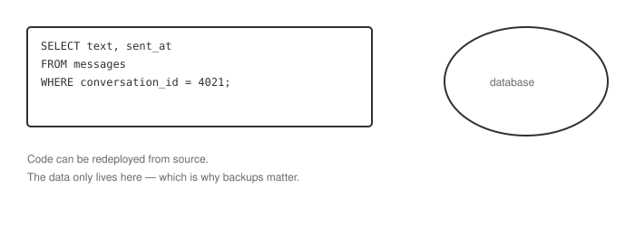

**Exercises.**
1. Why is "our code can always be redeployed from source" true of the application but not of the database?
2. What would happen to a chat app if its database was lost with no backup, versus if its application server was lost with no backup?
3. Write (on paper) a query you'd expect a to-do list app to run when its home screen loads.

**Go deeper.**
- [PostgreSQL Tutorial — Backup and Restore](https://www.postgresql.org/docs/current/backup.html)

---

## 5.7 The response comes back

**What it is.** The backend sends back a status code together with the data, so the client knows what happened and what to put on the screen:

- **2xx — it worked.** Here is what was asked for, or confirmation it's done.
- **4xx — the client asked wrong.** Not logged in, not allowed, or the thing doesn't exist.
- **5xx — the server failed.** The request was fine, but something on the server fell over.

**Try it.**

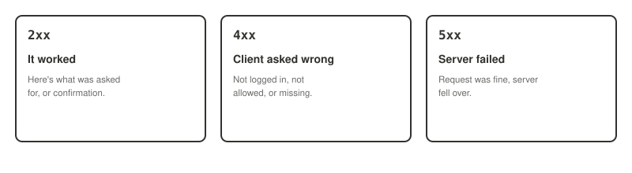

```bash
# See the status code for a real request
curl -o /dev/null -s -w "%{http_code}\n" https://example.com
curl -o /dev/null -s -w "%{http_code}\n" https://example.com/this-page-does-not-exist
```

**Exercises.**
1. Run both `curl` commands above. What status codes come back, and why do they differ?
2. Sort these into 2xx/4xx/5xx: a login with the wrong password, a successful file upload, a database connection timing out, a request for a deleted post.
3. Why does the status code matter separately from the data in the body?

**Go deeper.**
- [MDN — HTTP response status codes](https://developer.mozilla.org/en-US/docs/Web/HTTP/Reference/Status)

---

## 5.8 Where the time actually goes

**What it is.** A typical request's half-second breaks down roughly as: name lookup (~20ms), opening the line (~40ms), server thinking (~120ms — the part we write), sending it back (~30ms). Only the "server thinking" bar is ours to shrink, and most of *that* is spent waiting on the database.

**Try it.**

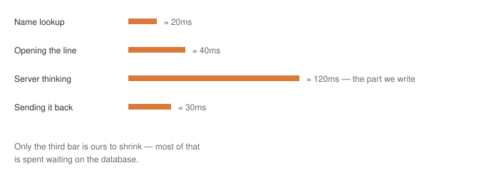

**Exercises.**
1. Given the breakdown above, if you wanted to make an app feel faster, which bar should you focus on first? Why?
2. What are two ways to reduce time spent "waiting on the database" without changing the database itself? (Hint: revisit Section 4's component shelf.)
3. Walk through all eight steps of a request end to end, out loud, using the interactive walkthrough (`request-lifecycle-walkthrough.html`) as a guide.

**Go deeper.**
- [web.dev — Measure performance with the RAIL model](https://web.dev/articles/rail)

---

# Section 06 — Servers, Demystified

## 6.1 "Server" means two different things

**What it is.** When somebody says "the server," they could mean:

- **The machine** — a box in a rack somewhere, no screen, no keyboard, switched on for years at a time. We rent it by the month.
- **The program** — software running on that machine whose whole job is to wait for connections and answer them. We install it, or a host does.

When somebody says "the server is down," ask which of the two they mean — the answer changes who has to fix it.

**Try it.**

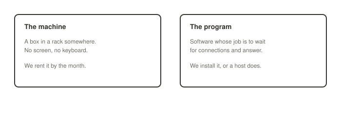

**Exercises.**
1. Give an example of "the server is down" meaning the machine, and one meaning the program.
2. Can the machine be up while the program is down? Can it happen the other way around?
3. Who would you contact to fix each of the two failures above?

**Go deeper.**
- [DigitalOcean — What is a Server?](https://www.digitalocean.com/community/tutorials/webinar-series-an-introduction-to-servers)

---

## 6.2 A server is named after its job

**What it is.** One machine can run several server programs at once, so a server's name describes the job it's doing, not the box it runs on:

- **Web server** — takes requests from the internet, hands back an answer
- **Application server** — runs our code, works out what the answer should be
- **Database server** — keeps the data, returns the rows we ask for
- **File server** — holds big things like photos, video, documents
- **Mail server** — sends and receives email on our behalf
- **Cache server** — keeps a fast copy of answers already worked out

**Try it.**

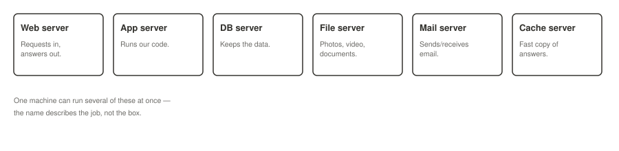

**Exercises.**
1. Name one program that could plausibly run as both a web server and a cache server on the same machine.
2. Why would separating a database server onto its own machine, away from the application server, ever make sense?
3. Pick a company's product you use and guess which of these six server jobs it likely runs, even though you can't see any of them.

**Go deeper.**
- [Nginx — About Us / What is Nginx used for](https://nginx.org/en/)

---

## 6.3 What a web server actually does

**What it is.** A web server is a doorman, not a decision maker — it never works out what the answer should be. Its jobs:

- **Accepts connections** — listens on a port, takes thousands at once without falling over
- **Serves files** — images, stylesheets, fonts, straight off disk without running any code
- **Handles HTTPS** — scrambles and unscrambles traffic so our code never has to deal with it
- **Forwards the rest** — anything that needs our code to run gets handed to the application

**Try it.**

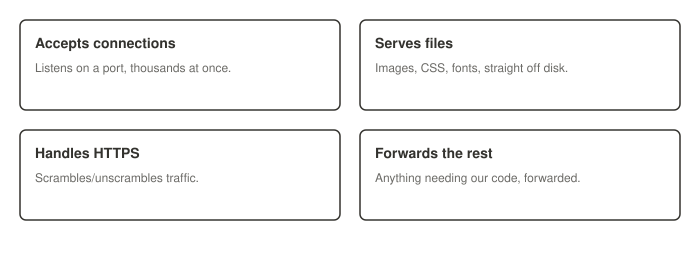

```nginx
server {
  listen 443 ssl;
  location /static/ {
    root /var/www;          # served directly, no app involved
  }
  location / {
    proxy_pass http://localhost:3000;   # forwarded to the application
  }
}
```

**Exercises.**
1. In the config above, which requests never reach the application at all?
2. Why is TLS termination ("handles HTTPS") something the web server does, rather than the application?
3. What does "doorman, not decision maker" rule out a web server from ever doing?

**Go deeper.**
- [Nginx Docs — `location` directive](https://nginx.org/en/docs/http/ngx_http_core_module.html#location)

---

## 6.4 When our code has to run

**What it is.** As soon as the answer depends on who is asking, static files aren't enough — an application server runs our code, and a **reverse proxy** typically stands in front of it. The reverse proxy takes the HTTPS work off our code, and when there are several copies of the app running, it also **load-balances**: sharing requests across them so one copy can die and the rest carry on.

**Try it.**

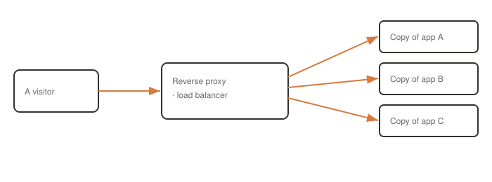

**Exercises.**
1. What two jobs does a reverse proxy do in front of multiple app copies, according to the diagram?
2. If one copy of the application crashes, what should the reverse proxy do, and how would it know to do it?
3. Could a static site (Section 6.3's "just files" case) ever need a load balancer? Why or why not?

**Go deeper.**
- [Nginx — Load Balancing Docs](https://nginx.org/en/docs/http/load_balancing.html)

---

# Section 07 — How Web Servers Talk to Applications

## 7.1 Roles, not programs

**What it is.** "Web server" and "application server" sound like two products, but they are roles a piece of software can take on. One program can play both roles at once, two programs can split the work, or a translator protocol can sit between them.

- **HTTP-facing work** — terminating TLS, serving static files, compression and caching, routing, managing connections
- **Application work** — business logic, application-level routes, talking to the database, building the response

The question to keep asking: **who receives the request, and how does it reach my code?**

**Try it.**

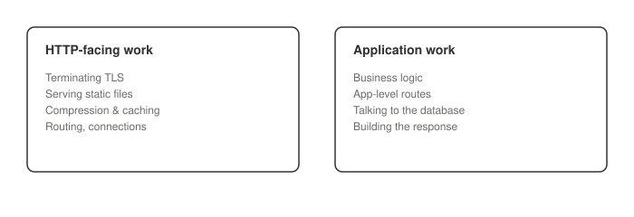

**Exercises.**
1. Apache with `mod_php` runs PHP inside the web server itself. Which of the two roles does that single process play?
2. List three things that belong to "HTTP-facing work" and three that belong to "application work," in your own words.
3. Why is "who receives the request, and how does it reach my code" a more useful question than "where's the application server?"

**Go deeper.**
- [Apache HTTP Server — mod_php vs PHP-FPM](https://httpd.apache.org/docs/2.4/mod/mod_php.html)

---

## 7.2 Nginx + Node.js: the HTTP handoff

**What it is.** The most common pairing: Nginx sits in front, Node.js sits behind. Both speak HTTP, so the handoff is simple — Nginx receives the request and forwards ("proxies") it to Node, which is why Nginx in this position is called a **reverse proxy**.

**Try it.**


```nginx
server {
  listen 443 ssl;
  location / {
    proxy_pass http://localhost:3000;
    proxy_http_version 1.1;
    proxy_set_header Host $host;
  }
}
```

The two extra lines matter: Nginx proxies with HTTP/1.0 by default and does not pass the original `Host` header on its own.

**Exercises.**
1. What would break if you removed `proxy_set_header Host $host;` from the config above?
2. Node behind Nginx is described as "a long-running Node process which understands HTTP all by itself." What does that mean compared to the FastCGI setup in the next topic?
3. Why is Nginx in this role called a *reverse* proxy rather than just a proxy?

**Go deeper.**
- [Nginx Docs — `proxy_pass`](https://nginx.org/en/docs/http/ngx_http_proxy_module.html#proxy_pass)

---

## 7.3 Nginx + PHP-FPM: the FastCGI bridge

**What it is.** PHP works differently, and this is where "web server → application server" falls apart: behind Nginx there's no HTTP server at all. Instead, **PHP-FPM** — a process manager that speaks **FastCGI** — hands the request to an idle worker, the worker runs `index.php`, and the result travels back the same way. The PHP process never listens on a public HTTP port, which is why the config points at a socket instead of a URL.

**Try it.**

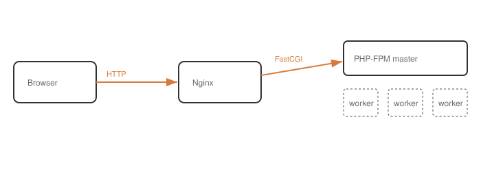

```nginx
# PHP: a socket, not a URL
fastcgi_pass unix:/run/php/php-fpm.sock;

# compare with Node:
proxy_pass http://localhost:3000;
```

PHP-FPM is not "the PHP version of Node." Node is one long-running app that understands HTTP. PHP-FPM keeps a pool of worker processes alive, and each request runs your script from a clean state inside one of those workers.

**Exercises.**
1. Why does the Nginx config for PHP point at a filesystem socket instead of a `localhost:PORT` URL?
2. What does "each request runs your script from a clean state" mean, and how is that different from Node's long-running process?
3. Explain in your own words why PHP-FPM and Node "occupy the same seat in the diagram, but are very different creatures."

**Go deeper.**
- [PHP-FPM Manual](https://www.php.net/manual/en/install.fpm.php)

---

## 7.4 Four shapes of a backend

**What it is.** There's no single true "web server → application server" architecture — there are at least four legitimate shapes:

- **A — Just files.** A static site; Nginx serves the files itself, no application server anywhere.
- **B — Proxy to an HTTP app.** The backend speaks HTTP and Nginx just forwards (Node, Gunicorn, Uvicorn, Laravel Octane).
- **C — Bridge protocol.** The thing behind Nginx doesn't speak HTTP at all — FastCGI, SCGI, or uwsgi carries the request (PHP-FPM).
- **D — No front door.** The app listens on a public port itself, with no Nginx in front (uvicorn+FastAPI, Kestrel+ASP.NET often run this way).

**Try it.** Click through all four shapes and watch the request path change in each one:

`backend-shapes-comparison.html` — open in a browser for the interactive version.

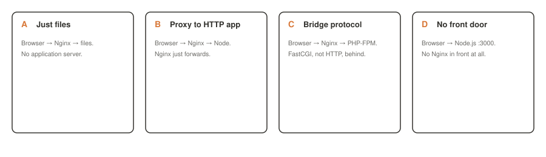

**Exercises.**
1. Which of the four shapes did Section 6.4 ("reverse proxy + load balancer") describe?
2. Which shape has literally no web server role at all?
3. Pick an app or API you've used and guess which of the four shapes it most likely runs as.

**Go deeper.**
- [Uvicorn Docs — Deployment](https://www.uvicorn.org/deployment/) — an example of shape D running directly

---

## 7.5 The naming mess

**What it is.** The same program collects three or four labels because we name software after whichever role it happens to be playing at the moment:

| Software | You'll hear it called | What it actually is |
|---|---|---|
| Nginx | "web server", "reverse proxy", "load balancer" | An HTTP server that can serve files, forward requests, and balance load |
| Node.js | "runtime", "HTTP server", "app server" | A JavaScript runtime — only becomes a server when your code opens a listening socket |
| PHP-FPM | "PHP's app server" | A FastCGI process manager for PHP workers, not an HTTP server at all |

```js
// Node.js is just a runtime...
const http = require('http');
// ...until this line turns it into an HTTP server
http.createServer(handler).listen(3000);
```

**Try it.** Run the two-line Node snippet above (`node server.js` after adding a basic `handler` function) and watch it become a server only at the `.listen()` call.

**Exercises.**
1. Before `.listen()` is called, is the code above a server? What is it instead?
2. "Is Node a web server or an application server?" — explain why this is the wrong question, using this topic's framing.
3. Is PHP itself an application server? What role does PHP-FPM actually play?

**Go deeper.**
- [Node.js Docs — `http.createServer()`](https://nodejs.org/api/http.html#httpcreateserveroptions-requestlistener)

---

## 7.6 The question that matters

**What it is.** Instead of memorizing stacks, ask two things about any setup: **who receives the HTTP request, and how does that process pass it onward?** The three possible answers are: it forwards over HTTP (Nginx → Node/Gunicorn/Octane), it forwards over FastCGI (Nginx → PHP-FPM), or it serves the answer itself (static files).

**Try it.**

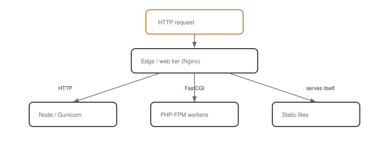

**Exercises.**
1. `Nginx → HTTP → Laravel Octane` — is Octane an HTTP application server? Why?
2. `Nginx → FastCGI → PHP-FPM` — is PHP-FPM an HTTP application server? Why not?
3. Using only this one question, work out and diagram the shape of the last web app you deployed or configured (or, if you haven't yet, one you use daily and can research).

**Go deeper.**
- [Laravel Octane Docs](https://laravel.com/docs/octane) — an app server that really does speak HTTP itself

---

# Wrap-up

## The whole class on one page

1. Four shapes of software (web/mobile/desktop/IoT) all do the same three things — and only "reach something that isn't the device" ever needs a backend.
2. Client and server are roles, not machines; frontend/backend is a different split that doesn't line up with it.
3. A backend earns its cost for four reasons: shared truth, secrets, heavy work, change without shipping.
4. Five yes/no questions decide if you need one at all.
5. The smallest real backend is three components: web server, application, database — add anything else only when you can name the problem.
6. Every request makes the same eight-step trip: DNS → connect/TLS → request text → web server → app logic (authn/authz/validate/work/respond) → database → status code → screen.
7. "Server" means a machine or a program; a server is named after its job, not its box.
8. Web server and application server are roles: sometimes bridged over HTTP (Nginx+Node), sometimes over FastCGI (Nginx+PHP-FPM) — the only question that matters is who receives the request and how they pass it on.

## Self-test — close the notes and answer

- [ ] Name an app that genuinely needs no backend, and say why.
- [ ] What are the three parts of the smallest real backend?
- [ ] Why can the browser never be trusted to check a password?
- [ ] Why is a backend still a client sometimes?
- [ ] What's the difference between authentication and authorization?
- [ ] Why does PHP-FPM occupy "the same seat" as Node in a stack diagram, despite being a very different creature?

Say them out loud to somebody who doesn't code. That's the real test.

## Not covered by these slides

- Specific database types (SQL vs NoSQL) — arrives in Week 5 (Database and Data storages)
- Caching strategy in depth — arrives in Week 6
- Queues, workers, and scheduled tasks in depth — arrives in Week 8
- Authentication and authorization mechanisms in depth (tokens, sessions, OAuth) — arrives in Week 4
- Any specific language or framework — this course deliberately stays language-agnostic

## Tying this back to the cohort

Next class: **networking fundamentals** — HTTP, HTTPS, SSH, DNS, SMTP. We take the first arrow in this week's diagrams (the request going out) and pull it apart to see how a message actually crosses the world.
