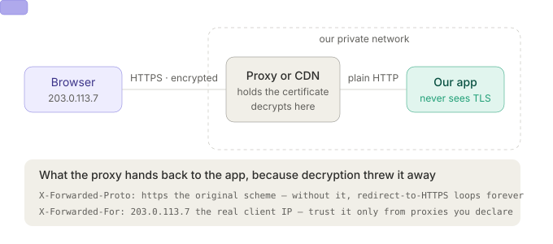
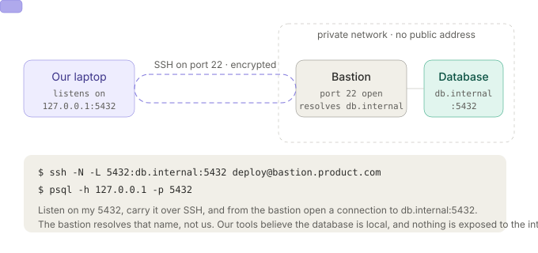

# Class 02 — Networking Fundamentals, Part Two: Study Guide

HTTPS, SSH and SMTP — sections 05, 06 and 07 of the Week-2 deck. Part one ([`class-02-networking-study-guide.md`](class-02-networking-study-guide.md)) covered the internet, addresses, DNS and HTTP; everything here sits on top of that. Section numbering continues from it, so this guide starts at 5.1.

Each topic has four parts:

- **What it is** — the idea in plain terms, plus the part slides usually skip.
- **Try it** — a command or a few lines of code you run right now and watch.
- **Exercises** — do these without looking at notes.
- **Go deeper** — where to read next.

Everything here runs on Linux/macOS. On Windows use WSL. Tools you'll need up front:

```bash
sudo apt install openssl curl dnsutils openssh-client swaks nmap   # Debian/Ubuntu
brew install openssl curl bind swaks nmap                          # macOS
```

One warning before you start: several exercises point at real servers. Reading a public certificate, running `dig`, or opening an SMTP conversation and typing `QUIT` are all ordinary client behaviour. Port-scanning or brute-forcing machines you don't own is not — keep `nmap` pointed at `scanme.nmap.org` (which exists for this) or at your own boxes.

---

# Section 05 — HTTPS

## 5.1 Plain HTTP is readable by everyone on the path

**What it is.** An HTTP request is text (§4.1), and text on a wire is text anyone touching the wire can read. Send this:

```
POST /login HTTP/1.1
Host: product.com
Content-Type: application/json

{ "user": "ayesha", "password": "hunter2" }
```

and the password sits in the body in the clear. Your laptop → café Wi-Fi → your ISP → a dozen routers you've never heard of → the server. **Every one of those hops can read it.** That's not a bug in HTTP; HTTP simply never claimed to protect anything.

Three separate attacks, and it matters that they're separate — TLS fixes all three, and people usually only remember the first:

- **Read it** — the password, the session cookie, the API token, the reply body. Passive; leaves no trace.
- **Change it** — a hop rewrites the response before it reaches you. Injected ads, injected JavaScript, a tampered download.
- **Impersonate** — nothing in plain HTTP proves the reply actually came from `product.com`. Whoever answers first wins.

So the three properties TLS provides map exactly onto those: **confidentiality**, **integrity**, **authenticity**. A common half-understanding is "HTTPS means encrypted." Encryption alone would stop the first attack only.

**Try it.** Watch a plain HTTP request on the wire, then the same site over TLS:

```bash
# terminal 1 — capture
sudo tcpdump -i any -n -A -s 0 'tcp port 80 and host neverssl.com' -c 40

# terminal 2 — send something that looks like a login
curl -s -X POST http://neverssl.com/login \
     -d 'user=ayesha&password=hunter2' > /dev/null
```

Scroll the tcpdump output. You'll find `password=hunter2` as readable ASCII. Now repeat against `https://example.com/login` and capture on port 443 — the same bytes are gone.

**Exercises.**
1. Run the capture above. Copy the exact line of tcpdump output where the password appears and paste it into your notes. That line is the whole argument for TLS.
2. List every hop between your laptop and `example.com` with `traceroute`. For each, write who plausibly operates it. How many organisations would have to be trustworthy for plain HTTP to be safe?
3. Of the three attacks (read / change / impersonate), which one does a captive-portal Wi-Fi network perform on you legitimately every time you connect to a hotel network? What does that tell you about why HTTPS breaks on those networks?
4. Your uptime monitor checks a customer site over plain HTTP and gets `200 OK` with the expected body. Name a scenario where the site is actually down and your check still passes.

**Go deeper.**
- [Why HTTPS Matters](https://web.dev/articles/why-https-matters) — web.dev, short
- [Firesheep](https://codebutler.github.io/firesheep/) — the 2010 extension that made session-cookie sniffing a one-click demo and pushed the web to HTTPS
- [HTTPS Everywhere: the road to a fully encrypted web](https://blog.cloudflare.com/tag/https/) — Cloudflare blog tag

---

## 5.2 TLS is the protocol, SSL is its old name

**What it is.** **TLS** (Transport Layer Security) is the set of rules two machines follow to encrypt a connection. **SSL** (Secure Sockets Layer) was the same idea under an older name, retired in 1999. People still say "SSL certificate" out of habit — the file, the library flag and the protocol are all TLS.

The version history is not trivia; each retirement was a break:

| Version | Year | Status |
|---|---|---|
| SSL 2.0 | 1995 | Broken. Prohibited (RFC 6176) |
| SSL 3.0 | 1996 | Broken by POODLE. Prohibited (RFC 7568) |
| TLS 1.0 | 1999 | Deprecated 2021 (RFC 8996) |
| TLS 1.1 | 2006 | Deprecated 2021 (RFC 8996) |
| TLS 1.2 | 2008 | Fine, still very widely used |
| TLS 1.3 | 2018 | Current. Fewer round trips, weak options removed |

Browsers refuse everything above TLS 1.2. What your servers speak today is TLS 1.2 or 1.3, and TLS 1.3's contribution is as much about *deletion* as encryption: no static RSA key exchange, no renegotiation, no compression, no CBC-mode ciphers. Whole classes of attack disappeared by removing the options that enabled them.

**Try it.** Ask a server which versions it will accept:

```bash
# does it speak 1.3?
openssl s_client -connect example.com:443 -servername example.com -tls1_3 </dev/null 2>&1 | grep -E 'New,|Protocol|Cipher'

# does it still accept 1.0?  (expect a handshake failure — that's the good outcome)
openssl s_client -connect example.com:443 -servername example.com -tls1 </dev/null 2>&1 | tail -5

# the full picture in one command
nmap --script ssl-enum-ciphers -p 443 example.com
```

**Exercises.**
1. Run the `nmap --script ssl-enum-ciphers` scan against three sites you use. Grade each (nmap prints an A–F per version). Did any accept TLS 1.0?
2. Why does "SSL certificate" remain the everyday term when nothing involved has been SSL since 1999? Write one sentence you'd use to correct a colleague without being annoying about it.
3. TLS 1.3 removed RSA key exchange entirely. Read §5.6, then come back and explain what that removal bought.
4. Your monitor should record the negotiated TLS version per check. Design the alert: what condition fires it, and what's the false-positive risk?

**Go deeper.**
- [RFC 8446 — TLS 1.3](https://datatracker.ietf.org/doc/html/rfc8446) (skim §1.2, "Major Differences from TLS 1.2")
- [SSL Labs Server Test](https://www.ssllabs.com/ssltest/) — paste any hostname, get a graded report
- [Mozilla SSL Configuration Generator](https://ssl-config.mozilla.org/) — copy-paste TLS config for nginx/Apache/HAProxy at three security levels

---

## 5.3 TLS sits between HTTP and TCP

**What it is.** Your code writes a normal HTTP request. TLS turns it into bytes nobody on the path can read, and the server turns them back into the same text before the app sees it. Neither end of your application code changes.

```
what our code writes            what goes on the wire
POST /login HTTP/1.1      →     17 03 03 00 2a 8f 2b c1
Host: product.com               9e 44 d0 a7 3f 11 5c e8
{ "password": "hunter2" }       91 7a 22 b6 0d 4f 88 ac
```

In encapsulation terms (§1.4), TLS is a layer wedged between TCP and HTTP. That placement decides exactly what is and isn't hidden:

**Encrypted:** the method, the path, the query string, *all* headers, cookies, tokens, request body, response body, status code.

**Still visible to the network:**

- The destination **IP address** — the routers need it to deliver anything at all.
- The **hostname**, via **SNI** in the ClientHello. TLS is negotiated before HTTP, so the server must be told which site you want before it can pick a certificate — and that name goes out in plain text. (ECH, Encrypted Client Hello, is the in-progress fix.)
- **Timing and size.** A snooper can't read your traffic but can see you sent 800 bytes and got 40 KB back, 200 ms later.

That's why "the path is encrypted, so `?token=abc` in a URL is safe" is wrong for a different reason than people assume: the URL genuinely is encrypted on the wire, but it lands in server access logs, browser history, and the `Referer` header. Encryption protects the wire, not the endpoints.

**Try it.** Prove the hostname leaks while the path doesn't:

```bash
sudo tcpdump -i any -n -A -s 0 'tcp port 443' -c 60 &
curl -s https://example.com/secret-path-nobody-should-see > /dev/null
```

Search the capture for `example.com` — you'll find it, in the ClientHello. Search for `secret-path` — nothing.

**Exercises.**
1. Do the capture. Note which packet number the hostname appears in, and how many packets in the whole handshake precede your request.
2. A colleague puts an API key in a query string, arguing HTTPS encrypts the URL. They're right about the wire. Name three places the key ends up anyway.
3. Your uptime agent runs inside a customer's network, and their security team wants to know what their firewall can see about your traffic. Write the honest answer in four bullets.
4. Why can't TLS start *before* TCP? Why can't it start *after* HTTP? (Answer using the encapsulation model from §1.4.)

**Go deeper.**
- [What is SNI?](https://www.cloudflare.com/learning/ssl/what-is-sni/) — Cloudflare
- [Encrypted Client Hello](https://blog.cloudflare.com/announcing-encrypted-client-hello/) — the fix for the SNI leak
- [HPBN, Chapter 4: Transport Layer Security](https://hpbn.co/transport-layer-security-tls/) — Ilya Grigorik, free online

---

## 5.4 Two kinds of encryption

**What it is.** Everything in TLS and SSH is built from two primitives.

**Symmetric.** One key. Both sides hold the same one. Encrypting and decrypting are the same cheap operation — modern CPUs have AES instructions in hardware, so this runs at gigabytes per second. The problem is entirely logistical: how do two strangers come to hold the same key without ever sending it?

**Asymmetric (public key).** Two mathematically linked keys. What the public key locks, only the private key opens — and the reverse: what the private key *signs*, anyone with the public key can verify. The public one is safe to hand to the world. It solves the distribution problem and is hundreds of times slower.

The signing direction matters as much as the encrypting one. A certificate (§5.8), an SSH login (§6.6) and a DKIM header (§7.4) are all signatures, not encryption — proof that the holder of a private key touched this exact data.

**Try it.** Do a full asymmetric round trip by hand:

```bash
cd "$(mktemp -d)"
openssl genpkey -algorithm RSA -out private.pem -pkeyopt rsa_keygen_bits:2048
openssl rsa -in private.pem -pubout -out public.pem

echo "the eagle lands at dawn" > message.txt
openssl pkeyutl -encrypt -pubin -inkey public.pem -in message.txt -out cipher.bin
xxd cipher.bin | head -3                                   # unreadable
openssl pkeyutl -decrypt -inkey private.pem -in cipher.bin # back to plain text

# now the other direction: sign and verify
openssl dgst -sha256 -sign private.pem -out sig.bin message.txt
openssl dgst -sha256 -verify public.pem -signature sig.bin message.txt   # Verified OK
echo "tampered" >> message.txt
openssl dgst -sha256 -verify public.pem -signature sig.bin message.txt   # Verification Failure
```

**Exercises.**
1. Run the block above. Then time the two approaches on a 10 MB file: `openssl enc -aes-256-cbc` versus trying to `pkeyutl -encrypt` it. What happens with the second, and why does the error itself explain why TLS doesn't use asymmetric for bulk data?
2. You have someone's public key. Which of these can you do — encrypt to them, decrypt from them, verify their signature, sign as them?
3. Why is "the private key never leaves the machine" a design property of every system in this guide (TLS, ACME, SSH, DKIM) rather than just good hygiene?
4. Ed25519 keys are 32 bytes; RSA keys are 256+ bytes at comparable strength. Find out why, in one sentence.

**Go deeper.**
- [Public-key cryptography, visually](https://www.youtube.com/watch?v=GSIDS_lvRv4) — Computerphile, Diffie-Hellman with paint
- [Crypto 101](https://www.crypto101.io/) — free book, the first four chapters cover exactly this
- [Why is asymmetric encryption slow?](https://crypto.stackexchange.com/questions/591/) — Crypto StackExchange

---

## 5.5 Why TLS uses both

**What it is.** Symmetric encryption is what you want for the traffic — it's fast. But it needs both sides to hold the same key, and sending that key over the network would defeat the point, because that's the very network you don't trust.

So TLS splits the job:

- **Asymmetric — once, when the connection opens.** Agree on one shared key, and prove who the server is.
- **Symmetric — every byte after that.** Carry all requests and replies.

Asymmetric *could* encrypt everything on its own. It's just far too slow, so TLS pays that cost exactly once per connection.

Which is the real reason the handshake is the interesting part of HTTPS, and the reason connection reuse matters so much. Each new connection re-runs the expensive opening; keep-alive, HTTP/2 multiplexing (§4.5), and connection pools all exist to amortise it. This is the same insight as "why database connection pools are a thing" from the part-one self-test, one layer up.

**Try it.** Measure what the handshake costs, and what reuse saves:

```bash
curl -s -o /dev/null -w \
 'dns:%{time_namelookup}  tcp:%{time_connect}  tls:%{time_appconnect}  ttfb:%{time_starttransfer}  total:%{time_total}\n' \
 https://example.com

# two requests on one connection vs two connections
curl -s -o /dev/null -o /dev/null -w 'reused: total=%{time_total}\n' https://example.com https://example.com
```

`time_appconnect - time_connect` is the TLS handshake alone. On a distant server it's often larger than everything else combined.

**Exercises.**
1. Run the timing command against a nearby and a far-away host. What fraction of total time is the TLS handshake in each?
2. TLS 1.3 cut the handshake from two round trips to one. Using your measured RTT, calculate the saving in milliseconds for your far host.
3. Session resumption lets a client skip the key agreement on reconnect. What does the client have to store for that, and what's the security trade-off (hint: it weakens one property from §5.6)?
4. Your monitor opens a fresh connection for every check. Argue both sides: is that wasteful, or is it exactly what you want from a monitor?

**Go deeper.**
- [TLS handshake latency](https://hpbn.co/transport-layer-security-tls/#tls-handshake) — HPBN, with the round-trip diagrams
- [Introducing 0-RTT](https://blog.cloudflare.com/introducing-0-rtt/) — Cloudflare, and read the replay-attack section carefully

---

## 5.6 Ephemeral Diffie-Hellman

**What it is.** The trick that makes the whole thing work: **neither side ever sends its secret.** Each generates a secret, sends only a *public half* derived from it, and mixes the half it receives with the secret it kept. The maths is arranged so both arrive at the same value — and someone who recorded both public halves cannot compute it.

```
                 public channel
  BROWSER  ──── my public half ────▶  SERVER
           ◀─── their public half ───
  keeps secret A                      keeps secret B
  B's half + A  =  same key  =  A's half + B
```

**Ephemeral** means short-lived: the two secrets are generated fresh when the connection opens and thrown away when it closes. That gives **forward secrecy** — if the server's private key is stolen next year, last year's recorded traffic still can't be decrypted, because the key that encrypted it never existed on disk and no longer exists anywhere.

This is precisely what old RSA key exchange lacked. There, the client encrypted the session key *to the server's public key* and sent it. Anyone recording traffic for a decade, then obtaining that one private key, could decrypt all of it retroactively. TLS 1.3 removed the option (§5.2) — that's the deletion paying off.

Note what Diffie-Hellman does *not* do: it agrees a key with *somebody*, with no evidence of who. A machine in the middle can run DH with you and separately with the server, and sit in the middle reading everything. Certificates (§5.8) are the part that fixes that, which is why the two always appear together.

**Try it.** Confirm you're getting an ephemeral exchange:

```bash
openssl s_client -connect example.com:443 -servername example.com </dev/null 2>&1 \
  | grep -E 'New,|Protocol|Cipher|Server Temp Key'
```

`Server Temp Key: X25519, 253 bits` is the ephemeral key — a fresh one per connection. Run it twice; the cipher stays the same, the temp key is regenerated. In TLS 1.2 cipher names, `ECDHE` is the ephemeral marker (the final `E`).

**Exercises.**
1. Run the command against five sites. Does any of them fail to show a `Server Temp Key`? What would that mean?
2. Explain forward secrecy to a non-engineer using a physical analogy. Test it on someone.
3. An attacker records your entire TLS session today and steals the server's private key in 2030. What can they decrypt — with ECDHE, and with old RSA key exchange?
4. If Diffie-Hellman alone can't tell you who you agreed a key with, why is it still the first thing that happens in the handshake, before the certificate is checked?

**Go deeper.**
- [Diffie-Hellman key exchange](https://www.youtube.com/watch?v=NmM9HA2MQGI) — Computerphile, the paint-mixing explanation
- [Forward secrecy](https://blog.cloudflare.com/staying-on-top-of-tls-attacks/) — Cloudflare
- [Elliptic curve cryptography, gently](https://blog.cloudflare.com/a-relatively-easy-to-understand-primer-on-elliptic-curve-cryptography/)

---

## 5.7 The handshake, message by message

**What it is.** Put §5.4–5.6 in order and you have the TLS 1.3 handshake — one round trip before application data flows.


1. **ClientHello** — "hello, I want `product.com` (SNI), I speak TLS 1.3, here are the ciphers I support, and here is my public half of the key."
2. **ServerHello** — "hello, we'll use TLS 1.3 and this cipher, here is my public half, and here is my certificate chain." Both sides can now compute the shared key; everything from here on is encrypted.
3. **Certificate verification** — the client checks the chain, the hostname and the dates (§5.8), and checks a signature proving the server holds the private key matching the certificate. This is the step that turns "I have a key with someone" into "I have a key with `product.com`."
4. **Finished** — both sides send a MAC over the entire transcript. If any message was tampered with in flight, the values won't match and the connection dies.

Then the HTTP request goes, encrypted. The client sending its key share *in the very first message* is the TLS 1.3 optimisation: it guesses the curve the server will pick, which is normally right, and saves a round trip.

**Try it.** Watch every message with `-msg`, and time the whole thing:

```bash
openssl s_client -connect example.com:443 -servername example.com -msg -tls1_3 </dev/null 2>&1 \
  | grep -E '^>>>|^<<<'
```

Each `>>>` is a message you sent, each `<<<` one you received. Count them, then compare against TLS 1.2:

```bash
openssl s_client -connect example.com:443 -servername example.com -msg -tls1_2 </dev/null 2>&1 \
  | grep -E '^>>>|^<<<'
```

> **Interactive version:** open [`tls-handshake-console.html`](tls-handshake-console.html) in a browser. Step through the handshake one message at a time, watch what each side knows after each step, then swap in an expired, self-signed or wrong-hostname certificate and see exactly which check fails and what the browser says.

**Exercises.**
1. Run both `-msg` captures. How many messages in each version? Map each TLS 1.3 message onto the four numbered steps above.
2. At which numbered step does the connection become unreadable to a snooper? At which step does the client know *who* it's talking to? Explain why those are not the same step, and why that ordering is safe.
3. The Finished message covers the whole transcript. Which of the three attacks in §5.1 does that specifically defeat?
4. Sketch the handshake from memory. Then add TCP's three-way handshake (§2.5) in front of it and count total round trips before the first byte of HTTP.

**Go deeper.**
- [The Illustrated TLS 1.3 Connection](https://tls13.xargs.org/) — every single byte of a real handshake, annotated. The best resource on this page.
- [A Detailed Look at RFC 8446](https://blog.cloudflare.com/rfc-8446-aka-tls-1-3/) — Cloudflare
- [Keyless SSL and handshake internals](https://blog.cloudflare.com/keyless-ssl-the-nitty-gritty-technical-details/)

---

## 5.8 Certificates and the chain of trust

**What it is.** Anyone can generate a key pair and send you a public key. A **certificate** is that public key with the domain name attached, signed by an authority your machine already trusts.


A leaf certificate says: this domain, this public key, valid between these dates, signed by this issuer. Your OS and browser ship with a **root store** of a few hundred CA certificates. Roots don't sign leaves directly — they sign **intermediates**, which sign leaves, so the root's private key can stay offline in a vault. Verification walks the chain upward and checks, at each link: is the signature valid, is the name right, are we inside the dates, is it revoked.

Three things certificates are routinely believed to do and don't:

- **They prove the name, not the site's honesty.** `definitely-not-a-scam.com` can get a perfectly valid certificate in 60 seconds. The padlock means "you are talking to the domain in the address bar," full stop.
- **They don't imply anything about the company behind it.** EV certificates tried to; browsers removed the special UI because users never noticed it.
- **The chain must be complete.** The single most common production TLS bug is serving the leaf without the intermediate. Browsers often paper over it by fetching the missing link; `curl`, Java clients and mobile apps frequently don't — so "works in my browser, fails in the app" is the classic symptom.

**Try it.** Read a real chain, then break it on purpose:

```bash
# the whole chain, as the server presents it
openssl s_client -connect example.com:443 -servername example.com -showcerts </dev/null 2>/dev/null \
  | grep -E 's:|i:'

# just the important fields of the leaf
echo | openssl s_client -connect example.com:443 -servername example.com 2>/dev/null \
  | openssl x509 -noout -subject -issuer -dates -ext subjectAltName

# days until expiry, the number your monitor actually needs
echo | openssl s_client -connect example.com:443 -servername example.com 2>/dev/null \
  | openssl x509 -noout -checkend $((30*86400)) && echo "OK for 30+ days" || echo "EXPIRES SOON"

# every failure mode, on purpose — badssl.com exists for this
for h in expired self-signed wrong.host untrusted-root incomplete-chain; do
  echo "== $h"; curl -sI --max-time 10 "https://$h.badssl.com/" 2>&1 | head -3
done
```

**Exercises.**
1. Run the `badssl.com` loop. Write down curl's exact error text for each case — you will see all five in production eventually, and recognising them by wording saves an hour each time.
2. Look at `subjectAltName` for a site you use. How many names does one certificate cover? Why is the `Common Name` field no longer what browsers check?
3. Find the root store on your machine (`/etc/ssl/certs/ca-certificates.crt` on Debian, Keychain Access on macOS). Roughly how many CAs are in it? Any one of them can issue a valid certificate for your domain — write two sentences on what that means for the trust model, then look up Certificate Transparency and revise.
4. For your uptime monitor: implement a cert-expiry check using `-checkend`. Decide the warning threshold and defend it. What should the check do when the chain is incomplete but the leaf is valid?
5. Why does `curl` fail on `incomplete-chain.badssl.com` while Chrome usually succeeds? Which behaviour is more correct?

**Go deeper.**
- [badssl.com](https://badssl.com/) — a live site per failure mode. Bookmark it.
- [How Certificate Transparency works](https://certificate.transparency.dev/howctworks/) — and search your own domain at [crt.sh](https://crt.sh/)
- [Everything you should know about certificates and PKI](https://smallstep.com/blog/everything-pki/) — smallstep, long and worth it
- [Mozilla CA Certificate Program](https://wiki.mozilla.org/CA) — how an organisation becomes trusted in the first place

---

## 5.9 How we actually get a certificate

**What it is.** Four steps, and the point of the design is in step 3.

1. Our server generates a key pair and keeps the **private key on disk, locally**.
2. It asks a CA (Let's Encrypt, say) for a certificate for `product.com`.
3. The CA sends back a token, and we prove the domain is ours by publishing it where only the domain's controller could:
   - **HTTP-01** — serve the token at `http://product.com/.well-known/acme-challenge/<token>`.
   - **DNS-01** — put the token in a `_acme-challenge.product.com` TXT record. Slower (TTL, §3.5), but it's the only option for wildcard certificates and it works for a server with no public HTTP port.
4. The CA verifies the token, signs the certificate, sends it back, and our server starts serving it.

**The private key never leaves our server, so the CA never sees it.** That's the whole reason this is safe to automate: the CA is only attesting "whoever controls this domain also holds this public key."

Let's Encrypt certificates last **90 days**, deliberately — short enough that renewal must be automated, which means it will actually work. Certbot runs all four steps and re-runs them around day 60. The renewal you never test is the one that fails on a Saturday, so the failure mode to design against isn't "certificate expired," it's "the renewal cron died three months ago and nobody noticed."

**Try it.** Watch the ACME flow without touching production:

```bash
# what the challenge path looks like from outside (404 unless a renewal is in flight)
curl -sI http://example.com/.well-known/acme-challenge/test | head -1

# a DNS-01 token, if a domain is mid-renewal
dig _acme-challenge.example.com TXT +short

# generate a CSR by hand — the exact thing certbot sends to the CA
cd "$(mktemp -d)"
openssl req -new -newkey rsa:2048 -nodes -keyout site.key -out site.csr \
  -subj "/CN=product.com" -addext "subjectAltName=DNS:product.com,DNS:www.product.com"
openssl req -in site.csr -noout -text | head -20    # note: contains the PUBLIC key only

# on a server you own, rehearse renewal without spending a rate limit
sudo certbot renew --dry-run
```

**Exercises.**
1. Generate the CSR. Confirm with `openssl req -in site.csr -noout -text` that the private key is *not* in it. Which field carries the public key?
2. You need a wildcard certificate for `*.product.com`. Which challenge type must you use, and why is HTTP-01 impossible for it?
3. Let's Encrypt's rate limit is 5 duplicate certificates per week. Describe a deploy pipeline that would burn through that in an afternoon, and how to avoid it.
4. Design the alert for renewal failure. Certbot's cron is silent on success. What do you monitor — the cron's exit code, or the certificate's expiry date from the outside? Argue for one.
5. Your uptime monitor is asked to add "certificate expires in under 14 days" as an alert type. Where in the check pipeline (§3.6) does it belong, and should it fire an incident or a warning?

**Go deeper.**
- [How Let's Encrypt works](https://letsencrypt.org/how-it-works/) — the canonical short version
- [RFC 8555 — ACME](https://datatracker.ietf.org/doc/html/rfc8555), §8 for the challenge types
- [Certbot documentation](https://eff-certbot.readthedocs.io/) and [Let's Encrypt rate limits](https://letsencrypt.org/docs/rate-limits/)
- [caddy](https://caddyserver.com/docs/automatic-https) — a web server that does all of this with zero configuration; worth seeing as a contrast

---

## 5.10 TLS termination

**What it is.** In practice your application code usually never touches TLS. A proxy, load balancer or CDN sits in front, holds the certificate, decrypts the request, and forwards plain HTTP to your app over the private network.



The proxy is where certificates, renewal, cipher configuration and HTTP/2 or HTTP/3 support live — one place instead of every service. What your app receives is a plain HTTP request that has lost two facts, which the proxy hands back as headers:

- `X-Forwarded-Proto: https` — the original scheme. Without it, your app thinks every request arrived over plain HTTP, so "redirect to HTTPS" becomes an infinite loop and `secure` cookies never get set.
- `X-Forwarded-For: 203.0.113.7` — the real client IP. Without it, every request in your logs, your rate limiter and your geo-blocking appears to come from the proxy.

Both are only as trustworthy as the network in front of them: anyone who can reach your app directly can send whatever `X-Forwarded-For` they like. So frameworks make you *declare* which proxies to trust (`trusted_proxies` in Laravel, `ProxyFix` in Flask, `set_real_ip_from` in nginx, `--forwarded-allow-ips` in gunicorn). Trusting the header unconditionally is a real rate-limit bypass, not a theoretical one.

The other consequence: between the proxy and your app the traffic is plain text. That's fine inside a VPC you control and not fine across the public internet — which is what "end-to-end encryption" versus "encryption in transit" is arguing about.

**Try it.** Run the exact shape locally — an app that only reports what it received:

```bash
# terminal 1 — a plain HTTP "app" that echoes its headers
python3 -m http.server 8000 &
# better: see the headers themselves
python3 - <<'PY' &
from http.server import BaseHTTPRequestHandler, HTTPServer
class H(BaseHTTPRequestHandler):
    def do_GET(self):
        body = "".join(f"{k}: {v}\n" for k, v in self.headers.items()).encode()
        self.send_response(200); self.send_header("Content-Type","text/plain")
        self.send_header("Content-Length", str(len(body))); self.end_headers()
        self.wfile.write(body)
HTTPServer(("127.0.0.1", 8000), H).serve_forever()
PY

# terminal 2 — pretend to be the proxy
curl -s http://127.0.0.1:8000/ \
  -H 'X-Forwarded-Proto: https' -H 'X-Forwarded-For: 203.0.113.7'
```

Your app sees `https` and a client IP it has no way to verify. That's the whole trust problem in one command.

**Exercises.**
1. Run it. Now send `X-Forwarded-For: 1.2.3.4` from a different terminal. If your rate limiter keyed on that header, what just happened?
2. Your app redirects HTTP to HTTPS by checking the request scheme, and behind a terminating proxy it redirect-loops. Explain the loop step by step, then give the one-line fix.
3. Find the trusted-proxy setting in whatever framework you use. Read its documentation and write down the default. Is the default safe?
4. Your uptime agent runs behind a corporate proxy that terminates TLS with its own root CA. What does your agent see, and how should it be configured to still validate certificates meaningfully?
5. When is proxy-to-app plain HTTP acceptable, and when must it be re-encrypted? Give one concrete example of each.

**Go deeper.**
- [X-Forwarded-For](https://developer.mozilla.org/en-US/docs/Web/HTTP/Headers/X-Forwarded-For) — MDN, and read the security-considerations note
- [RFC 7239 — Forwarded](https://datatracker.ietf.org/doc/html/rfc7239) — the standard header nobody uses
- [nginx: Configuring HTTPS servers](https://nginx.org/en/docs/http/configuring_https_servers.html)
- [Cloudflare SSL modes](https://developers.cloudflare.com/ssl/origin-configuration/ssl-modes/) — "Flexible" mode is a good exercise in reading a security claim carefully

---

# Section 06 — SSH

## 6.1 Why we need remote access at all

**What it is.** Your server is a rented machine in a data centre. It has no screen and no keyboard attached to anything you can reach. Everything you do to it travels over the network, and falls into three jobs:

- **Run commands** — restart the app, run a database migration, check whether a process is still alive.
- **Move files** — push a build up, pull a log file down.
- **Manage the machine** — install updates, add a user, edit a config file.

All three need the same thing: a way to act on a machine you can't touch, over a network you don't trust. That's what SSH is, and its second job — being a secure tunnel for *other* protocols (§6.8) — turns out to matter almost as much.

**Try it.** See how much of your existing tooling is already SSH:

```bash
git remote -v                      # git@github.com:... is SSH
ssh -V                             # your client version
ls -la ~/.ssh/                     # keys, known_hosts, config
ss -tlnp | grep :22 || sudo systemctl status ssh   # is sshd running here?
```

**Exercises.**
1. List every tool you use that runs over SSH without saying so (git, rsync, scp, sftp, Ansible, VS Code Remote, `docker context`). How many did you find?
2. Your app is down at 2am. Write the exact sequence of commands you'd run after connecting. Which of the three jobs above does each belong to?
3. Cloud providers offer browser-based consoles and agent-based shells (AWS SSM, GCP IAP) that need no open port 22. What do those buy you, and what do they cost?

**Go deeper.**
- [OpenSSH manual pages](https://man.openbsd.org/ssh) — `ssh`, `sshd_config`, `ssh_config`
- [SSH Mastery](https://mwl.io/nonfiction/tools#ssh) — Michael W. Lucas, short and practical

---

## 6.2 Telnet sent passwords in plain text

**What it is.** Before SSH there was **telnet**: type commands on a machine somewhere else, see the output. It worked, and nothing it sent was encrypted.

```
$ telnet product.com 23
Trying 203.0.113.42...
Connected to product.com.
product login: deploy
Password:                          ← never echoed on screen,
deploy@product:~$ cat secrets.env    but sent as readable text
DB_PASSWORD=s3cret                 ← and so is this
```

The password isn't shown on screen, which is exactly the illusion: not echoing locally has nothing to do with what crosses the network. Every keystroke and every reply — including that file — travels as plain ASCII.

This is §5.1 again, one protocol over. It's the same lesson twice because it's the same mistake twice: protocols designed for a trusted network, deployed on an untrusted one. FTP, HTTP, telnet, SMTP and DNS were all built this way, and each got its encrypted replacement or retrofit.

**Try it.** Telnet the *protocol* is dead; `telnet` the *tool* is still a fine way to poke a plain-text service. Never use it for a login.

```bash
# a plain-text protocol you can still safely read: HTTP by hand
telnet example.com 80      # or: nc example.com 80
# then type, followed by a blank line:
GET / HTTP/1.1
Host: example.com

```

Everything you typed and everything that came back crossed the network exactly as displayed.

**Exercises.**
1. Do the telnet-to-port-80 exercise while running `tcpdump -A` on port 80. Confirm the capture and your screen show the same characters.
2. Name three plain-text protocols still in use today and their encrypted replacements. For each, say whether the fix was a new port or an upgrade on the same one (this distinction returns in §7.4).
3. Why is "the password isn't displayed" reassuring to users and meaningless to attackers? Where else does this same false comfort show up?

**Go deeper.**
- [RFC 854 — Telnet](https://datatracker.ietf.org/doc/html/rfc854) (1983), for a sense of the era's assumptions
- [Why is telnet insecure?](https://security.stackexchange.com/questions/9556/) — Security StackExchange

---

## 6.3 SSH: an encrypted shell on the server

**What it is.** A **shell** is the program that runs the commands you type — bash, zsh, fish. **SSH** (Secure Shell) gives you one on a remote machine over **port 22**, and encrypts every byte in both directions.

```bash
$ ssh deploy@product.com
deploy@product:~$ docker compose up -d
```

The same encrypted connection carries file transfers:

```bash
$ scp build.tar deploy@product.com:/srv/            # push
$ scp deploy@product.com:/var/log/app.log ./        # pull
$ rsync -avz ./dist/ deploy@product.com:/srv/app/   # push, but only what changed
```

`scp`, `sftp` and `rsync -e ssh` are not separate protocols — they're programs riding the SSH connection. So is `git push`, so is Ansible, so is VS Code Remote. Learning SSH once buys all of them.

**Try it.** GitHub runs an SSH endpoint that authenticates you and then politely refuses a shell — perfect for practising against:

```bash
ssh -T git@github.com                      # if you have a key: greets you by name
ssh -v -o BatchMode=yes git@github.com 2>&1 | head -40   # the whole negotiation

# a real shell, on a machine you own — start one locally if you have none
sudo systemctl start ssh && ssh localhost 'hostname && uptime'

# run one command and exit, rather than opening a session
ssh localhost 'df -h /'
```

**Exercises.**
1. Run `ssh -v -o BatchMode=yes git@github.com` and read the trace. Find the lines where it (a) picks a cipher, (b) checks the host key, (c) offers each of your keys in turn.
2. What's the difference between `ssh host 'command'` and `ssh host` followed by typing the command? Which do you use in a script, and why does the first one behave differently with quoting?
3. `scp` has been "deprecated in favour of sftp" for years. Find out what was actually wrong with it.
4. Your deploy runs `ssh server 'cd /srv && git pull && docker compose up -d'`. Name two ways this fails silently and how you'd detect each.

**Go deeper.**
- [SSH Essentials](https://www.digitalocean.com/community/tutorials/ssh-essentials-working-with-ssh-servers-clients-and-keys) — DigitalOcean
- [`~/.ssh/config`, properly](https://linuxize.com/post/using-the-ssh-config-file/) — host aliases, jump hosts, per-host keys. Set this up once and stop typing long commands.

---

## 6.4 SSH secures the line exactly the way TLS does

**What it is.** Nothing new is invented here, and noticing that is the point of this subsection. SSH agrees on a key with ephemeral Diffie-Hellman and then encrypts the session with a symmetric cipher — §5.5 and §5.6, unchanged.

| | HTTPS | SSH |
|---|---|---|
| Agreeing on a key | Ephemeral Diffie-Hellman | Ephemeral Diffie-Hellman |
| Carrying the traffic | One symmetric key | One symmetric key |
| Proving who the server is | **A certificate signed by a CA** | **A host key remembered in `known_hosts`** |

Only the last row differs. SSH has no certificate authority. Instead your machine remembers the host key it saw the first time and compares it on every later connection — **trust on first use** (TOFU).

That trade is worth understanding rather than memorising. TOFU needs no third party, no expiry, no renewal, and no CA that could be compromised. What it can't do is protect the *first* connection: if someone is in the middle the very first time you connect, you happily record their key as the truth. And that's why the warning on a *changed* key is so loud —

```
@@@@@@@@@@@@@@@@@@@@@@@@@@@@@@@@@@@@@@@@@@@@@@@@@@@@@@@@@@@
@    WARNING: REMOTE HOST IDENTIFICATION HAS CHANGED!     @
```

— and why the honest answer to it is "the server was rebuilt and I know why," never "delete the line and retry" as a reflex.

**Try it.** Inspect what your machine remembers:

```bash
ssh-keygen -lf ~/.ssh/known_hosts | head          # fingerprints you have accepted
ssh-keyscan -t ed25519 github.com 2>/dev/null | ssh-keygen -lf -   # what GitHub presents now
```

Compare that fingerprint against GitHub's published one (they document it). That comparison — out-of-band, over a channel you already trust — is what TOFU is missing, done manually.

```bash
# see the host key check happen
ssh -v localhost exit 2>&1 | grep -iE 'host key|known_hosts|fingerprint'
```

**Exercises.**
1. Compare `ssh-keyscan github.com` output against the fingerprint on GitHub's docs page. Do they match? What did you just do that TOFU can't do for you?
2. You rebuild a server; the IP is the same, the host key is new. Your team gets the big warning. What's the correct process, and which command removes just that one entry (`ssh-keygen -R`)?
3. TOFU vs. certificate authorities: name one attack each design resists that the other doesn't.
4. Look up SSH certificates (`ssh-keygen -s`) — OpenSSH's own CA mechanism. What problem at 50-servers scale do they solve that `known_hosts` can't?

**Go deeper.**
- [SSH host key verification](https://www.ssh.com/academy/ssh/host-key) — SSH Academy
- [GitHub's SSH key fingerprints](https://docs.github.com/en/authentication/keeping-your-account-and-data-secure/githubs-ssh-key-fingerprints)
- [If you use SSH, you should be using certificates](https://smallstep.com/blog/use-ssh-certificates/) — smallstep

---

## 6.5 How a session starts

**What it is.** The ordering is the interesting part: **encryption is switched on before you log in.**

```
  OUR LAPTOP                                              SERVER
      │  connect to port 22 · my half of the key            │
      │────────────────────────────────────────────────────▶│
      │  host key · checked against known_hosts             │
      │◀────────────────────────────────────────────────────│
      │  ═══ everything from here is encrypted ═══          │
      │  now I prove who I am (key signature, or password)  │
      │────────────────────────────────────────────────────▶│
      │  shell                                              │
      │◀────────────────────────────────────────────────────│
```

Key agreement and host verification come first; authentication happens *inside* the encrypted channel. So even the password method — weaker for other reasons (§6.7) — never puts a password on the wire in readable form. This is the same ordering as TLS (§5.7), where the certificate check precedes any HTTP request.

Note what the server proves and what you prove. The **host key** proves the server to you. Your **key or password** proves you to the server. Both directions get checked, in that order, before a shell exists.

**Try it.** Watch the phases go by:

```bash
ssh -vv -o BatchMode=yes git@github.com 2>&1 | grep -iE \
  'kex|host key|Authenticating|Offering|Server accepts|Authentication succeeded'
```

You'll see key exchange (`kex`), then the host key check, then authentication attempts — in that order, every time.

**Exercises.**
1. Run the trace. Copy the line that marks the transition into the encrypted phase, and the line where authentication first appears. How many lines apart are they?
2. If encryption starts before login, why is password authentication still discouraged? (Two reasons, neither about eavesdropping.)
3. Compare this diagram to the TLS one in §5.7 side by side. Write down every structural difference. There should be roughly one.
4. Your laptop offers keys one at a time until one is accepted. With eight keys in `~/.ssh/`, what can go wrong against a server with `MaxAuthTries 3`, and how does `IdentitiesOnly yes` in `~/.ssh/config` fix it?

**Go deeper.**
- [The SSH protocol architecture, RFC 4251](https://datatracker.ietf.org/doc/html/rfc4251) and [transport layer, RFC 4253](https://datatracker.ietf.org/doc/html/rfc4253)
- [The Illustrated SSH Connection](https://ssh.xargs.org/) — byte by byte, same series as the TLS one

---

## 6.6 Public key authentication, not passwords

**What it is.** Generate a pair once on your laptop; the private half never travels anywhere, ever.

```bash
$ ssh-keygen -t ed25519 -C "ayesha@laptop"
~/.ssh/id_ed25519       ← private, never leaves this machine
~/.ssh/id_ed25519.pub   ← public, safe to hand out, safe to paste anywhere

$ ssh-copy-id deploy@product.com
# appends the public key to ~/.ssh/authorized_keys on the server
```

At login, the server sends a challenge tied to this session. Your laptop **signs** it with the private key; the server verifies the signature with the public key it already holds. The private key never travels, and the signature is useless to a replay attacker because it only covers this session.

Why this beats passwords, concretely: nothing guessable, nothing to phish, nothing typed into a machine that might be compromised, and revoking one person means deleting one line from `authorized_keys` — no shared secret to rotate for everybody.

Two practical parts people skip:

- **Put a passphrase on the private key.** It encrypts the key file itself, so a stolen laptop isn't a stolen server. `ssh-agent` holds the decrypted key in memory so you type the passphrase once per session, not once per connection.
- **Ed25519 over RSA.** Smaller, faster, no key-size decision to get wrong. Use RSA 4096 only when something ancient refuses Ed25519.

**Try it.** Do the full loop against your own machine:

```bash
ssh-keygen -t ed25519 -f /tmp/demo_key -N '' -C 'demo'
cat /tmp/demo_key.pub                       # one line, safe to share
head -2 /tmp/demo_key                       # PRIVATE — never share, never copy to a server

# authorise it for yourself and use it
cat /tmp/demo_key.pub >> ~/.ssh/authorized_keys
ssh -i /tmp/demo_key -o IdentitiesOnly=yes localhost 'echo authenticated with a key'

# the agent
eval "$(ssh-agent -s)" && ssh-add /tmp/demo_key && ssh-add -l

# clean up
sed -i.bak '/demo$/d' ~/.ssh/authorized_keys && rm /tmp/demo_key*
```

**Exercises.**
1. Run the loop. Then re-run the `ssh -i` line after removing the key from `authorized_keys`. Read the failure message carefully — it's the one you'll see in CI.
2. Open both key files. Which one is longer? Which could you safely paste into a public GitHub issue? Why is the answer obvious from the filenames alone?
3. `~/.ssh` permissions: set `authorized_keys` to `0666` and try to connect. What happens, and why does sshd refuse rather than warn?
4. Your team has six engineers and twelve servers. Compare: one shared key everyone uses, versus one key per person on every server. How does off-boarding work in each?
5. A CI pipeline needs to deploy over SSH. Where does its private key live, what scope should it have, and how is that different from a human's key?

**Go deeper.**
- [Generating a new SSH key](https://docs.github.com/en/authentication/connecting-to-github-with-ssh/generating-a-new-ssh-key-and-adding-it-to-the-ssh-agent) — GitHub, works for any server
- [Comparing SSH key algorithms](https://goteleport.com/blog/comparing-ssh-keys/) — Teleport
- [Using ssh-agent forwarding safely](https://docs.github.com/en/authentication/connecting-to-github-with-ssh/using-ssh-agent-forwarding) — read the risks section before you ever use `-A`

---

## 6.7 Hardening SSH on every server

**What it is.** Port 22 is scanned constantly. Bots try common usernames and passwords all day, on every public IP, forever. Five settings turn that from a risk into background noise:

1. **Turn off password login once keys work.** `PasswordAuthentication no`. This single line ends password brute-forcing as a category.
2. **Don't log in as root.** `PermitRootLogin no`. Use a normal user with `sudo`, so actions are attributable and mistakes are smaller.
3. **Passphrase on the private key, and never copy it to a server.** A key on a server is a key an attacker who lands on that server now has.
4. **One key per person.** One person leaving means removing one line, not rotating a shared secret across every machine.
5. **Restrict who can reach port 22 at all.** Security-group or firewall rules limiting it to your office, VPN or a single bastion. What can't be reached can't be attacked.

Order matters when applying these: **verify key login works in a second terminal before you disable passwords.** Locking yourself out of a remote machine is the classic way to learn this, and the recovery is a provider console session.

Two things routinely mistaken for hardening: moving SSH to port 2222 (stops bulk scanners, stops nobody targeting you — mild noise reduction, not security) and `fail2ban` (useful for log volume; irrelevant once passwords are off).

**Try it.** Audit a server you own:

```bash
sudo sshd -T | grep -iE 'permitrootlogin|passwordauthentication|pubkeyauth|port|maxauthtries|permitemptypasswords'
```

`sshd -T` prints the *effective* configuration — every default resolved — which is what's actually running, not what the file appears to say.

```bash
# how much scanning a public server really gets
sudo grep -c 'Failed password\|Invalid user' /var/log/auth.log 2>/dev/null || \
sudo journalctl -u ssh --since '24 hours ago' | grep -c 'Invalid user'

# after editing sshd_config, ALWAYS check syntax before restarting
sudo sshd -t && echo "config OK"
```

**Exercises.**
1. Run the `sshd -T` audit on any server you have. Which of the five items above are already correct? Fix one and re-run.
2. Count invalid-login attempts on a public server over 24 hours. Now explain to a non-technical manager why the number is large and not alarming.
3. You disable `PasswordAuthentication` and get locked out. Write the recovery procedure for your provider *now*, before you need it.
4. Argue against moving SSH to port 2222, then argue for it. Which argument is stronger, and what does "security through obscurity" actually mean here?
5. Design SSH access for a five-person team across ten servers with one bastion. Who holds which keys, where does port 22 accept connections from, and what happens on someone's last day?

**Go deeper.**
- [Mozilla OpenSSH security guidelines](https://infosec.mozilla.org/guidelines/openssh) — a config you can copy
- [`sshd_config` manual](https://man.openbsd.org/sshd_config) — skim every option once
- [SSH bastion hosts](https://goteleport.com/blog/ssh-bastion-host/) — Teleport

---

## 6.8 Reaching a database that has no public port

**What it is.** Your production database listens only inside the private network. It has no public address, which is correct — a database on the public internet is a breach with a countdown. But you still need `psql` from your laptop occasionally.



```bash
ssh -L 5432:db.internal:5432 deploy@bastion.product.com
# then, in another terminal:
psql -h 127.0.0.1 -p 5432 -U app appdb
```

Read the `-L` argument as three parts: **listen on my port 5432** → carry it over the SSH connection to the bastion → from *there*, open a connection to `db.internal:5432`. The hostname `db.internal` is resolved **by the bastion**, not by your laptop, which is why an internal-only DNS name works.

Your tools believe the database is local. Nothing about it is exposed to the internet, and the whole hop is encrypted by the SSH session you already trust.

Useful variants:

```bash
ssh -N -L 5432:db.internal:5432 bastion       # -N: forward only, don't open a shell
ssh -f -N -L 5432:db.internal:5432 bastion    # -f: background it
ssh -J bastion deploy@app-server              # -J: jump through the bastion to another host
ssh -D 1080 bastion                           # SOCKS proxy — forward anything, not one port
```

`-R` (remote forwarding) is the mirror image: expose a port on *your* machine to the server. It's how `ngrok`-style demos work, and it's also why an attacker with SSH access can pull your local network out through a firewall — a good thing to know exists.

**Try it.** Build a tunnel entirely on your own machine, where you can see both ends:

```bash
# terminal 1 — a "database" that only listens on localhost
python3 -m http.server 9999 --bind 127.0.0.1

# terminal 2 — tunnel a different local port to it via SSH to localhost
ssh -N -L 8888:127.0.0.1:9999 localhost &

# terminal 3 — talk to 8888 and watch it arrive at 9999
curl -s http://127.0.0.1:8888/ | head -5
ss -tlnp | grep -E '8888|9999'
```

Port 8888 is your laptop end, 9999 is the "private" service, and the traffic between them went through SSH.

**Exercises.**
1. Run the three-terminal exercise. Then kill the SSH process and curl 8888 again. What error, and why is it the same error you'd see if the bastion went down?
2. Rewrite `-L 5432:db.internal:5432` in words, naming which machine resolves `db.internal` and which machine opens the second connection.
3. Why does `-L 5432:...` bind to `127.0.0.1` by default rather than `0.0.0.0`? What would `GatewayPorts yes` change, and when is that dangerous?
4. Compare three ways to reach a private database: SSH tunnel, VPN, cloud provider's managed proxy (AWS SSM / GCP IAP). One paragraph each on trade-offs.
5. Your uptime monitor must check a service inside a customer's private network. The customer will not open an inbound port. Using §2.2 (NAT) and this section, design the connection direction and justify it.

**Go deeper.**
- [SSH tunnelling explained](https://iximiuz.com/en/posts/ssh-tunnels/) — with diagrams for `-L`, `-R` and `-D`
- [`ssh` manual, PORT FORWARDING section](https://man.openbsd.org/ssh#L)
- [ProxyJump and bastion configuration](https://www.redhat.com/sysadmin/ssh-proxy-bastion-proxyjump)

---

# Section 07 — SMTP

## 7.1 How an email reaches the other side

**What it is.** Email is older than the web and is still the only protocol where one organisation hands a message directly to another organisation's infrastructure. Four programs, each with a name worth knowing because error messages use them:


```
Sender  →  Our server  →   MX lookup    →  Their server  →  Inbox
 MUA          MTA           DNS · MX          MTA             MDA
mail client  port 587   which server takes it  port 25    files the message
```

- **MUA** (Mail User Agent) — your mail client. Composes and submits.
- **MTA** (Mail Transfer Agent) — the server that relays. Postfix, Exim, SES, Postmark. **SMTP is the language MTAs speak to each other.**
- **MX lookup** — DNS again (§3.4). To deliver to `ayesha@example.com`, the sending MTA asks for `example.com`'s **MX** records: which hostnames accept mail for this domain, and in what priority order.
- **MDA** (Mail Delivery Agent) — files the message into the mailbox. Reading it back out is a different protocol entirely (§7.2).

The property that makes email unlike everything else in this class: delivery is **store-and-forward**. Each hop accepts responsibility, queues the message, and retries for days if the next hop is down. There's no live connection between sender and recipient, no request/response pair, and "sent" doesn't mean "delivered" — it means "handed to the next server, which accepted it."

**Try it.** Do the MX lookup a mail server does, then look at the trail on a real message:

```bash
dig gmail.com MX +short          # priority then hostname; lower number = tried first
dig github.com MX +short
dig example.com MX +short        # a domain that accepts no mail

# follow one MX to an address, then see if the port is open
host "$(dig gmail.com MX +short | sort -n | head -1 | awk '{print $2}')"
```

Now open any email in your client and choose "show original" / "view source". Read the `Received:` headers **bottom to top** — that's the route the message actually took, one line per MTA, with timestamps.

**Exercises.**
1. Run the MX lookups. Why does `gmail.com` publish five MX records at different priorities? What happens when the priority-5 host is down?
2. Take a real email, read its `Received:` chain bottom to top, and write out the hops. How many servers touched it, and how long did each take?
3. `example.com` has no usable MX. What does a sending MTA do — fail immediately, fall back to the A record, or queue? Look up the fallback rule in RFC 5321.
4. Your app "sent" a password reset and the user never got it. List every place it could be sitting, given store-and-forward. Which of them can you see from your side?
5. Why does email have no equivalent of an HTTP status code telling the *sender* that the human received it?

**Go deeper.**
- [RFC 5321 — SMTP](https://datatracker.ietf.org/doc/html/rfc5321), §2.1 for the actors, §5.1 for MX resolution
- [How email works](https://www.cloudflare.com/learning/email-security/how-email-works/) — Cloudflare
- [MXToolbox](https://mxtoolbox.com/) — MX, SPF, DKIM, DMARC and blocklist checks in one page

---

## 7.2 SMTP sends; IMAP and POP3 read

**What it is.** SMTP only ever pushes a message *forward*, from one server to the next. It never opens a mailbox and never reads anything back. Retrieval is a different protocol on a different port:

| Protocol | Port | Job |
|---|---|---|
| **SMTP** | 587, 25 | Hands the message from our server to theirs. Never opens a mailbox. |
| **IMAP** | 993 | Reads mail *while it stays on the server*, so every device sees the same mailbox — same folders, same read/unread state. |
| **POP3** | 995 | Downloads mail to one device and usually deletes it from the server. |
| **MIME** | — | Not a transfer protocol at all. It's how attachments, images and HTML fit inside what is fundamentally a plain-text message. |

POP3 made sense when you had one computer and paid by the minute. IMAP is what you want now, and the difference is exactly the sync question: with POP3, mail read on your phone is gone from your laptop.

MIME deserves its own note because it explains the shape of every email you'll ever generate from code. SMTP carries 7-bit ASCII text. An HTML email with a PDF attached is *still* one plain-text message — MIME just defines multipart boundaries and base64 encoding so binary survives the trip. That's why attachments inflate ~33% in transit, and why a "20 MB limit" isn't 20 MB of file.

Webmail hides all of this. The moment you configure a mail client by hand, you pick SMTP for sending and IMAP or POP3 for reading — two separate server settings, because they're two separate protocols.

**Try it.** Look at the raw MIME structure of a real message and check which protocols a provider offers:

```bash
# ports a mail provider exposes
nmap -Pn -p 25,110,143,465,587,993,995 smtp.gmail.com imap.gmail.com

# peek at an IMAP greeting (encrypted from the first byte on 993)
openssl s_client -crlf -connect imap.gmail.com:993 </dev/null 2>/dev/null | head -3
```

Then export one email as `.eml` from your client and read it:

```bash
grep -iE '^(Content-Type|Content-Transfer-Encoding|MIME-Version|--)' message.eml | head -20
```

You'll see `multipart/alternative` (plain text *and* HTML versions of the same body) and `base64` for anything binary.

**Exercises.**
1. Export one email with an attachment. Find the MIME boundary string, count the parts, and identify which part is the plain-text fallback.
2. Compare the attachment's size on disk to its base64 size in the `.eml`. What's the ratio, and why is it that number?
3. A user says "I deleted an email on my phone and it's still on my laptop." Which protocol are they using, and what's the fix?
4. Your app sends HTML email. Why should you always include a `text/plain` alternative? Give two reasons — one about clients, one about spam scoring.
5. Why is SMTP's inability to read a mailbox a *feature* for an application that only ever sends transactional mail?

**Go deeper.**
- [RFC 2045–2049 — MIME](https://datatracker.ietf.org/doc/html/rfc2045) (skim 2045 §2)
- [IMAP vs POP3](https://www.cloudflare.com/learning/email-security/what-is-imap/) — Cloudflare
- [Email markup is stuck in 1999](https://www.caniemail.com/) — support tables for HTML/CSS in mail clients; a useful shock

---

## 7.3 The mail ports and who uses each

**What it is.** One port is for servers handing mail to each other; the others are for *your app* handing mail to a server it logs into. Confusing the two is the single most common reason "the email code works locally and not in production."

| Port | Who opens it | Encryption |
|---|---|---|
| **25** | One mail server delivering to the next | STARTTLS when both sides offer it |
| **587** | Our app or mail client submitting its own mail | STARTTLS, **and a login first** |
| **465** | Same job as 587 | TLS from the first byte ("implicit TLS") |
| **2525** | Same job as 587, unofficial | Whatever the provider offers |

The operational fact that decides your architecture: **most cloud providers block outbound port 25.** AWS, GCP, Azure, DigitalOcean — all of them, by default, often permanently. It's an anti-spam measure and it's not negotiable for most accounts.

So an app that tries to deliver mail directly to recipients' servers goes nowhere: it can't reach port 25. You send **through a provider on 587** (or 465), authenticated, and *they* do the port-25 delivery from IPs whose reputation they maintain (§7.6). When a corporate network blocks 587 too, providers offer 2525.

465 versus 587 is the same argument as HTTPS versus HTTP-with-upgrade: 465 is encrypted from the first byte, 587 starts plain and upgrades via STARTTLS (§7.4). 465 was deprecated, then un-deprecated in RFC 8314, which now recommends it. Either is fine; implicit TLS has one less thing to get wrong.

**Try it.** Prove the block exists and find which ports actually answer:

```bash
# from your laptop (likely fine) — and try the same from a cloud VM
nc -zv -w 5 smtp.gmail.com 25
nc -zv -w 5 smtp.gmail.com 587
nc -zv -w 5 smtp.gmail.com 465

nmap -Pn -p 25,465,587,2525 smtp.gmail.com

# time out on 25 from a cloud VM = the block, not a firewall of yours
timeout 5 bash -c 'cat < /dev/tcp/gmail-smtp-in.l.google.com/25' && echo open || echo "blocked or filtered"
```

**Exercises.**
1. Run the port checks from your laptop and, if you can, from a cloud VM. Which port differs, and does the failure look like a refusal or a timeout? Why does that distinction identify the cause?
2. Your app uses port 25 to a relay and works in development, then times out in production on AWS. Diagnose it in three sentences and give the fix.
3. Read RFC 8314's recommendation on 465 vs 587. Which does it prefer, and what's the argument?
4. Why does port 587 require authentication when port 25 doesn't? What would an unauthenticated 587 be called, and why is that the worst thing you can run on the internet?
5. Add "SMTP submission port reachable" as a check type in your uptime monitor. What do you connect to, what counts as healthy, and how is it different from an HTTP check?

**Go deeper.**
- [RFC 6409 — Message Submission](https://datatracker.ietf.org/doc/html/rfc6409) — why 587 exists separately from 25
- [RFC 8314 §3](https://datatracker.ietf.org/doc/html/rfc8314) — implicit TLS recommendation
- [AWS: port 25 throttling and removal requests](https://repost.aws/knowledge-center/ec2-port-25-throttle)

---

## 7.4 SMTP was built with no security

**What it is.** The original protocol carries plain text and believes whatever address it's given. `MAIL FROM:` is just a string you type — nothing checks it. That's why email spoofing was trivially easy for thirty years.

Four additions fix that, and every serious mail server checks them today:

- **STARTTLS** — the two servers open in plain text, then switch *the same connection* to TLS. It's an upgrade, not a separate port, and its weakness is inherent: an attacker who can strip the `STARTTLS` capability from the greeting causes a silent downgrade to plain text. MTA-STS and DANE exist to close that.
- **SMTP AUTH** — our app logs in with a username and password before the server accepts anything. This is what makes port 587 safe to expose.
- **SPF** — a DNS TXT record on our domain naming who may send for it. The receiving server checks the connecting IP against that list.
- **DKIM** — a cryptographic signature (§5.4, the signing direction) over the message headers and body, using a private key we hold; the public key is published in DNS. It proves the message wasn't altered and genuinely came from our domain — and unlike SPF it survives forwarding.
- **DMARC** — a policy record tying the two together: what should the receiver do when SPF and DKIM fail (`none`, `quarantine`, `reject`), and where to send reports.

**The receiving server runs these checks, not us.** Mail that fails them lands in spam or is refused at the door, and nobody tells you. This is why "our password reset emails aren't arriving" is almost always a DNS problem, not a code problem — which makes it §3.4 wearing a different hat.

**Try it.** Read a domain's whole email security posture out of DNS:

```bash
dig github.com TXT +short | grep spf        # who may send
dig _dmarc.github.com TXT +short            # the policy and report address
dig google._domainkey.github.com TXT +short # a DKIM public key (selector-specific)
dig _mta-sts.github.com TXT +short          # STARTTLS downgrade protection

# watch a real STARTTLS upgrade, capability by capability
openssl s_client -starttls smtp -connect smtp.gmail.com:587 -crlf </dev/null 2>&1 | head -30
```

In that last output, find the `EHLO` response listing `STARTTLS` and `AUTH` — the server advertising what it supports — and then the certificate, because after the upgrade this is ordinary TLS with everything from §5.8 applying.

Then check a message you received: its headers contain `Authentication-Results:` with `spf=pass dkim=pass dmarc=pass`. That's the receiving server showing its work.

**Exercises.**
1. Run all four DNS lookups against your own domain (or your employer's). Which records exist? If DMARC is missing or set to `p=none`, what is that domain currently allowing?
2. Find `Authentication-Results:` in a real email's source. Which checks passed? Find one email where something failed and work out why.
3. DKIM survives forwarding; SPF usually doesn't. Explain why, using the mailing-list case.
4. STARTTLS can be stripped by an active attacker. Explain the downgrade, and explain how MTA-STS closes it. Why is this the same class of problem as HTTP→HTTPS redirects and HSTS?
5. You're launching transactional email for `product.com`. Write the exact DNS records you need before the first send, and the order you'd deploy DMARC policies in (and why not `p=reject` on day one).

**Go deeper.**
- [SPF, DKIM and DMARC explained](https://www.cloudflare.com/learning/email-security/dmarc-dkim-spf/) — Cloudflare, the clearest short version
- [RFC 7208 (SPF)](https://datatracker.ietf.org/doc/html/rfc7208), [RFC 6376 (DKIM)](https://datatracker.ietf.org/doc/html/rfc6376), [RFC 7489 (DMARC)](https://datatracker.ietf.org/doc/html/rfc7489)
- [Learn and Test DMARC](https://www.learndmarc.com/) — send a message and watch every check run, step by step
- [MTA-STS](https://blog.cloudflare.com/introducing-mta-sts/) — the STARTTLS-stripping fix

---

## 7.5 Transactional and marketing email

**What it is.** Two categories that look identical to your code and completely different to a receiving mail server.

**Transactional** goes to one person because *they did something*. **Marketing** goes to a list because *we decided to send it*.

| | Transactional | Marketing |
|---|---|---|
| Examples | Password reset, receipt, 2FA code, alert | Newsletter, offer, announcement |
| Unsubscribe link | Not needed | Required by law (GDPR, CAN-SPAM) |
| If it lands in spam | **Nobody can log in** | A campaign does worse |

The consequence that actually shapes architecture: **reputation is shared per sending domain and IP.** Complaints and spam-marks on a marketing campaign damage the reputation your password resets depend on. One bad newsletter and your users can't reset their passwords — a support incident that looks nothing like an email problem.

So the two go out on **separate subdomains** (`mail.product.com` for marketing, `notify.product.com` for transactional) and usually **separate providers**, so their reputations can't contaminate each other. Set this up before you need it; splitting after a reputation problem means warming a new domain while the old one burns.

Related: never put an unsubscribe link on a password reset, and never send a receipt from `noreply@`. Both are small things that receiving filters and humans both notice.

**Try it.** Look at how a company you use splits its mail:

```bash
# check a few subdomains for separate mail configuration
for d in product.com mail.product.com notify.product.com; do
  echo "== $d"; dig "$d" TXT +short | grep -i spf; dig "_dmarc.$d" TXT +short
done
```

Try it with a real company (`github.com`, `stripe.com`). Then look at the `From:` and `Return-Path:` headers of a receipt versus a newsletter from the same company — usually different subdomains, sometimes visibly different providers.

**Exercises.**
1. Take two emails from the same company — one transactional, one marketing. Compare `From:`, `Return-Path:`, `Received:` and DKIM selector. Do they share infrastructure?
2. Your marketing team wants to send from the main domain "for brand consistency." Write the two-paragraph reply explaining the risk in terms they'll accept.
3. Which category do these belong to: shipping notification, "we've updated our terms," abandoned-cart reminder, security alert about a new login, annual summary? Two are genuinely arguable — say which and why.
4. Your uptime monitor sends incident alerts by email. Which category is that, what happens to your product if those land in spam, and what would you monitor to find out before a customer tells you?
5. What is IP warming, and why does it exist? What does it imply about switching email providers in a hurry?

**Go deeper.**
- [Transactional vs marketing email](https://postmarkapp.com/guides/transactional-email-best-practices) — Postmark
- [Email deliverability guide](https://www.mailgun.com/resources/learn/email-deliverability/) — Mailgun
- [Google's Email Sender Guidelines](https://support.google.com/a/answer/81126) — the rules that actually decide whether your mail arrives

---

## 7.6 Why we send through a mail provider

**What it is.** You *can* run your own MTA. Here's what each side actually involves:

**Running one yourself**

- A clean IP nobody has ruined — most cloud IPs have prior history, and blocklists remember.
- SPF, DKIM and DMARC records, kept in step with reality forever.
- Bounces, complaints, feedback loops and suppression lists, handled correctly, permanently.
- Port 25 outbound, which your provider probably blocks (§7.3).
- Reverse DNS matching your HELO name, or many receivers reject you at the door.

**Using a provider** (SES, Postmark, SendGrid, Resend, Mailgun)

- An API call, or SMTP on port 587.
- Their IP reputation — worth far more than anything a new server can build.
- Delivery, bounce, complaint and open events you can act on.
- They send *on behalf of* your domain, so **the SPF, DKIM and DMARC records still live in your zone** — you point at them, they sign as you.

That last line is the part people miss: using a provider doesn't remove the DNS work from §7.4, it just means the records point at someone else's infrastructure. Every provider's onboarding is "add these three records and verify your domain."

The honest summary: self-hosting outbound mail is a solved problem you don't get credit for solving, and the failure mode is invisible — mail silently filtered, discovered weeks later through support tickets. Self-host *inbound* if you like; send through a provider.

**Try it.** Reverse-engineer which provider a company uses, then send one yourself:

```bash
dig stripe.com TXT +short | grep spf        # the include: list names the providers
dig github.com TXT +short | grep spf
dig _dmarc.stripe.com TXT +short            # rua= often names the analytics vendor too

# send a real authenticated message via SMTP submission (needs an account)
swaks --to you@example.com \
      --server smtp.your-provider.com:587 \
      --auth --auth-user 'apikey' --auth-password "$SMTP_PASSWORD" \
      --tls \
      --header 'Subject: class 02 test' --body 'sent over SMTP submission'
```

`swaks --dump` prints the whole conversation — `EHLO`, `STARTTLS`, `AUTH`, `MAIL FROM`, `RCPT TO`, `DATA`, `QUIT`. That transcript *is* SMTP; read it once and the protocol stops being abstract.

**Exercises.**
1. Run the SPF lookups on three companies. Which providers do they use? Does any use more than one, and why might that be deliberate?
2. Sign up for a free tier (Postmark, Resend, SES sandbox), verify a domain, and send one message with `swaks`. Save the full `--dump` transcript and annotate each SMTP verb.
3. Send a test to [mail-tester.com](https://www.mail-tester.com/) and read the score breakdown. What did you lose points for? Fix one and re-send.
4. Estimate the cost of self-hosting outbound mail for a product sending 50,000 transactional emails a month: server, engineer time, and the expected cost of one deliverability incident. Compare to a provider's price.
5. Your uptime monitor's alert emails must arrive during an incident, when they matter most. Design for that: which provider tier, what fallback channel, and how do you detect that alert email itself has stopped being delivered?

**Go deeper.**
- [Why you should not run your own mail server](https://www.jitbit.com/journal/301-why-you-should-not-run-your-own-mail-server/) — and the counter-arguments in its comments
- [swaks documentation](https://www.jetmore.org/john/code/swaks/) — the Swiss Army knife of SMTP testing
- [Postmark's DMARC digests](https://dmarc.postmarkapp.com/) — free weekly DMARC reports for your domain
- [mail-tester.com](https://www.mail-tester.com/) — score any message you send

---

# Wrap-up

## The four questions that debug almost anything in part two

Part one's ladder was DNS → address → port → app → answer. Part two adds a security layer to each rung, and its own ordering:

1. **Is the certificate valid, complete and unexpired?** → `openssl s_client -showcerts`, `openssl x509 -checkend`
2. **Did the handshake succeed, and at which version?** → `openssl s_client -tls1_3`, `nmap --script ssl-enum-ciphers`
3. **Who does the far end claim to be, and do I have grounds to believe it?** → certificate chain, or `known_hosts` fingerprint
4. **For mail: does DNS say I'm allowed to send?** → `dig TXT` for SPF, `_dmarc`, `_domainkey`

Almost every HTTPS incident is question 1. Almost every SSH incident is question 3. Almost every email incident is question 4.

## One command per topic — the cheat sheet

```bash
# TLS
openssl s_client -connect host:443 -servername host </dev/null    # handshake, chain, temp key
openssl s_client -connect host:443 -msg -tls1_3 </dev/null        # every handshake message
echo | openssl s_client -connect host:443 2>/dev/null | openssl x509 -noout -dates -subject -issuer
echo | openssl s_client -connect host:443 2>/dev/null | openssl x509 -noout -checkend 2592000
nmap --script ssl-enum-ciphers -p 443 host                        # every version and cipher, graded
curl -s -o /dev/null -w 'tls:%{time_appconnect} total:%{time_total}\n' https://host
curl -vI https://expired.badssl.com/                              # each failure mode, on purpose
sudo certbot renew --dry-run                                      # rehearse renewal

# SSH
ssh -v -o BatchMode=yes user@host                                 # full negotiation trace
ssh-keygen -t ed25519 -C 'me@laptop'                              # make a key pair
ssh-copy-id user@host                                             # authorise it there
ssh-keygen -lf ~/.ssh/known_hosts                                 # fingerprints I trust
ssh-keygen -R host                                                # forget one changed host key
sudo sshd -T | grep -iE 'permitroot|passwordauth'                 # effective config
ssh -N -L 5432:db.internal:5432 bastion                           # tunnel to a private port
ssh -J bastion user@target                                        # jump through a bastion

# SMTP
dig domain MX +short                                              # who accepts mail here
dig domain TXT +short | grep spf                                  # who may send as this domain
dig _dmarc.domain TXT +short                                      # the failure policy
openssl s_client -starttls smtp -connect host:587 -crlf           # watch the upgrade
swaks --to you@example.com --server host:587 --auth --tls --dump  # send, and read the transcript
nmap -Pn -p 25,465,587,993,995 host                               # which mail ports answer
```

## Self-test — close the notes and answer

1. TLS gives three properties. Name them, and name the attack each one stops.
2. Why does TLS use both symmetric and asymmetric encryption instead of picking one?
3. What is forward secrecy, and which TLS design choice provides it?
4. At which point in the handshake does the client know *who* it's talking to — and why is that after encryption starts rather than before?
5. What exactly does a valid certificate prove? Name two things people think it proves and it doesn't.
6. Why do Let's Encrypt certificates last 90 days? What does that force you to build?
7. Your app is behind a terminating proxy and redirect-loops on HTTPS. What's the cause, in one sentence?
8. SSH and TLS agree on a key identically. Name the one row where they differ, and the trade-off that row represents.
9. Why is `ssh -L 5432:db.internal:5432 bastion` safe when exposing the database publicly isn't? Which machine resolves `db.internal`?
10. Which SSH hardening step ends password brute-forcing as a category? What must you verify first?
11. Which mail port is blocked outbound by most cloud providers, and what does that force your architecture to be?
12. SPF, DKIM, DMARC: which one is a signature, which is a list, and which is a policy?
13. Why do transactional and marketing email go out on separate subdomains?
14. STARTTLS can be stripped by an attacker. What is that attack, and what's the fix called?

## Tying this back to your capstone

The uptime & incident monitoring platform gains a whole check category from this half of the class:

- **Certificate expiry** (§5.8, §5.9) is the highest-value check you can add and the easiest to implement — `openssl x509 -checkend`. Every engineer has been burned by a Saturday-morning expiry. Decide the threshold, and decide whether an incomplete chain is a failure or a warning (it is: some clients will fail even though your browser doesn't).
- **TLS version and handshake time** (§5.2, §5.5) belong in your per-stage timing breakdown, next to DNS and TCP from part one. `time_appconnect - time_connect` is the number.
- **Checking inside a customer's private network** (§6.8, plus NAT in §2.2) is an architecture decision, not a feature: the agent dials out, or you tunnel in. Both sections argue for the same answer.
- **Your own alert delivery** (§7.4–7.6) is part of the product. An incident alert that lands in spam is an outage your customer experiences and you don't. SPF/DKIM/DMARC on your notification subdomain is table stakes, and a non-email fallback channel is not optional.
- **SMTP submission as a check type** (§7.3) is a feature customers will ask for — "is our mail relay up?" — and it's a TCP-plus-banner check, not an HTTP one.

## Not covered by these slides

Worth knowing exists, deliberately out of scope here:

- **mTLS** — the client presents a certificate too. Standard for service-to-service auth inside a mesh.
- **Certificate Transparency and CAA records** — the public log of every certificate issued, and the DNS record limiting who may issue for your domain. Both are answers to "any of 150 CAs could issue for me."
- **OCSP stapling and revocation** — revocation is genuinely unsolved; read about it once and enjoy the mess.
- **SSH certificates and short-lived credentials** — `known_hosts` and `authorized_keys` don't scale past a few dozen machines (§6.4, exercise 4).
- **DANE, MTA-STS, ARC and BIMI** — the next layer of mail authentication.
- **Post-quantum key exchange** — already shipping in Chrome and OpenSSH as hybrid X25519+ML-KEM. The "harvest now, decrypt later" threat is why it's arriving before quantum computers do.

Next week: how the backend answers, and how we build it — starting with a page, and deciding when that stops being enough.
