# Class 02 — Networking Fundamentals: Study Guide

A working companion to the 40 slides. Each topic has four parts:

- **What it is** — the idea in plain terms, plus the part slides usually skip.
- **Try it** — a command or a few lines of code you run right now and watch.
- **Exercises** — do these without looking at notes.
- **Go deeper** — where to read next.

Everything here runs on Linux/macOS. On Windows use WSL. A few tools you'll need up front:

```bash
sudo apt install dnsutils traceroute netcat-openbsd curl tcpdump   # Debian/Ubuntu
brew install bind mtr netcat curl                                  # macOS
```

---

# Section 01 — The Internet

## 1.1 There is no "the internet" — only networks joined to networks

**What it is.** A single machine can compute and store, but it has nobody to tell. A network starts at two machines. Wiring every pair together needs `n(n-1)/2` cables, so instead we put a **switch** in the middle and give each machine one cable — that's a LAN. A **router** is the one box sitting on two networks at once, so it's the only thing that can carry a message between them. Your router joins your LAN to your **ISP's** network. Your ISP reaches everyone else in one of two ways:

- **Transit** — it pays a bigger network to carry traffic to the rest of the world.
- **Peering** — it meets other networks at an **IXP** (internet exchange) and they swap traffic for free, because it's cheaper for both than paying transit.

The consequence that matters for backend work: **nobody owns the whole path**. Your packet crosses networks run by companies that have never heard of you, over fibre that has real length. A server in Singapore is slow from Dhaka not because it's busy but because light takes time. Distance is a fixed cost you can only design around (caching, CDNs, regional deploys), never optimise away.

**Try it.** Compare a near host to a far one:

```bash
ping -c 5 google.com          # likely served from a nearby cache
ping -c 5 pypi.org
mtr --report --report-cycles 10 1.1.1.1   # per-hop latency and loss
```

Look at where the latency *jumps* in the `mtr` output. That jump is usually the moment you leave your ISP.

**Exercises.**
1. Ping a host in three regions (e.g. something hosted in India, Europe, and the US west coast). Write down the RTT for each and estimate the km travelled assuming light in fibre moves ~200,000 km/s. Compare to reality.
2. Your uptime monitor pings a customer's site from one server in Frankfurt and reports 400 ms. Is the site slow? Write down three explanations, and how you'd tell them apart.
3. Explain to a non-engineer why a video call to the next city can be worse than one across the country.

**Go deeper.**
- [How the Internet Really Works](https://howtheinternet.works/) — ARTICLE 19, short and illustrated
- Cloudflare Learning Center: [What is an IXP?](https://www.cloudflare.com/learning/cdn/glossary/internet-exchange-point-ixp/)
- [BGP in 2024](https://blog.apnic.net/) — APNIC blog, for when you want to know how routes are actually chosen
- Book: *Computer Networking: A Top-Down Approach* (Kurose & Ross), Ch. 1

---

## 1.2 Inside a packet: header and payload

**What it is.** Your data doesn't travel as one blob. It's cut into **packets**, and each packet is two parts:

- **Header** — the metadata: where it's from, where it's going, which piece of the sequence it is.
- **Payload** — one slice of your actual data.

Why slices? A shared line with one giant transfer on it starves everyone else. Small packets interleave, so many conversations share one wire. It also means a failure costs you one packet to resend, not the whole file.

**Try it.** Watch real packets:

```bash
sudo tcpdump -i any -n -c 10 'host 1.1.1.1'
# then in another terminal: ping -c 3 1.1.1.1
```

Every line is one packet: source, destination, protocol, size. That's the header being printed for you.

**Exercises.**
1. Run `tcpdump -i any -n port 443 -c 20` and load a website. How many packets for one page?
2. A file is 1 MB and the network's max packet payload (MTU) is 1500 bytes. Roughly how many packets? Now account for ~40 bytes of TCP+IP header per packet — what percentage of the bytes on the wire is overhead?
3. Why does sending 10,000 tiny 1-byte messages cost far more than one 10 KB message, even though the data is smaller?

**Go deeper.**
- [Wireshark](https://www.wireshark.org/) + its [sample captures](https://wiki.wireshark.org/SampleCaptures) — the GUI version of tcpdump, much easier to learn on
- [IP header, field by field](https://nmap.org/book/tcpip-ref.html) (Nmap reference guide)

---

## 1.3 Routing, hop by hop

**What it is.** No router knows the whole path. Each one knows only *the next hop* for a given destination, forwards the packet there, and forgets it. The path emerges from many independent local decisions. Two packets in the same conversation can take different routes and arrive out of order, twice, or not at all.

IP makes no promises. **TCP** is the layer that numbers packets, reorders them, and asks again for anything missing — which is why "reliable delivery" is something you build on top of an unreliable network, not something the network gives you.

**Try it.**

```bash
traceroute google.com
traceroute -T -p 443 github.com   # TCP-based; gets through firewalls that block UDP/ICMP
```

Each numbered line is one router that admitted to being in the path. `* * *` means a hop chose not to reply — that's normal, not a fault.

**Exercises.**
1. Traceroute the same domain from your laptop and from a cloud VM in another country. Where do the paths converge?
2. Run traceroute twice in a row to a distant host. Did any hop change? What does that tell you about "the" route?
3. For your uptime monitor: a check fails from one probe location but succeeds from two others. What is the most likely cause, and what would you store in the incident record to prove it later?

**Go deeper.**
- [Traceroute Explained](https://www.cloudflare.com/learning/network-layer/what-is-traceroute/)
- Julia Evans, [How to Be a Wizard Programmer / networking zines](https://wizardzines.com/) — especially *Let's Learn tcpdump* and *How DNS Works*

---

## 1.4 Encapsulation: each layer adds a header

**What it is.** Going out, every layer wraps the layer above it:

```
[ LINK | IP | TCP |  your HTTP request  ]
  next   which  which        the payload
  box    machine program
```

Coming in, every layer reads *its own* header and hands the rest upward. A router in the middle opens only the IP header — it has no business reading TCP, and with HTTPS it couldn't read the HTTP anyway. That's why TCP is described as **end-to-end**: only the two endpoints ever look at it.

This is the mental model that makes everything else make sense. "Which layer is this problem in?" is the single most useful debugging question in backend work.

| Layer | Header answers | You see it as |
|---|---|---|
| Link (Ethernet/WiFi) | which box on this LAN | MAC address, `ip link` |
| Internet (IP) | which machine, anywhere | `203.0.113.42`, routing |
| Transport (TCP/UDP) | which program on it | port `443`, handshake |
| Application (HTTP, SSH, SMTP) | what we're saying | your request body |

**Try it.** See all four layers in one capture:

```bash
sudo tcpdump -i any -n -v -X -c 1 'tcp port 80'
# then: curl -s http://example.com > /dev/null
```

The `-X` hex dump shows the headers stacked in front of your `GET /`.

**Exercises.**
1. Map each of these failures to a layer: cable unplugged; "no route to host"; "connection refused"; `404 Not Found`.
2. Your monitor gets `connection refused` on port 8080 but `ping` works. Which layers are fine and which one isn't?
3. Why can a router change the IP header (NAT does exactly this) but not the TCP checksum-protected payload without breaking things?

**Go deeper.**
- [OSI vs TCP/IP model](https://www.cloudflare.com/learning/ddos/glossary/open-systems-interconnection-model-osi/) — read it once, then use the 4-layer version above forever
- *TCP/IP Illustrated, Vol. 1* (Stevens) — the reference, dip in rather than read cover to cover

---

# Section 02 — Addresses and Connections

## 2.1 What an IP address is

**What it is.** An IP address marks a **position in the network**, not an identity. It's the postal address of a house, not the name of the family living there. Move house and you get a new one; the family is unchanged. This is why you never use an IP as a user identifier, and why a server's address changes when you redeploy.

| | IPv4 | IPv6 |
|---|---|---|
| Looks like | `203.0.113.42` | `2001:db8:85a3::8a2e:370:7334` |
| Size | 32 bits, ~4.3 billion | 128 bits, effectively unlimited |
| Status | exhausted, kept alive by NAT | fully deployed, growing |

Both are in use simultaneously. A domain can publish an `A` record (IPv4) and an `AAAA` record (IPv6), and the client picks. `::` in IPv6 means "a run of zero groups", once per address.

**Try it.**

```bash
ip addr show                        # your addresses (Linux)
curl -4 ifconfig.me; echo           # your public IPv4
curl -6 ifconfig.me; echo           # your public IPv6, if you have one
```

If the IPv6 call fails, your ISP hasn't given you one — very common.

**Exercises.**
1. Is your machine's IPv4 the same as your public one? Why not?
2. Write down which of these are valid: `256.1.1.1`, `10.0.0.1`, `2001:db8::1::2`, `::1`.
3. Your uptime monitor is asked to check `example.com`. It resolves to both an A and an AAAA record. Should you check one or both? Argue for a default and name the failure mode your default hides.

**Go deeper.**
- [IPv6 for the rest of us](https://www.internetsociety.org/deploy360/ipv6/) — Internet Society
- RFC 5737 / RFC 3849 — the reserved documentation ranges (`203.0.113.x`, `2001:db8::`) used all over these slides

---

## 2.2 Private vs public addresses, and NAT

**What it is.** Some ranges are reserved as **private** and repeat in every home and office on earth:

- `10.0.0.0/8`
- `172.16.0.0/12`
- `192.168.0.0/16`

They're not routable on the internet. Your router performs **NAT** (Network Address Translation): it rewrites the sender of every outgoing packet from `192.168.0.11` to its single public address, remembers the mapping in a table, and rewrites replies back on the way in.



*The loop above plays on its own. For the clickable version — send from any of the three devices and watch the translation table grow — open [`nat-animated-diagram.html`](nat-animated-diagram.html) in a browser.*

Note the port in the rewritten address. The router doesn't just swap the IP; it also assigns each conversation its own public port (`40001`, `40002`, …), and that port is what makes the mapping reversible on the way back. Strictly this is NAPT/PAT — what every home router actually does. Note too that the table only gains a row when a device *initiates*: a packet arriving from outside with no matching entry has nowhere to go.

The consequence you'll hit constantly: **a machine behind NAT cannot be connected to from outside** unless something maps a port inward. That's why webhooks need a public URL, why you need `ngrok`/Cloudflare Tunnel in local dev, why P2P apps do STUN/TURN, and why your self-hosted service needs port forwarding or a reverse tunnel.

**Try it.**

```bash
ip route | grep default             # your router's private address
curl ifconfig.me; echo              # the address the world sees
```

Then, from a phone on mobile data, try to reach your laptop's private address. It won't work — that's NAT, doing its job.

**Exercises.**
1. Two colleagues both have `192.168.0.11`. How does a reply from a server find the right one?
2. Your monitoring agent runs inside a customer's private network and must report to your API. Which direction does the connection open, and why is that the only workable design?
3. Name three things that break because of NAT, and the workaround for each.

**Go deeper.**
- [What is NAT?](https://www.cloudflare.com/learning/network-layer/what-is-nat/)
- [Tailscale's "How NAT traversal works"](https://tailscale.com/blog/how-nat-traversal-works) — genuinely one of the best technical write-ups on the internet
- RFC 1918 — the private address ranges

---

## 2.3 Ports: one address, many programs

**What it is.** The IP address gets you to the machine. The **port** gets you to the program on it. Ports are not part of IP at all — they live in the **TCP or UDP header**, one layer up. Range is `0–65535`; below `1024` are the well-known ports and usually need root to bind.

| Port | Service | Port | Service |
|---|---|---|---|
| 22 | SSH | 443 | HTTPS |
| 25 | SMTP (server-to-server) | 587 | SMTP submission (client) |
| 53 | DNS | 5432 | PostgreSQL |
| 80 | HTTP | 6379 | Redis |

**Try it.** Be both sides of a connection:

```bash
# terminal 1 — listen
nc -l 9000

# terminal 2 — connect and type
nc 127.0.0.1 9000
```

Type in either window; it appears in the other. That's a raw TCP connection with no protocol on top. Now see it:

```bash
ss -tlnp        # every TCP port currently listening on your machine
```

**Exercises.**
1. Start two `nc -l 9000` listeners at once. What happens, and what's the exact error?
2. Try `nc -l 80` as a normal user. Explain the failure.
3. List every listening port on your machine and justify each one. Anything you can't explain is worth investigating.
4. Your monitor supports "TCP port checks". Write the smallest possible check that answers "is Postgres accepting connections?" without a Postgres driver.

**Go deeper.**
- [IANA port registry](https://www.iana.org/assignments/service-names-port-numbers/service-names-port-numbers.xhtml) — the authoritative list
- `man ss`, `man lsof` — learn one of these properly

---

## 2.4 What a socket is

**What it is.** A **socket** is one endpoint of an open connection. It's identified by a **five-tuple**:

```
protocol + source IP + source port + destination IP + destination port
   TCP      198.51.100.5    51234      203.0.113.42       443
```

Change any one of the five and it's a different socket. That's the answer to "how does one server serve thousands of clients on port 443?" — the server port is the same every time, but the client IP/port differ, so every connection is a distinct five-tuple. The client's port is **ephemeral**: the OS picks a free high number for each outgoing connection.

**Try it.** In Go — a server that shows you the five-tuple of every client:

```go
package main

import (
	"fmt"
	"net"
)

func main() {
	ln, _ := net.Listen("tcp", ":9000")
	defer ln.Close()
	fmt.Println("listening on :9000")

	for {
		conn, err := ln.Accept()
		if err != nil {
			continue
		}
		go func(c net.Conn) {
			defer c.Close()
			// LocalAddr = server side, RemoteAddr = client side
			fmt.Printf("tcp %s <-> %s\n", c.RemoteAddr(), c.LocalAddr())
			fmt.Fprintf(c, "you are %s\n", c.RemoteAddr())
		}(conn)
	}
}
```

Run it, then open three terminals with `nc 127.0.0.1 9000`. Same server port every time, three different client ports. Confirm with `ss -tn 'sport = :9000'`.

**Exercises.**
1. What is the theoretical maximum number of simultaneous connections one server can hold on port 443 from a *single* client IP? Why is that the binding limit in load testing?
2. Explain `TIME_WAIT` and why a load generator runs out of ports before the server runs out of anything.
3. Modify the Go server to count concurrent connections and print the number on each accept.

**Go deeper.**
- Beej's [Guide to Network Programming](https://beej.us/guide/bgnet/) — the classic; skim the socket API chapters
- [The C10K problem](http://www.kegel.com/c10k.html) — historical but the reasoning still shapes every server you use
- Go: [`net` package docs](https://pkg.go.dev/net)

---

## 2.5 TCP's three-way handshake

**What it is.** Before a single byte of your data moves, TCP does a round trip:

```
client → server   SYN       "can we talk?"
client ← server   SYN-ACK   "yes, and can we?"
client → server   ACK       "yes. go."
```

Both sides confirm they can send *and* receive, and they exchange starting sequence numbers. The cost is **one full round trip before anything useful happens** — and with HTTPS you then pay more round trips for the TLS handshake on top.

This is exactly why connections are kept alive and reused: connection pools in your database driver, `keep-alive` in HTTP, session reuse in TLS. Opening a new connection per request is the most common self-inflicted latency wound in backend code.



*Watch the elapsed counter at the bottom. Nothing you care about moves until the third round trip — the first two are pure protocol overhead, paid again in full every time you open a fresh connection. TLS 1.2 costs one round trip more than the 1.3 shown here.*

**Try it.** Watch the handshake, then watch a reuse:

```bash
sudo tcpdump -i any -n 'tcp port 80 and (tcp[tcpflags] & (tcp-syn|tcp-ack) != 0)' &
curl -s http://example.com > /dev/null
```

Then measure the cost:

```bash
curl -w "dns=%{time_namelookup}s connect=%{time_connect}s tls=%{time_appconnect}s ttfb=%{time_starttransfer}s total=%{time_total}s\n" \
     -o /dev/null -s https://example.com
```

`connect` minus `dns` is your handshake. `tls` minus `connect` is TLS on top.

**Exercises.**
1. Run that `curl -w` line against a local service and a distant one. Which number grows, and by how much?
2. Write out the timeline for "10 sequential HTTPS requests, new connection each time" vs "10 on one kept-alive connection" at 80 ms RTT. What's the difference in seconds?
3. Your uptime monitor reports response time. Should it report `total`, `ttfb`, or `connect`? Argue for one and say what each of the others would have caught that yours misses.

**Go deeper.**
- [High Performance Browser Networking](https://hpbn.co/), Ilya Grigorik — free online, Chapters 1–2 are the best explanation of this that exists
- [TCP handshake, packet by packet](https://www.cloudflare.com/learning/ddos/glossary/tcp-ip/)

---

## 2.6 TCP or UDP

**What it is.**

| Question | TCP | UDP |
|---|---|---|
| Handshake first? | Yes, before anything | No, the first packet is data |
| Delivery guaranteed? | Yes, lost packets resent; a dead link fails loudly | No, and nobody is told |
| Order preserved? | Always | No, packets can overtake |
| Good for | Web, APIs, SSH, email, databases | Calls, games, video, DNS lookups |

The trade is explicit: **TCP's promises cost waiting.** One lost packet holds back everything behind it, because TCP won't hand your program byte 500 until byte 499 has arrived. For a video call, a 200 ms-late frame is worthless — better to drop it and move on. For a bank transfer, waiting is obviously correct.

Note that UDP isn't "unreliable" as an insult; it's *unopinionated*. QUIC (which HTTP/3 uses) is built on UDP and adds its own, smarter reliability.

**Try it.**

```bash
# UDP echo — no handshake, no connection
nc -u -l 9001        # terminal 1
nc -u 127.0.0.1 9001 # terminal 2
```

Now kill the listener and keep typing in terminal 2. Nothing errors — the packets vanish silently. Do the same with TCP (`nc -l`/`nc`) and the client dies immediately. That difference *is* the whole lesson.

**Exercises.**
1. For each, choose TCP or UDP and justify in one line: DNS query; DNS zone transfer; live sports stream; webhook delivery; metrics from 10,000 agents once a second.
2. Why does DNS use UDP for queries but fall back to TCP for large responses?
3. Your monitor pushes metrics from agents. Argue the case for UDP (statsd-style) and the case for TCP, then pick one and name what you're accepting as a loss.

**Go deeper.**
- [QUIC explained](https://www.cloudflare.com/learning/performance/what-is-quic/)
- RFC 9293 (TCP, modern consolidated spec) — skim the state machine diagram at least once

---

# Section 03 — DNS

> The slides call DNS "the place where most deployment problems hide." That is not a joke. Budget real time here.

## 3.1 A domain name is read from the right

**What it is.** `api.chatapp.com.` — note the trailing dot, which is normally invisible.

| Part | Name | Who controls it |
|---|---|---|
| `.` | the root | 13 root server clusters; knows the TLDs |
| `com` | top-level domain (TLD) | a registry (Verisign for `.com`, BTCL for `.bd`) |
| `chatapp` | second level | you — this is what you register and pay for |
| `api` | subdomain | you, freely, as many as you like |

The tree is walked **right to left**: the root knows who runs `.com`, `.com` knows who runs `chatapp.com`, and `chatapp.com`'s own nameservers know about `api`. Nobody holds the whole database — that's the design.



*The highlight moves in resolution order, not reading order. That trailing dot really is part of the name; your browser just hides it.*

**Try it.**

```bash
dig +trace chatapp.com
```

Read the output top to bottom: root → `.com` servers → authoritative. That's the delegation chain, live.

**Exercises.**
1. Run `dig +trace` on your own domain. Name each server in the chain and who operates it.
2. Why is `api.chatapp.com` free to create but `chatapp.com` costs money every year?
3. Is `co.uk` a TLD? What about `com.bd`? What does that mean for who you buy from?

**Go deeper.**
- [How DNS works](https://howdns.works/) — comic, 20 minutes, genuinely good
- Julia Evans, [Implement DNS in a Weekend](https://implement-dns.wizardzines.com/) — the single best way to actually understand DNS

---

## 3.2 Registry, registrar, nameserver

**What it is.** Four different roles that beginners collapse into one:

| Who | What they do |
|---|---|
| **Registry** | Runs one TLD and lists every domain in it |
| **Registrar** | Sells you the name and points it at your nameservers (Namecheap, Cloudflare, GoDaddy) |
| **Nameserver** | Holds your records and answers the questions (Cloudflare DNS, Route 53, your registrar's default) |
| **You** | Edit the records, renew the name |

The key insight: **at the registrar, the nameserver setting is the only one that really matters.** Everything else — A records, MX, TXT — lives at whatever nameservers you delegated to. Editing records at your registrar while your nameservers point at Cloudflare means editing a file nobody reads. This is *the* classic wasted afternoon.



*Follow the dashed line in the middle. The registrar stores a pointer, not your records — which is why step 4 is the only place editing an A record has any effect.*

**Try it.**

```bash
dig chatapp.com NS +short       # where the records actually live
whois chatapp.com | grep -i "name server"   # what the registry says
```

If those two disagree, DNS is broken and you've found it.

**Exercises.**
1. Find the NS records for three domains you use. How many use their registrar's DNS vs a separate provider?
2. You move DNS from your registrar to Cloudflare. Write the ordered steps, and say which step causes downtime if done in the wrong order.
3. Your uptime monitor should probably warn on domain expiry too. What data source tells you the expiry date, and what's the failure mode of relying on it?

**Go deeper.**
- [ICANN's registry/registrar explainer](https://www.icann.org/resources/pages/registrars-0d-2012-02-25-en)

---

## 3.3 How a lookup actually works

**What it is.** Four participants:

1. **Your device (the stub)** — asks one question, accepts one answer, does no work.
2. **The recursive resolver** — your ISP's, or `1.1.1.1` / `8.8.8.8`. Does all the legwork and caches everything.
3. **Root and TLD servers** — never give you an address, only say *who to ask next* (a referral).
4. **The authoritative nameserver** — the only one that gives a real answer.

Each question is one small UDP packet on **port 53**. Because resolvers cache aggressively, most lookups never leave your ISP.



*Your device asks exactly once. Every other trip is the resolver's work, and the caption shows what comes back each time — two referrals and one real answer.*

**Try it.** See the caching effect:

```bash
dig chatapp.com | grep "Query time"     # run it twice
dig @1.1.1.1 example.com                # bypass your local resolver
dig @8.8.8.8 example.com                # compare
```

The second run is near-instant. That's the resolver cache, and it's also why your DNS change "hasn't propagated."

**Exercises.**
1. Query the same record from three public resolvers. Do they agree? If not, what does that mean?
2. "DNS propagation" is a slightly misleading term. Explain what's actually happening in one sentence.
3. Your monitor does an HTTP check every 60s. Should it resolve DNS every time or cache? Name what each choice hides from you.

**Go deeper.**
- [dig's output, field by field](https://www.digwebinterface.com/) — or `man dig`
- [DNSViz](https://dnsviz.net/) — visualises the whole delegation and DNSSEC chain for any domain

---

## 3.4 Zone files and record types

**What it is.** A **zone file** is every record for one domain. One name carries many records because each type answers a different question.

| Type | The question it answers | Example value |
|---|---|---|
| `A` | Which IPv4 address is this name at? | `203.0.113.42` |
| `AAAA` | Which IPv6 address? | `2001:db8::42` |
| `CNAME` | This name is another name for what? | `cname.vercel-dns.com.` |
| `MX` | Which server takes email for this domain? | `10 mail1.provider.com.` |
| `TXT` | Free text, for proofs and policies | `"v=spf1 include:_spf.provider.com ~all"` |
| `NS` | Which nameservers are authoritative here? | `ns1.provider.com.` |

**A/AAAA vs CNAME.** A/AAAA give an *address*. CNAME gives *another name to look up*, which means when Vercel changes machines you change nothing. The rule that catches everyone: **a CNAME cannot go on the zone apex** (`chatapp.com` itself), only on names under it (`www.`, `app.`). Providers work around this with non-standard "ALIAS"/"CNAME flattening" records.

**MX and TXT.** The MX number is a **priority — lowest is tried first**, so `10` beats `20`. An MX value must be a *hostname*, never an IP address. And because only the domain owner can add a TXT record, pasting a provider's string into TXT is how you prove the domain is yours — that's the whole mechanism behind SPF, DKIM, DMARC, and every "verify your domain" flow you've ever done.

**Try it.**

```bash
dig chatapp.com A +short
dig chatapp.com MX +short
dig chatapp.com TXT +short
dig _dmarc.chatapp.com TXT +short
dig www.github.com CNAME +short
```

Try them against `github.com`, `google.com`, and a domain you own.

**Exercises.**
1. Write the zone file for a domain that serves a site on Vercel at `www`, hosts email at Google Workspace, and has SPF and DMARC set. Six records or so.
2. Why can't you put a CNAME on the apex? What does your DNS provider offer instead?
3. Two MX records, priority 10 and 20. The priority-10 server is down. What happens, and how long does the sender keep trying?
4. Read a real SPF record aloud in plain English, including what `~all` means versus `-all`.

**Go deeper.**
- [Cloudflare DNS records reference](https://developers.cloudflare.com/dns/manage-dns-records/reference/) — practical, provider-neutral enough
- [MXToolbox](https://mxtoolbox.com/) — paste a domain, see every mail-related record and what's wrong with it
- [Learn DMARC](https://learndmarc.com/) — walks a real message through SPF/DKIM/DMARC

---

## 3.5 TTL

**What it is.** Every record carries a **TTL** — how many seconds a resolver may keep a cached copy before asking again.

| TTL | Means |
|---|---|
| `300` | five minutes |
| `3600` | one hour — the usual default |
| `86400` | one day |

The operational rule that saves you: **lower the TTL a day *before* a migration, not during it.** Once a record is out there with an 86400 TTL, that copy is in caches all over the world and you cannot pull it back. Drop to 300, wait for the old TTL to expire everywhere, *then* do the switch, then raise it again afterwards.

**Try it.**

```bash
dig example.com A          # look at the TTL column in the ANSWER section
sleep 20 && dig example.com A   # watch it count down toward zero
```

That countdown is your resolver telling you how much of the cache lifetime is left.

**Exercises.**
1. Find a domain with a low TTL and one with a high TTL. Why might each have chosen that?
2. You need to move a production site to a new IP with minimum downtime. Write the full timeline, hour by hour, starting three days out.
3. Trade-off: what does a permanently low TTL cost you? Name two things.

**Go deeper.**
- [DNS TTL best practices](https://www.nslookup.io/learning/dns-record-ttl/)

---

## 3.6 From domain name to running app

**What it is.** The whole chain, end to end:

```
1. The name        chatapp.com
2. NS record       → who answers for this domain
3. A record        → the address
4. Port 443        → the door on that machine
5. The app         → answers
```

Five links. When a deploy "doesn't work", the debugging skill is finding *which link* is broken, in order, rather than guessing.



*The distinction the animation is making: steps 4 and 5 come back `unknown`, not `failed`. Once a rung breaks, everything below it is untested, and reading those as failures is how one bug turns into four.*

**Try it.** The debugging ladder — run these top to bottom and stop at the first failure:

```bash
dig chatapp.com NS +short              # 1-2  is DNS delegated?
dig chatapp.com A +short               # 3    does a record exist?
dig @1.1.1.1 chatapp.com +short        # 3    does a fresh resolver agree?
nc -zv 203.0.113.42 443                # 4    is the port open?
curl -Iv https://chatapp.com           # 5    does the app answer?
```

**Exercises.**
1. For each of these, say which of the five links is broken: `NXDOMAIN`; `connection timed out`; `connection refused`; `502 Bad Gateway`; site loads for you but not your colleague.
2. Automate the ladder as a script that prints which link failed. This is, more or less, a first draft of your monitoring probe.
3. Why does `connection refused` tell you *more good news* than `connection timed out`?

**Go deeper.**
- Julia Evans, [Networking zines](https://wizardzines.com/zines/) — *How DNS Works* and *Bite Size Networking*

---

# Section 04 — HTTP

## 4.1 An HTTP request is plain text

**What it is.** No magic. A request is text with a defined shape:

```http
POST /v1/messages HTTP/1.1
Host: api.chatapp.com
Authorization: Bearer eyJhbGciOi…
Content-Type: application/json
Content-Length: 39

{ "to": "ayesha", "text": "on my way" }
```

Four parts:

- **Start line** — the verb, the path, the version.
- **Host header** — *which site* you mean, because one IP serves many sites. This is what makes shared hosting and virtual hosts possible, and it's the one header HTTP/1.1 requires.
- **Headers** — everything about the request.
- **Body** — optional, after exactly one blank line.

And the fact that shapes all of backend auth: **HTTP is stateless.** The server remembers nothing between requests, so proof of who you are has to travel *again on every single request* — as a cookie, a bearer token, whatever. Sessions are something you build on top; the protocol has no concept of them.

**Try it.** Speak HTTP by hand:

```bash
printf 'GET / HTTP/1.1\r\nHost: example.com\r\nConnection: close\r\n\r\n' | nc example.com 80
```

You just made a web request with no HTTP library. Then compare with `curl -v https://example.com` — same conversation, TLS-wrapped.

**Exercises.**
1. Hand-write a `POST` with a JSON body over `nc` against a local server. Get the `Content-Length` right; get it wrong deliberately and see what happens.
2. Remove the `Host` header from the raw request. What does the server say, and why is that legal?
3. Explain statelessness to a junior: why can't the server just "remember" the logged-in user between requests?

**Go deeper.**
- [MDN: HTTP Messages](https://developer.mozilla.org/en-US/docs/Web/HTTP/Messages)
- RFC 9110 (HTTP Semantics) — surprisingly readable; use it as a lookup, not a read-through

---

## 4.2 Methods and status codes

**What it is.**

| Method | Meaning | Idempotent? |
|---|---|---|
| `GET` | Read, change nothing | Yes (also *safe*) |
| `POST` | Create, or ask for work | **No** |
| `PUT` | Replace the whole thing | Yes |
| `PATCH` | Change part of it | Not necessarily |
| `DELETE` | Remove it | Yes |

**Idempotent** means doing it twice is the same as doing it once. This is not trivia — it decides whether a client is allowed to retry after a timeout. A timed-out `PUT` can be safely resent; a timed-out `POST` might have charged the card already. That's why payment APIs make you send an idempotency key: they're bolting idempotency onto a method that lacks it.



*The badges are the whole point. Two of the five are safe to blind-retry, two are not, and PATCH depends entirely on how you wrote it — `{"every": 30}` is idempotent, `{"every": "+30"}` is not.*

| Class | Meaning | Common members |
|---|---|---|
| `2xx` | It worked | 200 OK, 201 Created, 204 No Content |
| `3xx` | Go elsewhere, or reuse what you have | 301, 302, 304 Not Modified |
| `4xx` | The client asked wrong | 400, 401, 403, 404, 429 |
| `5xx` | Our side failed | 500 (us), 502 / 504 (the proxy) |

Two distinctions worth memorising: **401** means "I don't know who you are", **403** means "I know, and no". **502/504** point at the proxy or upstream, not your application code — which is a very different 3am investigation from a 500.



*Watch the "who has to act" row at the bottom. That's the only question a status class really answers, and it's what decides whether an alert should wake you or wake the customer.*

### Try every method against a real server

`httpbin.org` echoes back whatever you send, so you can see each verb's shape without writing a server:

```bash
curl -s https://httpbin.org/get | head -5
curl -s -X POST   -H 'Content-Type: application/json' -d '{"url":"chatapp.com"}' https://httpbin.org/post   | grep -A2 '"json"'
curl -s -X PUT    -H 'Content-Type: application/json' -d '{"url":"chatapp.com","every":30}' https://httpbin.org/put
curl -s -X PATCH  -H 'Content-Type: application/json' -d '{"every":30}' https://httpbin.org/patch
curl -s -X DELETE -i https://httpbin.org/delete | head -1
```

Then walk every status class in one loop:

```bash
for c in 100 200 201 204 301 304 400 401 403 404 429 500 502 504; do
  printf "%s -> " "$c"
  curl -s -o /dev/null -w "%{http_code}\n" "https://httpbin.org/status/$c"
done
```

And watch a real redirect chain resolve, which is the 3xx decision your monitor has to make:

```bash
curl -sI  http://github.com | head -3     # stops at the 301
curl -sIL http://github.com | grep HTTP   # follows it to the 200
```

**Feel idempotency for yourself.** Run each of these twice against your own FastAPI app and compare the database after:

```bash
curl -X POST -d '{"url":"a.com"}' -H 'Content-Type: application/json' localhost:8000/v1/checks  # twice -> two rows
curl -X PUT  -d '{"url":"a.com"}' -H 'Content-Type: application/json' localhost:8000/v1/checks/1 # twice -> one row, same values
```

> **Interactive version:** open [`http-methods-console.html`](http-methods-console.html) in a browser. It's a fake `/v1/checks` API with a visible state panel — press POST twice and watch two resources appear, press PUT twice and watch nothing change the second time. Every failure class has a button too.

**Try it.**

```bash
curl -s -o /dev/null -w "%{http_code}\n" https://example.com
curl -s -o /dev/null -w "%{http_code}\n" https://example.com/nope
curl -X POST -d '{}' -H 'Content-Type: application/json' -i https://httpbin.org/post
curl -i https://httpbin.org/status/429
```

[httpbin.org](https://httpbin.org) exists purely for this kind of poking.

**Exercises.**
1. Pick the right status for each: created a user; deleted one; user sent bad JSON; user not logged in; logged in but not allowed; rate-limited; your database is down.
2. Your uptime monitor gets a `301` from a customer's site. Is that up or down? Justify a default and make it configurable — say why.
3. Design a "trigger a re-check" endpoint. Which method, and how do you make a duplicate click harmless?

**Go deeper.**
- [MDN HTTP status reference](https://developer.mozilla.org/en-US/docs/Web/HTTP/Status)
- [Idempotency keys, Stripe's docs](https://docs.stripe.com/api/idempotent_requests) — the canonical real-world treatment

---

## 4.3 Headers

**What it is.** Headers describe the message and sit between the start line and the body.

| Header | What it decides |
|---|---|
| `Host` | Which site on this machine |
| `Content-Type` | Whether the body is JSON, a form, an image |
| `Content-Length` | How many bytes of body to expect |
| `Authorization` / `Cookie` | Who is asking — sent again on every request |
| `Cache-Control` / `ETag` | How long a copy may be reused, and how to ask if it changed |
| `User-Agent` | Who's calling (set a real one on your monitor's requests) |
| `Retry-After` | Paired with 429/503 — when to come back |

Layering note worth holding on to: **inside HTTP, headers and body are separate things. To the TCP layer below, the entire message is one undifferentiated payload.** The split exists only because both ends agreed on where the blank line is.

**Try it.**

```bash
curl -I https://github.com                      # response headers only
curl -H 'User-Agent: uptime-probe/0.1' -v https://example.com
curl -H 'Accept: application/json' https://httpbin.org/headers
```

Then try conditional requests:

```bash
curl -I https://example.com | grep -i etag
curl -I -H 'If-None-Match: "THE_ETAG_YOU_SAW"' https://example.com   # expect 304
```

**Exercises.**
1. Get a `304 Not Modified` out of a real site using `ETag`. How many bytes did you save?
2. Your monitor makes a request every 60s. Which headers should it *set*, and which should it *record*? Give a reason for each.
3. Why is `Content-Length` mandatory-ish for a body, and what does `Transfer-Encoding: chunked` do instead?

**Go deeper.**
- [MDN header reference](https://developer.mozilla.org/en-US/docs/Web/HTTP/Headers)
- [Caching best practices](https://jakearchibald.com/2016/caching-best-practices/), Jake Archibald

---

## 4.4 The response has the same shape

**What it is.**

```http
HTTP/1.1 201 Created
Location: /v1/messages/4021
Content-Type: application/json
Content-Length: 49
Set-Cookie: session=…; HttpOnly; Secure

{ "id": 4021, "sent_at": "2026-08-15T10:04:11Z" }
```

Status line, headers, blank line, body. Same structure as the request with the start line swapped. `Location` on a `201` tells the client where the new thing lives. `Set-Cookie` with `HttpOnly; Secure` is the server handing back a state token that JavaScript can't read and that won't travel over plain HTTP — the stateless protocol's workaround for state.

That shape *is* the whole of HTTP/1.1. HTTP/2 and /3 pack exactly the same parts into binary frames.

**Try it.** A tiny server, in Python since your capstone is FastAPI:

```python
# pip install fastapi uvicorn
from fastapi import FastAPI, Response

app = FastAPI()

@app.post("/v1/checks", status_code=201)
def create_check(response: Response):
    response.headers["Location"] = "/v1/checks/4021"
    return {"id": 4021, "status": "pending"}

# uvicorn main:app --reload --port 8000
```

Then: `curl -i -X POST http://127.0.0.1:8000/v1/checks` and read the raw response you just designed.

**Exercises.**
1. Make that endpoint return `204 No Content` on delete. What does curl show, and why is there no body?
2. Add `Cache-Control: no-store` and explain when you'd want it.
3. Return a `429` with a `Retry-After` header. Then write the client logic that respects it.

**Go deeper.**
- [FastAPI response docs](https://fastapi.tiangolo.com/advanced/response-directly/)
- [MDN: HTTP response](https://developer.mozilla.org/en-US/docs/Web/HTTP/Messages#http_responses)

---

## 4.5 Versions, and head-of-line blocking

**What it is.**

| Version | What changed |
|---|---|
| HTTP/1.0 | A new connection and handshake for every single file |
| HTTP/1.1 | The connection is reused, but one slow reply still blocks the rest |
| HTTP/2 | Many requests travel at once on one connection (**multiplexing**) |
| HTTP/3 | Runs on QUIC over UDP, so one lost packet delays only its own reply |

|  | HTTP/1.1 | HTTP/2 | HTTP/3 |
|---|---|---|---|
| Requests at once | One | Many | Many |
| One lost packet | Everything waits | All streams wait | Only that stream waits |
| Runs on | TCP | TCP | QUIC over UDP |
| WiFi → mobile data | Connection drops | Connection drops | Connection survives |

The subtlety worth understanding: HTTP/2 fixed head-of-line blocking *at the HTTP layer* but not at the TCP layer, because TCP still refuses to deliver byte 500 before byte 499 — so one lost packet stalls every multiplexed stream. HTTP/3 moves to QUIC over UDP and does its own per-stream reliability, so a loss only affects the stream it belonged to. QUIC also carries a connection ID rather than relying on the five-tuple, which is why a HTTP/3 connection survives you walking out of WiFi range.

**Your application code doesn't change for any of this.** Only the way it travels is different.

**Try it.**

```bash
curl -sI --http1.1 https://cloudflare.com | head -1
curl -sI --http2   https://cloudflare.com | head -1
curl -sI --http3   https://cloudflare.com | head -1   # needs a QUIC-enabled curl
curl -s -o /dev/null -w "negotiated: %{http_version}\n" https://www.google.com
```

**Exercises.**
1. Check which version five sites you use negotiate. Any still on 1.1?
2. HTTP/2 removed the need for "domain sharding" and sprite sheets. Explain why in two sentences.
3. Your monitor should record the negotiated HTTP version per check. Argue whether that's useful signal or noise.

**Go deeper.**
- [HTTP/3 explained](https://http3-explained.haxx.se/) — Daniel Stenberg (curl's author), free
- [HPBN, Chapter 12: HTTP/2](https://hpbn.co/http2/)

---

# Wrap-up

## The five questions that debug almost anything

Ask them in this order. Whichever fails first is your bug.

1. **Does the name resolve?** → `dig`
2. **Is the address reachable?** → `ping`, `traceroute`
3. **Is the port open?** → `nc -zv`, `ss -tlnp`
4. **Does the app answer?** → `curl -v`
5. **Is the answer correct?** → status code, body, headers

## One command per topic — the cheat sheet

```bash
mtr --report host                       # path + per-hop loss
traceroute -T -p 443 host               # route to a TCP port
sudo tcpdump -i any -n port 443         # see packets
ip addr / ip route                      # my addresses, my router
curl ifconfig.me                        # my public address
ss -tlnp                                # what's listening here
nc -zv host port                        # is that port open
nc -l 9000 / nc host 9000               # be both ends of a socket
dig +trace domain                       # full delegation chain
dig @1.1.1.1 domain TYPE +short         # ask a named resolver
dig domain NS +short                    # where records actually live
curl -w "@format" -o /dev/null -s URL   # timing breakdown
curl -I URL                             # headers only
```

## Self-test — close the notes and answer

1. Why can't a machine behind NAT be connected to from outside?
2. What are the five parts of a socket's five-tuple?
3. Where does the port number live — IP header or TCP header?
4. Why can't a CNAME go on the zone apex?
5. What's the difference between 401 and 403? Between 502 and 500?
6. Which HTTP methods are idempotent, and why does it matter for retries?
7. What do you do to TTL *before* a migration, and why can't you do it during?
8. HTTP/2 fixed head-of-line blocking — at which layer, and which layer still has it?
9. Why does DNS use UDP?
10. Why are database connection pools a thing? (Answer in terms of the handshake.)

## Tying this back to your capstone

The uptime & incident monitoring platform touches nearly every idea in this class, which makes it a good forcing function:

- The **five-link ladder** (§3.6) is literally your check pipeline — DNS resolution, TCP connect, TLS, HTTP status, body assertion. Consider recording each stage's timing separately rather than one "response time"; that's what turns "the site is slow" into "their DNS provider is slow."
- **NAT** (§2.2) decides your agent architecture: agents inside customer networks must dial *out* to you.
- **TTL and DNS caching** (§3.5) decide whether your probe re-resolves per check — and whether you can detect a DNS misconfiguration at all.
- **Idempotency** (§4.2) decides whether a retried "acknowledge incident" call double-pages someone.
- **Status code semantics** (§4.2) decide when you fire an alert: is a `301` down? a `403`? Make it configurable and have an opinion about the default.

## Not covered by these 40 slides

The class agenda lists three more sections that aren't in this deck: **05 HTTPS**, **06 SSH**, **07 SMTP**. Everything above is the groundwork for them — TLS sits between TCP and HTTP, SSH is another application protocol over TCP on port 22, SMTP is why MX records exist. Worth a second guide once you have those slides.
