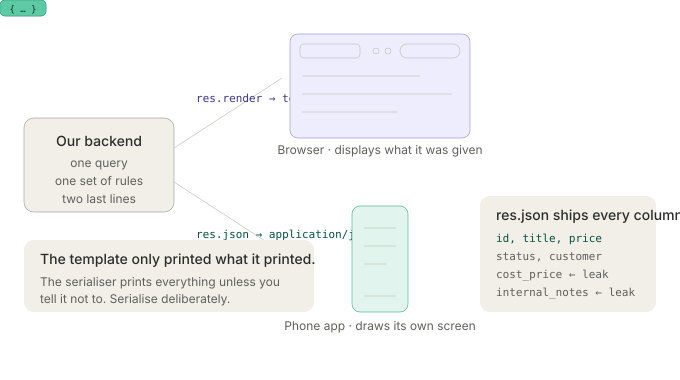
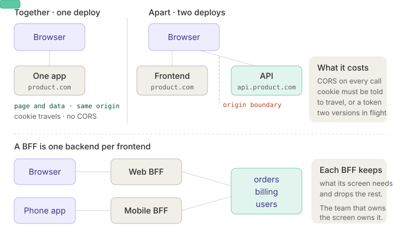

# Class 03 — API, Monolithic App, REST, GraphQL, Part One: Study Guide

Sections 01–05 of the Week-3 deck: the simplest backend, what an API is, one codebase or many, how the screen gets built, and where the frontend is deployed. **REST and GraphQL are part two** — this guide ends exactly where they begin, and §5.5 is the problem they both claim to answer.

Classes 01 and 02 covered how a request reaches your process ([`class-01`](../class-01-study-pack/class-01-how-backend-systems-work-study-guide.md), [`class-02 part one`](../class-02-study-pack/class-02-networking-study-guide.md), [`part two`](../class-02-study-pack/class-02-networking-part-two-study-guide.md)). This class is about what your process *sends back*, and how the code that produces it is arranged.

Each topic has four parts:

- **What it is** — the idea in plain terms, plus the part slides usually skip.
- **Try it** — a command or a few lines of code you run right now and watch.
- **Exercises** — do these without looking at notes.
- **Go deeper** — where to read next.

Tools you'll want up front:

```bash
sudo apt install curl jq nodejs npm      # Debian/Ubuntu
brew install curl jq node                # macOS
```

Plus a browser with devtools open on the Network tab — half of this class is visible there and nowhere else.

One framing to carry through all five sections. Every decision here is the same shape: **you are choosing where a boundary goes.** Between page and data (§2), between modules or processes (§3), between server and browser (§4), between deploys (§5). Boundaries buy independence and cost coordination. Nothing in this class is free, and nothing in it is universally right.

---

# Section 01 — The simplest backend

## 1.1 The server answers with a finished page

**What it is.** The browser asks for a URL. Your code reads the database, fills a template, and sends back HTML — plus the CSS and JavaScript files that HTML references. The browser's job is to display what it was given. This is where nearly every backend starts, and for a large number of products it is where it stays: Wikipedia, GitHub's HTML pages, Shopify storefronts, Basecamp, the admin panel of almost everything.

The word people reach for is "server-side rendering", but that name only became necessary once the alternative existed. Before roughly 2010 this was just "a website".

What actually crosses the wire is one HTTP response whose body is complete:

```
HTTP/1.1 200 OK
Content-Type: text/html; charset=utf-8

<!doctype html>
<html><body>
  <h1>Your orders</h1>
  <ul><li>#1042 · 1,200</li><li>#1043 · 890</li></ul>
</body></html>
```

Two things follow from that, and they are the entire argument for this shape:

- **The data and the markup arrive together.** There is no second request, no loading state, no "what if the data call fails after the page loaded".
- **The server knows who is asking before it renders.** `req.session.userId` is available at template time, so the page is already personalised. There is no flash of an empty dashboard.



**Try it.** Fetch a page that is genuinely server-rendered and look at the body you get *before* any JavaScript runs:

```bash
# the whole page arrives in the first response — the data is already in the HTML
curl -s https://news.ycombinator.com | head -40

# count how much of it is real content vs script tags
curl -s https://news.ycombinator.com | grep -c '<script'

# and how big that first response is
curl -s -o /dev/null -w 'bytes:%{size_download}  time:%{time_total}s\n' https://news.ycombinator.com
```

`curl` runs no JavaScript. Whatever you can see here is what a crawler, a screen reader before hydration, and a browser with a failed JS bundle all see too.

**Exercises.**
1. Run the `curl` above against three sites you use daily. For each, write down whether the visible text appeared in the raw HTML. Which ones would still work with JavaScript switched off?
2. `view-source:` a server-rendered page in your browser and find one value that could only have come from the database. Trace what the server had to know to put it there.
3. This shape sends the same HTML shell on every request even when only one number changed. Name the specific cost of that, and the specific thing it saves you from.
4. Your uptime monitor fetches a page and checks for the string `Your orders`. Under this rendering shape, what does a pass actually prove? Keep this answer — §4.4 will break it.

**Go deeper.**
- [MDN: An overview of HTTP](https://developer.mozilla.org/en-US/docs/Web/HTTP/Overview)
- [The Rails Doctrine](https://rubyonrails.org/doctrine) — the most articulate defence of building this way
- [Server-side rendering, MDN glossary](https://developer.mozilla.org/en-US/docs/Glossary/SSR)

---

## 1.2 A page starts with one route

**What it is.** A route is a pair — a method and a path — bound to a function. When a request matches the pair, the function runs and produces a response. That is the whole abstraction, and every framework in every language is a variation on it.

```js
app.get('/orders', async (req, res) => {
  const orders = await db.orders.findAll({ userId: req.session.userId })
  res.render('orders', { orders })          // sends a page
})
```

Three things are happening in three lines, and it is worth naming them separately because later sections split them apart:

1. **Identify the caller** — `req.session.userId`, read from a cookie the browser sent.
2. **Fetch and apply rules** — the query is scoped to that user. This is authorisation, sitting in the query.
3. **Produce a representation** — `res.render` turns data into HTML.

The method matters as much as the path. `GET` returns something and changes nothing; `POST`, `PUT`, `PATCH` and `DELETE` change something on the server and then answer — in a page-rendering app, usually with a `302` redirect rather than a body, so that a browser refresh doesn't resubmit the form. That redirect-after-POST habit has a name (Post/Redirect/Get) and it exists purely because the browser's back button and refresh are dumb.

**Try it.** Run a real two-route server. Save as `orders.js`, then `node orders.js`:

```js
const http = require('http')
const orders = [{ id: 1042, total: 1200 }, { id: 1043, total: 890 }]

http.createServer((req, res) => {
  if (req.method === 'GET' && req.url === '/orders') {
    const rows = orders.map(o => `<li>#${o.id} · ${o.total}</li>`).join('')
    res.writeHead(200, { 'Content-Type': 'text/html' })
    return res.end(`<!doctype html><ul>${rows}</ul>`)
  }
  if (req.method === 'POST' && req.url === '/orders') {
    orders.push({ id: 1044, total: 500 })
    res.writeHead(302, { Location: '/orders' })   // redirect, don't render
    return res.end()
  }
  res.writeHead(404); res.end('not found')
}).listen(3000, () => console.log('http://localhost:3000/orders'))
```

```bash
curl -s http://localhost:3000/orders                    # the page
curl -si -X POST http://localhost:3000/orders | head -3 # 302 + Location, no body
curl -si http://localhost:3000/nope | head -1           # 404
```

**Exercises.**
1. Add a `GET /orders/:id`-style route to the server above by parsing `req.url` yourself. What did the framework you normally use hide from you?
2. Change the `POST` handler to `res.end(html)` instead of redirecting. Submit a form, then hit refresh in the browser. Describe exactly what the browser asks you and why.
3. Which HTTP methods are safe (change nothing) and which are idempotent (same result if repeated)? Put `POST`, `PUT`, `PATCH` and `DELETE` in the right boxes and justify `PATCH`.
4. A route needs the user id before it can query. Name three places that id could come from and the trust level of each.

**Go deeper.**
- [MDN: HTTP request methods](https://developer.mozilla.org/en-US/docs/Web/HTTP/Methods)
- [MDN: Redirections in HTTP](https://developer.mozilla.org/en-US/docs/Web/HTTP/Redirections)
- [Express routing guide](https://expressjs.com/en/guide/routing.html) — the vocabulary every framework copies

---

## 1.3 The pages and the logic live in one project

**What it is.** In this shape the template and the code that fills it sit in the same repository, run in the same process, and ship in the same deploy:

```
app/
├── routes/       orders.routes.js
├── controllers/  orders.controller.js
├── models/       order.js
├── views/        layout.ejs, orders.ejs      ← the pages
└── public/       style.css, app.js           ← what the browser downloads
```

Two directories deserve attention because they behave completely differently:

- **`views/`** is rendered *on the server*. It never reaches the browser as a file. Secrets referenced there stay on the server.
- **`public/`** is shipped *to the browser* verbatim. Anything in it is public — the name is not decorative. Every API key ever leaked in a frontend bundle was leaked from a directory like this one.

The property that makes this shape cheap: **a change to a page and a change to the query behind it are one commit, one review, one deploy.** Rename a database column and fix the template in the same diff, and there is no window in which they disagree. Section 05 is largely about what you give up when that stops being true.

**Try it.** Prove the split for yourself on any site:

```bash
# what the server rendered — templates are invisible here, only their output
curl -s https://example.com | head -20

# what the browser downloads separately: every static asset the page references
curl -s https://news.ycombinator.com | grep -oE '(src|href)="[^"]+\.(css|js)"'
```

Then fetch one of those asset URLs directly. It comes back as-is — no session, no rendering, no server logic. That is the `public/` half.

**Exercises.**
1. In a project you have locally, list every file that ends up served to the browser. Grep those files for anything that looks like a key or an internal hostname.
2. Why can a server-rendered template safely contain `db.password` in scope while a `public/app.js` cannot, even though both are "in your repo"?
3. One repository, one deploy is listed as a benefit. Write the version of that sentence that is a cost, in the voice of a team of forty people.
4. Where would a CDN sit in this structure, and which of the two directories would it serve?

**Go deeper.**
- [The Twelve-Factor App: Codebase](https://12factor.net/codebase) and [Build, release, run](https://12factor.net/build-release-run)
- [MDN: Static vs dynamic sites](https://developer.mozilla.org/en-US/docs/Learn/Server-side/First_steps/Client-Server_overview)

---

## 1.4 What "simple" actually means here

**What it is.** The slides list the benefits — one release, login is a cookie, one place to change, no outside caller, one copy of the rules. Each is worth restating as the *risk it removes*, because that is what you lose when you leave this shape:

| Benefit | The risk it removes |
|---|---|
| One release to ship | Two deploys can never be out of step, because there is one. |
| Login is a cookie | The server sets it, the browser returns it automatically. No token storage, no refresh flow, no XSS-readable credential. |
| One place to change | A field rename is a compiler/test error, not a runtime surprise in someone else's client. |
| No outside caller | Nobody else depends on your field names, so you may rename them this afternoon. |
| One copy of the rules | The form posts to the app that validates it. Validation cannot drift between two implementations. |

**Simple here means simple in architecture, not simple in capability.** Shopify, GitHub, Basecamp and Stack Overflow are or were monolithic server-rendered apps serving enormous traffic. Stack Overflow famously ran on a handful of servers. "We outgrew the monolith" is nearly always a statement about team size and deploy frequency (§3.7), not about traffic.

The honest counterpoint: this shape has one failure mode and it arrives quietly. Because everything can reach everything, boundaries erode unless someone defends them. The billing code reaches into the orders table, the template calls the model directly, and three years later nothing can be extracted. §3.3 is the deliberate fix.

**Try it.** Measure the coupling in a codebase you have:

```bash
# how many files import from more than one feature area?
grep -rEho "require\('\.\./[a-z]+" --include='*.js' . | sort | uniq -c | sort -rn | head

# git tells you the truth about boundaries: which files change together?
git log --format='%H' --name-only | awk 'NF' | sort | uniq -c | sort -rn | head -20
```

Files that always change together are one module whether your directories say so or not.

**Exercises.**
1. Name a product you use daily that is almost certainly a server-rendered monolith. What evidence from the browser's Network tab would confirm it?
2. "Login is a cookie" is listed as a benefit. Write down the three things a cookie gives you for free that a token does not. (§5.3 will check your answer.)
3. Give one concrete situation where a monolith is the *wrong* first choice on day one. Be specific — vague answers about "scale" don't count.
4. Run the `git log` command above on any repo. Which two directories change together most often? Should they be one module?

**Go deeper.**
- [Modular Monolith: A Primer, Kamil Grzybek](https://www.kamilgrzybek.com/blog/posts/modular-monolith-primer)
- [Stack Overflow's architecture, 2016](https://nickcraver.com/blog/2016/02/17/stack-overflow-the-architecture-2016-edition/) — read the server count
- [Majestic Monolith, DHH](https://signalvnoise.com/svn3/the-majestic-monolith/)

---

# Section 02 — What an API is, and when we need one

## 2.1 API means Application Programming Interface

**What it is.** Three words, each carrying weight:

| The word | What it means here |
|---|---|
| **Application** | Our running software — the process, not the source code. |
| **Programming** | *Other code* calls it. Not a person with a mouse. |
| **Interface** | The agreed way in. Agreed means someone else is relying on it. |

The sentence to keep: **a page is made for a person to read; an API is made for a program to read.** Everything downstream follows from that one difference. A person tolerates a slightly moved button. A program does not tolerate a renamed field — it crashes.

So the real definition of an API isn't technical, it's social: **an API is a promise.** The moment something outside your deploy reads your field names, you have made a commitment about those names, and you can no longer change them on your own schedule. §2.4 is entirely about how expensive that promise is depending on who holds it.

A common confusion worth clearing now: "API" does not mean "JSON over HTTP". A library's function signatures are an API. The Linux syscall table is an API. In this class, "API" means the HTTP kind — but the promise property is what all of them share.

**Try it.** Call one and read what a program is expected to consume:

```bash
# a public HTTP API answering with data, not a page
curl -s https://api.github.com/repos/nodejs/node | jq '{name, stars: .stargazers_count, open_issues}'

# the same server can also answer with a page — same data, different representation
curl -sI https://github.com/nodejs/node | grep -i content-type
curl -sI https://api.github.com/repos/nodejs/node | grep -i content-type
```

Two `Content-Type` values — `text/html` and `application/json` — is the whole distinction, made concrete.

**Exercises.**
1. Fetch any public API and write down five field names it returns. For each, ask: could they rename it tomorrow? What would break?
2. "An API is a promise." Name three things you promise besides field names. (Hint: think about what a client does when your answer is slow, or fails.)
3. Your team's internal API and Stripe's API are both APIs. Write the one sentence that explains why one can change on Tuesday and the other cannot.
4. Find an API you use that returns HTML rather than JSON. Is it still an API? Defend your answer using the three words above.

**Go deeper.**
- [MDN: Introduction to web APIs](https://developer.mozilla.org/en-US/docs/Learn/JavaScript/Client-side_web_APIs/Introduction)
- [GitHub REST API docs](https://docs.github.com/en/rest) — read the deprecation policy, not the endpoints
- [Stripe API reference](https://docs.stripe.com/api) — the canonical example of a promise kept for a decade

---

## 2.2 The same work. A different last line.

**What it is.** This is the most important slide in the section, and it is deliberately anticlimactic:

```js
// answers with a page
app.get('/orders', async (req, res) => {
  const orders = await db.orders.findAll({ userId: req.session.userId })
  res.render('orders', { orders })
})

// answers with data
app.get('/api/orders', async (req, res) => {
  const orders = await db.orders.findAll({ userId: req.user.id })
  res.json({ data: orders })
})
```

Same query. Same authorisation. Same business rules. **The last line is the whole difference.** Adding an API to an existing app is not a rewrite; it is a second representation of work you already do.

Two details in that snippet are not cosmetic, and both are §5.3 in miniature:

- `req.session.userId` versus `req.user.id`. The page route identified the caller from a **cookie the browser attached automatically**. The API route identified it from something the client had to **send deliberately** — usually an `Authorization: Bearer …` header. A phone app has no cookie jar tied to your domain, and a call from another origin will not send your cookie unless you configure it to (§5.2, §5.3).
- `res.json({ data: orders })` wraps the array in an object. That envelope is not decoration: it leaves room to add `meta`, `errors` or pagination later without changing the type of the top-level response. Returning a bare `[…]` is a decision you cannot undo without breaking every client.

And the trap this slide hides: `res.render` never had to decide *which fields* to include, because the template only prints what it prints. `res.json` serialises the whole row. That is how internal notes, cost prices and password hashes get shipped to browsers. **Serialise deliberately, always.**


**Try it.** Watch the leak happen, then fix it:

```js
const http = require('http')
const row = { id: 42, title: 'Blue chair', price: 1200,
              cost_price: 400, internal_notes: 'refunded twice', owner_id: 7 }

http.createServer((req, res) => {
  res.writeHead(200, { 'Content-Type': 'application/json' })
  if (req.url === '/leaky') return res.end(JSON.stringify({ data: row }))
  const { id, title, price } = row                       // deliberate serialisation
  res.end(JSON.stringify({ data: { id, title, price } }))
}).listen(3001, () => console.log('http://localhost:3001/leaky'))
```

```bash
curl -s http://localhost:3001/leaky | jq   # cost_price and internal_notes, shipped
curl -s http://localhost:3001/safe   | jq   # only what the screen needs
```

**Exercises.**
1. Take one `res.render` route from a project you have and write the `res.json` twin. List every field the template *didn't* print — those are the ones the JSON version would leak.
2. Why does `{ data: [...] }` age better than `[...]`? Write the change you'd want to make in six months that the bare array blocks.
3. The page route trusts a session cookie; the API route trusts a bearer token. Name one attack each is exposed to that the other is not.
4. Your ORM's `toJSON()` returns every column by default. Name two mechanisms that would make a leak structurally impossible rather than a thing you must remember.

**Go deeper.**
- [OWASP API Security Top 10 — API3: Excessive Data Exposure](https://owasp.org/API-Security/editions/2023/en/0xa3-broken-object-property-level-authorization/)
- [MDN: Response.json()](https://developer.mozilla.org/en-US/docs/Web/API/Response/json)
- [JSON:API](https://jsonapi.org/) — one opinionated answer to what the envelope should hold

---

## 2.3 Who asks for an API

**What it is.** You don't add an API because it's modern. You add one because a specific caller appeared that a page cannot serve:

| What appears | Why a page is not enough |
|---|---|
| **A phone app** (mobile client) | It draws its own screens with native components. Your HTML is useless to it; it wants values. |
| **Another company's software** (third-party integration) | It reads orders into their system. Nobody is looking at a screen at all. |
| **A screen that updates while open** (SPA) | The page is already loaded and needs fresh data without a reload. |
| **A frontend that deploys on its own** (decoupled frontend) | That team ships on their own clock and asks you for data, not markup (§5.1). |
| **A second service of ours** (internal API) | Billing needs order data and must not reach into the orders database (§3.4). |

Notice what is *not* on this list: "we might need one later", "it's best practice", "the tutorial had one". Each row is a real caller that exists today. The slide's own rule — **stay on the left until one line on the right is true** — is the entire decision procedure:

| The question | Serve the view | Add an API |
|---|---|---|
| Who is asking? | Only our own browser. | A phone app, a partner, a service. |
| Who draws the screen? | The server. | Someone else's code. |
| Does the screen update itself? | No. A form post is fine. | Yes, while it stays open. |

**Try it.** Identify which of these five callers a site has, from the outside:

```bash
# does a mobile app exist? its API is usually a separate hostname
dig +short api.github.com api.stripe.com api.spotify.com

# does the site's own page fetch data after load? look for JSON endpoints in the bundle
curl -s https://example.com | grep -oE 'src="[^"]+\.js"' | head

# public API or not: does an unauthenticated call answer, and how does it refuse?
curl -si https://api.github.com/user | head -3
```

In your browser's Network tab, filter by **Fetch/XHR** on any app you use. An empty list means the page is doing §1.1. A busy list means callers from row 3.

**Exercises.**
1. Open the Network tab on three apps and classify each as "no API calls after load", "a few", or "constant". What does that predict about the code behind them?
2. For each of the five rows, write the one question you'd ask a stakeholder to find out whether that row is true today.
3. A colleague says "let's build API-first so the mobile app is easy later." Give the strongest argument for, then the strongest argument against, then say what you'd actually do.
4. Which of the five callers can you take away later without anyone noticing? Which one can you never take away? Explain the asymmetry.

**Go deeper.**
- [MDN: Using the Fetch API](https://developer.mozilla.org/en-US/docs/Web/API/Fetch_API/Using_Fetch)
- [Nielsen Norman: mobile app vs mobile web](https://www.nngroup.com/articles/mobile-native-apps/) — why native clients need values

---

## 2.4 Public, private, internal

**What it is.** The same code can be exposed to three very different audiences, and the audience — not the code — sets your change velocity:

| Kind | Who can call it | Example |
|---|---|---|
| **Public** | Anyone who signs up for a key. You do not know them. | Stripe, Google Maps, a weather service. |
| **Private** | Named partners you have an agreement with. | A delivery company reading your orders. |
| **Internal** | Only your own apps and services. | Your phone app, your billing service. |

**The wider the audience, the slower you can change it.** An internal API can change this afternoon — you deploy both sides. A private API needs an email, a date and a partner's sprint. A public API can take months, and some fields you will never remove. Stripe still serves API versions from 2011.

The mechanics that follow from the audience, which the slide leaves implicit:

- **Authentication** differs: internal often uses network trust or a service token; private uses issued keys; public needs self-service key issuance, rotation and revocation.
- **Rate limiting** is optional internally and mandatory publicly — an unbounded public endpoint is a free denial-of-service.
- **Versioning** is the direct cost of the promise. Internal: none needed. Public: `/v1/` in the path or a version header, plus a deprecation policy with dates.
- **Documentation** stops being optional the moment a caller can't read your source.

The failure mode to recognise: an internal API that quietly acquired an external caller. Someone shared a URL, a partner scripted against it, and now your "internal" endpoint has a public contract nobody agreed to. **The audience is a fact about who calls you, not about what you named the folder.**

**Try it.** Read how a public API keeps its promise:

```bash
# a public API announces its version and its limits in the headers
curl -si https://api.github.com/repos/nodejs/node | grep -iE 'x-ratelimit|x-github-api-version|deprecat'

# what refusal looks like when you exceed a public limit (headers, not just a 403)
curl -si https://api.github.com/rate_limit | jq -r '.resources.core | "\(.remaining)/\(.limit) resets \(.reset)"' 2>/dev/null \
  || curl -s https://api.github.com/rate_limit | jq '.resources.core'
```

**Exercises.**
1. Pick a public API you use. Find its deprecation policy. How much notice do they promise, and what does that imply about their release process?
2. Your internal API has one external caller you just discovered. List the three options and pick one, with a reason.
3. Why is rate limiting a correctness concern and not just a cost concern? Give a scenario where a missing limit takes the whole product down.
4. Sketch what `/v1/` in a URL actually buys you. What does it *not* solve? (Hint: what happens when v1 and v2 need the same database row?)

**Go deeper.**
- [Stripe: versioning](https://docs.stripe.com/api/versioning) and [how Stripe handles API upgrades](https://stripe.com/blog/api-versioning)
- [OWASP API Security Top 10](https://owasp.org/API-Security/editions/2023/en/0x11-t10/)
- [Google API Improvement Proposals](https://google.aip.dev/) — how a large org writes the promise down

---

## 2.5 Our backend calls APIs too

**What it is.** Everything above assumed you are the callee. Half the time you are the caller: your backend calls a payment provider, a mail service, a map service, and — once you run more than one service — your own APIs the same way (§3.4).

That flip matters because **being a client is where reliability engineering actually happens.** A function call cannot time out. A network call can be slow, arrive twice, or never arrive. Every outbound call needs four things the local call never needed:

1. **A timeout.** Not the default. The default is often infinite, and an infinite wait on a payment provider becomes an outage of yours.
2. **A retry policy, and a rule about what is safe to retry.** Retrying `POST /charges` may charge the card twice. This is why payment APIs support **idempotency keys** — you send a key, they de-duplicate.
3. **A failure decision.** If the mail service is down, is the signup rejected or queued? That is a product decision expressed in code (class 08's queues are the usual answer).
4. **A circuit breaker or budget.** When a dependency is failing, stop calling it. Otherwise your threads all sit in the same doomed wait and the failure spreads to endpoints that never needed that dependency.

Somebody else wrote that API and you live with it. Their rate limit is your rate limit. Their downtime is your downtime unless you designed for it.

**Try it.** Feel each failure mode deliberately:

```bash
# a slow dependency: 5s response, 2s timeout — this is what your code must handle
curl -s --max-time 2 https://httpbin.org/delay/5 ; echo "exit code: $?"

# an unreachable dependency (connection refused, fast failure)
curl -s --max-time 2 http://127.0.0.1:9 ; echo "exit code: $?"

# a dependency that returns 500 — note curl still exits 0; a 500 is a *successful* HTTP call
curl -s -o /dev/null -w 'status:%{http_code} exit-before:' https://httpbin.org/status/500 ; echo $?
```

That last line is the one people get wrong: **the request succeeded and the answer was a failure.** Your client code must check the status, not just catch exceptions.

**Exercises.**
1. Find every outbound HTTP call in a project you have. How many set an explicit timeout? That number is your incident forecast.
2. Which of your outbound calls are safe to retry blindly? For the unsafe ones, describe how an idempotency key would make them safe.
3. Your payment provider is down for 20 minutes. Write the user-visible behaviour you'd choose for checkout, and the behaviour you'd choose for the receipt email. Why do they differ?
4. Your service calls three others sequentially, each with a 10s timeout. What is your worst-case response time, and what should the caller's timeout above you be?

**Go deeper.**
- [Stripe: idempotent requests](https://docs.stripe.com/api/idempotent_requests)
- [AWS Builders' Library: timeouts, retries and backoff with jitter](https://aws.amazon.com/builders-library/timeouts-retries-and-backoff-with-jitter/)
- [Release It!, Michael Nygard](https://pragprog.com/titles/mnee2/release-it-second-edition/) — where "circuit breaker" comes from

---

# Section 03 — One codebase, or many

## 3.1 Three shapes, three names

**What it is.** Three arrangements of the same features, and all three are in production at serious companies today:

| The name | What it means |
|---|---|
| **Monolith** | One codebase. One deploy. |
| **Modular monolith** | One deploy, split into modules with enforced boundaries. |
| **Microservices** | Many codebases. Many deploys. |

**None of them is the best one.** The choice is a trade of *coordination cost* against *independence*, and the right answer moves as the team grows. The one thing worth memorising: the axis is **deployment**, not directories. If two things must ship together, they are one unit no matter how many repositories they live in — that is why §3.6 exists.


**Try it.** Classify real projects by the only test that matters — what does one deploy contain?

```bash
# a monorepo is not a monolith and a monolith is not a monorepo: count deployable units
find . -name 'Dockerfile' -o -name 'Procfile' -o -name 'fly.toml' | head
find . -name 'package.json' -not -path '*/node_modules/*' | wc -l

# how many things does one release actually move?
git log --oneline -20 --name-only | head -40
```

**Exercises.**
1. For a project you know, answer in one sentence each: how many repositories, how many deploys, how many databases? Which number decides its shape?
2. Two services in two repositories always release together. Which shape is that, really? Name it.
3. Why is "we use microservices" an incomplete statement without saying how many teams ship them?
4. Rank the three shapes by (a) time to ship your first feature, (b) time to ship the four-hundredth. Are the rankings the same?

**Go deeper.**
- [Martin Fowler: Microservices](https://martinfowler.com/articles/microservices.html) and [MonolithFirst](https://martinfowler.com/bliki/MonolithFirst.html)
- [Shopify: deconstructing the monolith](https://shopify.engineering/deconstructing-monolith-designing-software-maximizes-developer-productivity)

---

## 3.2 The monolith, and where it starts to hurt

**What it is.** One repository, one deploy, one running process. Every feature lives in the same tree, and a call from orders to billing is a normal function call — no network, no serialisation, no timeout, no partial failure.

```
src/
├── controllers/   order.controller.ts  billing.controller.ts  user.controller.ts
├── services/      order.service.ts     billing.service.ts     user.service.ts
└── models/        order.model.ts       billing.model.ts       user.model.ts
```

Almost every product you use started here, and many never changed. It hurts later, and the pains are specific:

| What we feel | Why it happens |
|---|---|
| One release for everything | A risky migration holds up a one-line fix. |
| Shared resources | One heavy report slows every other request in the process. |
| Scale all of it, or none | Only search needs more memory; everything gets more. |
| Teams wait on each other | One release train, however many teams there are. |

**None of this hurts on day one. It hurts when two teams want to ship on the same afternoon.** That is the actual trigger, and it is organisational.

Notice the directory layout above is grouped **by layer** — all controllers together, all services together. That is the arrangement that makes the boundaries hardest to see: `order.service.ts` and `billing.service.ts` are neighbours, so reaching across is one import away and looks like every other import. §3.3 changes exactly this.

**Try it.** Find the shared-resource pain in a running process:

```js
// blocking.js — one heavy request stalls every other request in the same process
const http = require('http')
http.createServer((req, res) => {
  if (req.url === '/report') {
    const end = Date.now() + 5000
    while (Date.now() < end) {}          // CPU-bound: the event loop is blocked
    return res.end('report done\n')
  }
  res.end('fast\n')
}).listen(3002)
```

```bash
node blocking.js &
curl -s -o /dev/null -w 'fast alone: %{time_total}s\n' http://localhost:3002/fast
curl -s http://localhost:3002/report > /dev/null &          # start the heavy one
sleep 0.3
curl -s -o /dev/null -w 'fast during report: %{time_total}s\n' http://localhost:3002/fast
kill %1
```

The second number is the slide's "shared resources" row, measured. Everything in the process shares one CPU, one heap, one connection pool.

**Exercises.**
1. Run the experiment above and record both numbers. Now explain why moving `/report` to a separate process fixes it — and what new problem that creates.
2. "Scale all of it, or none." If search needs 8 GB and everything else needs 512 MB, what does a ten-instance monolith deployment cost versus a split one? Do the arithmetic.
3. Which of the four pains are technical and which are organisational? Which kind does splitting actually fix?
4. Your monolith deploys once a week because the release is risky. Name three changes that would let it deploy five times a day *without* splitting it.

**Go deeper.**
- [Martin Fowler: MicroservicePremium](https://martinfowler.com/bliki/MicroservicePremium.html)
- [Node.js: don't block the event loop](https://nodejs.org/en/learn/asynchronous-work/dont-block-the-event-loop)

---

## 3.3 A modular monolith sets the boundaries first

**What it is.** Still one deploy, still one process. The difference is that the code is grouped **by feature**, and each module exposes exactly one public entry point:

```
src/
├── modules/
│   ├── orders/
│   │   ├── index.ts            ← the only import other modules may use
│   │   ├── order.service.ts    private to orders
│   │   ├── order.repository.ts private to orders
│   │   └── order.model.ts      private to orders
│   ├── billing/index.ts
│   └── users/index.ts
└── shared/
```

Two rules make it real, and without enforcement it degrades to §3.2 within a quarter:

1. **Modules follow the business, not the layers.** Orders, billing, users — not controllers, services, models.
2. **The rest of the app imports `index.ts` and nothing else.** `import { chargeOrder } from '../billing'` is legal; `import { BillingRepository } from '../billing/billing.repository'` is not.

This is the highest-leverage arrangement in the whole section, and the reason is arithmetic: **you get most of the boundary and none of the network.** A module call is still a function call — it cannot time out, arrive twice, or fail halfway. And if a module later needs to become a service, its callers already go through one door, so you replace the inside of `index.ts` with an HTTP client and the rest of the app doesn't notice.

Enforcement is the whole game. Directory conventions are not enforcement — humans in a hurry are the failure mode. Use tooling: ESLint `no-restricted-imports`, TypeScript project references, Java modules, `.internal` package conventions, or an import-boundary linter in CI. A rule nobody can break beats a rule everybody agreed to.

**Try it.** Enforce a boundary in one file. In an ESLint config:

```json
{
  "rules": {
    "no-restricted-imports": ["error", {
      "patterns": [{
        "group": ["**/modules/*/!(index)*", "!**/modules/*/index"],
        "message": "Import a module through its index.ts only."
      }]
    }]
  }
}
```

Then prove it fails:

```bash
mkdir -p src/modules/billing && echo 'export const x = 1' > src/modules/billing/billing.repository.ts
echo "import { x } from '../billing/billing.repository'" > src/modules/orders/bad.ts
npx eslint src/modules/orders/bad.ts     # should error, not warn
```

If your CI doesn't fail on that line, you have directories, not modules.

**Exercises.**
1. Take a codebase you have and draw its modules by feature, ignoring the current directories. How many of your existing files would move?
2. Which is the harder boundary to enforce — code imports or database tables? Two modules in one process usually share one database. What stops orders from `SELECT`ing billing's tables?
3. A module needs data from two others to render one screen. Where does that coordination live: in one of the modules, or above all three? Justify.
4. Write the `index.ts` for an `orders` module: exactly which functions does the rest of the app need, and which does it merely *use today* out of convenience?

**Go deeper.**
- [Modular Monolith: A Primer, Kamil Grzybek](https://www.kamilgrzybek.com/blog/posts/modular-monolith-primer)
- [Simon Brown: Modular monoliths (talk)](https://www.youtube.com/watch?v=5OjqD-ow8GE)
- [ESLint no-restricted-imports](https://eslint.org/docs/latest/rules/no-restricted-imports)

---

## 3.4 Microservices put the boundary on the network

**What it is.** Each service is its own codebase, its own deploy, and — this is the load-bearing part — **its own database.** No service reads another service's tables. It asks over the network instead.

That rule is the whole point, and it is the first one people break. The moment billing runs a `JOIN` against the orders tables, you no longer have two services; you have two processes that cannot be deployed independently, which is strictly worse than one (§3.6).

What the network boundary genuinely buys:

- **Independent deploys.** The billing team ships at 11:00 without asking the orders team.
- **Independent scaling.** Search gets eight instances; everything else gets two.
- **Independent failure**, *if you design for it.* Billing being down should degrade checkout, not delete it. This is not automatic — it takes explicit fallbacks.
- **Independent technology.** Rarely the real reason, and rarely worth it on its own.

And what it costs, which §3.5 measures: everything that used to be a function call is now a request that can be slow, duplicated, or lost.

**Try it.** Turn a function call into a network call and watch what appears:

```js
// billing.js — the "other service"
require('http').createServer((req, res) => {
  if (Math.random() < 0.2) return req.socket.destroy()       // 20%: the connection just dies
  const delay = 50 + Math.floor(Math.random() * 500)         // sometimes slower than our timeout
  setTimeout(() => res.end(JSON.stringify({ paid: true })), delay)
}).listen(3003)
```

```js
// orders.js — the caller, with the four things a function call never needed
const call = async () => {
  const ctrl = new AbortController()
  const t = setTimeout(() => ctrl.abort(), 300)            // timeout
  try {
    const r = await fetch('http://localhost:3003/', { signal: ctrl.signal })
    if (!r.ok) throw new Error('status ' + r.status)        // a 500 is not an exception
    return await r.json()
  } finally { clearTimeout(t) }
}
call().then(r => console.log('ok:', r)).catch(e => console.log('failed:', e.message))
```

```bash
node billing.js & sleep 0.5
for i in $(seq 1 10); do node orders.js; done
kill %1
```

Run it ten times. Some print `ok`, some abort on the timeout, some fail outright on a dropped connection (`fetch failed`). **Every one of those outcomes is new code you now have to write** — and none of it existed when this was `billing.charge(order)`.

**Exercises.**
1. Run the loop above. Count the outcomes. Now write the retry logic — and say which of the three failure modes it is *unsafe* to retry.
2. "No service reads another service's tables." Give the two-sentence explanation you'd use with a manager who wants to skip that rule to save a sprint.
3. Orders needs a customer's name to render a list of 50 orders. Naively that's 50 calls to the users service. Name two fixes and the cost of each.
4. A single user action touches three services and must either fully happen or not at all. Name what you've lost from the monolith, and look up what people use instead.

**Go deeper.**
- [Martin Fowler: Microservice Trade-Offs](https://martinfowler.com/articles/microservice-trade-offs.html)
- [Sam Newman: Building Microservices, 2nd ed.](https://samnewman.io/books/building_microservices_2nd_edition/)
- [Fallacies of distributed computing](https://en.wikipedia.org/wiki/Fallacies_of_distributed_computing) — read all eight, then read them again

---

## 3.5 What splitting actually costs

**What it is.** Before: orders → billing → users, three boxes in one process, two function calls. After: four services and five network calls. **Every one of those amber lines is code you now have to write**, and the list is longer than people expect:

| What was free | What it costs now |
|---|---|
| The call always returns | Timeouts, retries, backoff, circuit breakers |
| The call happens once | Duplicate delivery — so idempotency, everywhere |
| One transaction | Partial success across services; compensating actions |
| One stack trace | Distributed tracing, correlation IDs (class 09) |
| One log file | Log aggregation, or you are debugging blind |
| One deploy of one version | Two versions of every contract live at once |
| `localhost` | Service discovery, TLS between services, network policy |
| One database's consistency | Data that is briefly, visibly wrong in two places |

The latency arithmetic is the part that surprises people. A function call is nanoseconds. A same-datacentre HTTP call is ~1 ms of network plus serialisation, and a chain of four sequential calls is 4 ms *before* any work happens. Add one slow dependency at p99 and every service above it inherits that p99. This is why a "microservice" architecture can be slower than the monolith it replaced, even on faster hardware.

**Try it.** Measure the two costs — the call itself, and a chain of them:

```bash
# a local function call vs a local HTTP call, same work
node -e '
const t=process.hrtime.bigint; const f=x=>x+1;
let s=t(); for(let i=0;i<1e6;i++) f(i); console.log("1M function calls:", Number(t()-s)/1e6, "ms");
'
# one local HTTP round trip, repeated
node -e 'require("http").createServer((q,r)=>r.end("ok")).listen(3004)' &
sleep 0.5
curl -s -o /dev/null -w 'one local HTTP call: %{time_total}s\n' http://localhost:3004/
for i in 1 2 3 4; do curl -s -o /dev/null http://localhost:3004/; done
kill %1
```

Compare the per-call numbers. Now imagine that call crossing a datacentre, with TLS, four deep.

**Exercises.**
1. Run the measurement. What is the ratio between a function call and a local HTTP call? Between a local call and one to a public API (`curl -w` against any HTTPS host)?
2. Four services, each 99.9% available, called sequentially in one request. What is the availability of that request? Now do it with a fallback on one of them.
3. Pick three rows from the cost table and say which tool or class in this course addresses each.
4. Your p99 got worse after splitting even though each service is fast. Explain how, using the word "tail".

**Go deeper.**
- [AWS Builders' Library: Timeouts, retries, backoff](https://aws.amazon.com/builders-library/timeouts-retries-and-backoff-with-jitter/)
- [The Tail at Scale, Dean & Barroso](https://research.google/pubs/the-tail-at-scale/)
- [OpenTelemetry: what tracing is for](https://opentelemetry.io/docs/concepts/observability-primer/)

---

## 3.6 Split the code, keep the one database — the trap

**What it is.** Two services. One shared database. People build this constantly, and it is the single most common way a microservice migration goes wrong.

It looks cheaper: nothing to copy, nothing to keep in sync, no distributed transaction, no data duplication. And then one team renames a column, the other service breaks in production, and now **both must deploy together again** — which was the exact thing splitting was supposed to buy.

That shape has a name: the **distributed monolith**. You have paid every cost in §3.5 and kept every constraint of §3.2. It is strictly the worst option available, and it is easy to arrive at accidentally.

It isn't only the shared database. Three symptoms, any one of which is enough:

- **Shared tables** — one service's schema change breaks another.
- **Lockstep releases** — "deploy A then B, in that order, within the same window".
- **Synchronous call chains with no fallback** — service D down means A returns 500, so all four are one availability unit.

The test is a single question: **can I deploy this service, right now, without telling anybody?** If the answer is no, it is not an independent service, whatever the org chart says.

**Try it.** Reproduce the break in ninety seconds with SQLite:

```bash
sqlite3 shop.db "CREATE TABLE orders(id INTEGER, total INTEGER); INSERT INTO orders VALUES(1042,1200);"

# "orders service" and "billing service" both read the same table
sqlite3 shop.db "SELECT id, total FROM orders;"           # orders service: fine
sqlite3 shop.db "SELECT id, total FROM orders;"           # billing service: fine

# the orders team ships a rename. their code is updated. billing's is not.
sqlite3 shop.db "ALTER TABLE orders RENAME COLUMN total TO amount_cents;"
sqlite3 shop.db "SELECT id, total FROM orders;"           # billing service: broken in production
```

The rename was a one-line migration reviewed by the orders team alone. That is precisely the point.

**Exercises.**
1. Run the sequence above. Now design the same change as a safe rollout: what are the steps if the two services must never break? Count the deploys.
2. Apply the deploy test to a system you know. List every pair of components that cannot deploy independently.
3. Is a shared *read-only* replica also a distributed monolith? Argue both sides, then decide.
4. Two services genuinely need the same data. Name three ways to give it to them without a shared table, and the trade-off each makes.

**Go deeper.**
- [Database per service pattern](https://microservices.io/patterns/data/database-per-service.html)
- [Expand/contract migrations (parallel change)](https://martinfowler.com/bliki/ParallelChange.html)
- [Change Data Capture / outbox pattern](https://microservices.io/patterns/data/transactional-outbox.html)

---

## 3.7 How to decide, honestly

**What it is.** Three questions settle it, and none of them is about traffic:

| The question | Stay as one | Split it |
|---|---|---|
| How many people ship this? | Under ten. | Several teams, blocking each other. |
| How often does it go out? | A few times a week. | Many times a day, team by team. |
| What must survive a failure? | Nothing in particular. | One part must stay up while another is down. |

**Splitting looks attractive long before it pays.** The modular monolith (§3.3) gives you most of the boundary and none of the network, which is why it is the right default for the overwhelming majority of teams — and why "monolith first" is the standard advice.

Two additions the slide leaves out:

- **Extract one service, not twelve.** If something must split, pick the piece with the clearest boundary and the strongest independent reason (usually: different scaling profile, different failure requirement, or a different team). Learn what it costs. Then decide about the next one.
- **The organisation predicts the architecture.** Conway's law is descriptive, not aspirational: your system will end up shaped like your communication structure. If you want three independent services, you need three teams who can decide independently. Buying the architecture without the org gets you a distributed monolith.

**Try it.** Score a system you actually work on:

```bash
# how many people ship this, really?
git log --since='6 months ago' --format='%an' | sort -u | wc -l

# how often does it go out?
git tag --sort=-creatordate | head -20
git log --since='3 months ago' --oneline --merges | wc -l

# where the change actually concentrates — the candidate for extraction
git log --since='6 months ago' --name-only --format='' | grep -v '^$' | cut -d/ -f1-2 | sort | uniq -c | sort -rn | head
```

Three numbers, one honest answer.

**Exercises.**
1. Run the three commands on a repo you work on. Based only on those numbers, which shape does it want? Does that match what it is?
2. Name a system where "one part must stay up while another is down" is a hard requirement. What is the part, and what does it protect?
3. Conway's law: describe a split that would fail purely because of the org chart, with no technical problem at all.
4. You've been asked to split a monolith that four people ship twice a week. Write the two-paragraph reply you'd actually send.

**Go deeper.**
- [Martin Fowler: MonolithFirst](https://martinfowler.com/bliki/MonolithFirst.html) and [Conway's Law](https://martinfowler.com/bliki/ConwaysLaw.html)
- [Shopify: deconstructing the monolith](https://shopify.engineering/deconstructing-monolith-designing-software-maximizes-developer-productivity)
- [Team Topologies](https://teamtopologies.com/) — the org half of the decision

---

# Section 04 — How the screen is built

## 4.1 Three ways to build the screen

**What it is.** Someone has to turn data into HTML. There are exactly three answers to *who*, and the choice decides what your backend sends:

| The name | Who makes the HTML | What happens next |
|---|---|---|
| **MPA** — multi-page application | The server, for every page. | Nothing. The next click asks the server again. |
| **SPA** — single-page application | Nearly nothing. An empty shell. | JavaScript builds the screen and keeps it. |
| **Hybrid** — SSR plus hydration | The server, for the first page. | JavaScript attaches to that HTML and takes over. That step is **hydration**. |

The note on this slide is the one people miss: **"SSR" only says the server made the HTML. It does not say whether JavaScript then takes over.** So there are really two questions, and mixing them up causes most of the confusion in this area:

1. **Where was the HTML made?** Server, browser, or at build time.
2. **Does JavaScript take over afterwards?** Yes or no.

MPA is "server / no". SPA is "browser / yes". Hybrid is "server / yes". The fourth combination — "browser / no" — doesn't exist, and that tells you the two questions aren't independent as often as people assume.


> **Interactive version:** open [`rendering-modes-console.html`](rendering-modes-console.html) in a browser. Pick a mode, step through what the browser receives request by request, then switch off JavaScript or view it as a crawler and watch what survives.

**Try it.** Ask any site which one it is, from the command line:

```bash
# MPA / hybrid: the content is in the first response
curl -s https://news.ycombinator.com | grep -oE '<title>[^<]+' | head -1
curl -s https://news.ycombinator.com | grep -o 'titleline' | wc -l    # 30 stories, in the HTML

# SPA: an almost-empty body, one root element, and an apology for crawlers
curl -s https://excalidraw.com/ | grep -oE '<div id="[^"]+"></div>|<noscript>[^<]*'
```

The test that never lies: **does the text you can see in the browser appear in `curl`'s output?** Yes → the server made it. No → the browser did.

**Exercises.**
1. Run the test on five sites — a news site, a bank, a dashboard, a docs site, a social app. Classify each. Any surprises?
2. Why is "we use SSR" an incomplete description of an app's rendering? Write the follow-up question in one sentence.
3. The "browser / no JavaScript takeover" combination doesn't exist. Explain why in terms of who would have made the HTML.
4. Which mode would you pick for: a marketing homepage, an internal admin panel, a public docs site, a trading dashboard? One line each.

**Go deeper.**
- [web.dev: Rendering on the web](https://web.dev/articles/rendering-on-the-web) — the canonical taxonomy
- [Next.js: rendering fundamentals](https://nextjs.org/docs/app/building-your-application/rendering)

---

## 4.2 What the browser actually receives

**What it is.** The difference is visible in the first response body, and nowhere else. Three modes, same page:

```html
<!-- MPA · GET /orders -->
<ul>
  <li>#1042 · 1,200</li>
  <li>#1043 · 890</li>
</ul>
<!-- full page. no JavaScript needed to see it. -->
```

```html
<!-- SPA · GET / -->
<div id="root"></div>
<script src="/app.js"></script>
<!-- then, in the browser: -->
<!-- createRoot(root).render(<App/>) ; await fetch('/api/orders') -->
```

```html
<!-- HYBRID · GET /orders -->
<div id="root">
  <ul><li>#1042 · 1,200</li></ul>          <!-- server already rendered it -->
</div>
<script>window.__DATA__ = { … }</script>   <!-- the same data, for JS to reuse -->
<script src="/app.js"></script>
<!-- then: hydrateRoot(root, <App/>) -->
```

**Look at `#root`. Empty means the browser builds everything. Filled means the server did it once and JavaScript is only taking over.**

The hybrid case has one detail worth understanding, because it explains a category of bug: the page is sent *twice* — once as HTML, once as `window.__DATA__` (or a `<script type="application/json">` block). That duplication exists so JavaScript can rebuild its component tree without a second round trip. If the server's data and the client's first render disagree — a timestamp, a random id, a locale-dependent date — React logs a **hydration mismatch** and throws away the server's markup. The visible symptom is a flash where the page re-renders from scratch, and the cause is almost always something non-deterministic in the render.

**Try it.** Read all three artefacts on a real hybrid site:

```bash
# the server-rendered markup
curl -s https://nextjs.org/ | grep -o '<div id="__next"' | head -1

# the embedded data payload that JS will hydrate from
curl -s https://nextjs.org/ | grep -oE '__NEXT_DATA__|self.__next_f' | head -3

# how big the first response is compared to a pure SPA shell
curl -s -o /dev/null -w 'nextjs.org: %{size_download} bytes\n' https://nextjs.org/
curl -s -o /dev/null -w 'example.com: %{size_download} bytes\n' https://example.com/
```

**Exercises.**
1. Find a hybrid site and extract its embedded data payload. Is any of it data the user isn't allowed to see? (This is a real and common leak.)
2. Why does hybrid send the data twice? Describe what would break if it sent only the HTML.
3. Name three things that cause a hydration mismatch. For each, say how you'd make it deterministic.
4. In devtools, disable JavaScript and reload an MPA, an SPA and a hybrid app. Write down what remains in each case.

**Go deeper.**
- [React: hydrateRoot and hydration mismatches](https://react.dev/reference/react-dom/client/hydrateRoot)
- [web.dev: Rendering on the web — hydration](https://web.dev/articles/rendering-on-the-web#rehydration)

---

## 4.3 MPA: every click is a new document

**What it is.** Click a link, the browser throws the current page away and asks for the next one. The server renders every page. This is the browser's native model, and its consequences are almost all in your favour:

- **History, the back button, deep links and refresh all work.** You wrote no code for any of them.
- **Loading states are the browser's job.** The tab spinner is the loading state.
- **Nothing on the page survives the jump** — which is a constraint, not always a cost. State lives in the URL, the session or the database, so it's shareable and refresh-proof.
- **Accessibility defaults are correct.** Focus moves to the new document; screen readers announce it. In an SPA, you must do this yourself, and most don't.

The cost is the flip side: every navigation re-sends the whole shell, and anything genuinely live on the page (a partially filled form, an open editor, a scroll position) is gone. WordPress, Rails, Laravel and Django default to this, and the modern versions of these frameworks (Turbo, Livewire, LiveView, HTMX) mostly try to keep the model while swapping only the changed fragment.

**Try it.** Watch a whole document arrive on every click:

```bash
# three navigations, three complete documents
for p in / /newest /ask; do
  curl -s -o /dev/null -w "$p  %{size_download} bytes\n" "https://news.ycombinator.com$p"
done

# and the same shell — nav, search form, footer — is inside every one of them
for p in / /newest /ask; do
  printf '%-9s nav links: ' "$p"; curl -s "https://news.ycombinator.com$p" | grep -o 'yclinks' | wc -l
done
```

In the browser: open the Network tab, filter to **Doc**, and click around. One document per click, and the Fetch/XHR tab stays empty.

**Exercises.**
1. Run the loop above. The shell is in all three responses. Estimate what proportion of each page is that shell, and name the technique (§4.3, last paragraph) that avoids re-sending it.
2. An MPA gets the back button for free. List four other browser behaviours it gets free that an SPA must reimplement.
3. "Nothing on the page survives the jump." Name one feature this makes hard, and one class of bug it makes impossible.
4. HTMX and Turbo swap page fragments over the wire. Which of §4.1's two questions does that change, and which does it leave alone?

**Go deeper.**
- [Hotwire / Turbo](https://turbo.hotwired.dev/handbook/introduction)
- [HTMX essays](https://htmx.org/essays/) — the strongest modern case for the MPA model
- [MDN: the browser's navigation model](https://developer.mozilla.org/en-US/docs/Web/API/History_API)

---

## 4.4 SPA: one document, and JavaScript swaps the screen

**What it is.** The browser loads one document once. After that, JavaScript fetches data and redraws part of the screen. No reload. **The backend stops sending HTML and starts sending JSON** — which is the sentence that connects this section to §2.

What it costs, and each of these is a real engineering budget line:

| The cost | What it means for us |
|---|---|
| **The first screen is slower** | JavaScript must download, parse and run before anything appears. On a mid-range phone that's seconds, not milliseconds. |
| **Search engines see an empty page** | Our HTML is nearly empty. Google usually renders JS; most other crawlers, link previews and social unfurlers do not. |
| **We own routing and state** | The URL changes without asking the server. History, the back button, scroll restoration, focus management and loading states all become our code. |

Two costs the slide doesn't list and that bite in production:

- **Two sources of truth for "is the user logged in".** The server knows; the JavaScript app thinks it knows. Token expiry mid-session is the classic symptom (§5.3).
- **Error handling moves to the client.** In an MPA a failed query is a 500 page. In an SPA it's a component that must decide between a spinner, a retry, an empty state and an error — for every panel on the screen.

**An SPA is the right answer for a dashboard people keep open all day. It is a poor answer for a marketing page nobody logs into.**

And here is the §1.1 exercise, revisited: an uptime check that fetches HTML and greps for `Your orders` **passes on a completely broken SPA**, because the shell always renders. Checking an SPA means checking the API endpoints it calls, or driving a real browser.

**Try it.** Prove the crawler problem and the empty-shell problem in one go:

```bash
# what a crawler that doesn't run JavaScript sees on an SPA
curl -s https://excalidraw.com/ | tr -d '\n' | grep -oE '<body.{0,220}'; echo

# the shell answers 200 even if every API behind it is down —
# so this is a useless health check for an SPA:
curl -s -o /dev/null -w 'shell status: %{http_code}  bytes: %{size_download}\n' https://excalidraw.com/

# a useful one checks the data the screen actually needs:
curl -s -o /dev/null -w 'api status: %{http_code}\n' https://api.github.com/repos/nodejs/node
```

**Exercises.**
1. Disable JavaScript in devtools and load three SPAs. Screenshot what remains. Would a customer call that "up"?
2. Rewrite your §1.1 exercise-4 answer: what should an uptime check for an SPA actually assert?
3. The first screen is slower. Name three techniques that reduce that, and which of §4.1's questions each one changes.
4. Your marketing team says social link previews show a blank card. Explain the cause in one sentence and name two fixes.

**Go deeper.**
- [web.dev: Core Web Vitals](https://web.dev/articles/vitals) — LCP is where the SPA cost shows up
- [Google Search Central: JavaScript SEO basics](https://developers.google.com/search/docs/crawling-indexing/javascript/javascript-seo-basics)
- [Script evaluation and long tasks](https://web.dev/articles/script-evaluation-and-long-tasks) — what the bundle costs after it downloads

---

## 4.5 Hybrid: server-rendered, then hydrated

**What it is.** The server renders the first page so something appears immediately; then JavaScript attaches and the app behaves like an SPA from there. Next.js, Nuxt and SvelteKit are built around this, and they let you choose **per page** — which is why "our app is SSR" is usually false at the granularity that matters.

Hydration is not free, and understanding why explains most of the last five years of frontend churn: the browser must download the same components the server already ran, re-execute them to rebuild the component tree, and attach event handlers. Until that finishes, the page **looks** ready and doesn't respond to clicks. That gap has a metric — Interaction to Next Paint — and it is the specific reason for streaming SSR, islands architecture, partial hydration and server components. Each is an attempt to hydrate less.

The decision rule that survives all the framework names:

- Content that must be visible to crawlers and instantly readable → render on the server.
- Interactivity that only some users reach → send that JavaScript only when they reach it.
- A page with no interactivity at all → don't ship a bundle for it.

**Try it.** See the two payloads and the gap between them:

```bash
# server-rendered markup arrives first
curl -s https://nextjs.org/ -o /tmp/first.html
wc -c /tmp/first.html

# then the bundles the browser must fetch and execute before it responds to clicks
grep -oE 'src="/_next/static/[^"]+\.js"' /tmp/first.html | head -5
```

In the browser: Performance tab → record a reload. The gap between "the text painted" and "the long tasks finished" is hydration, visible as a solid block of scripting.

**Exercises.**
1. Record a Performance profile on a hybrid site. Measure the gap between first paint and the end of the main-thread work. Click something during it — does it respond?
2. Why can a hybrid page be *worse* than an MPA for a user on a slow phone? Be specific about what gets downloaded.
3. "Islands architecture" hydrates only some components. Which of §4.1's two questions does that change?
4. Your app has 40 pages; 6 are interactive. Sketch the rendering decision for each group and what you'd ship.

**Go deeper.**
- [Islands architecture, Jason Miller](https://jasonformat.com/islands-architecture/)
- [React Server Components](https://react.dev/reference/rsc/server-components)
- [web.dev: Interaction to Next Paint](https://web.dev/articles/inp)

---

## 4.6 Where the HTML gets built

**What it is.** The same taxonomy, asked as a *when* question rather than a *who* question:

| Approach | Who builds the HTML | Good for |
|---|---|---|
| **Static** | Once, at deploy time. Served as a file. | Docs, blogs, marketing pages. |
| **Server rendered** | Per request, on the server. | Pages that differ per user. |
| **In the browser** | After JavaScript loads. | Apps behind a login. |

**This sheet answers one question: where is the HTML made? Whether JavaScript then takes over is the other question** (§4.1). Next.js, Nuxt and SvelteKit mix all three, page by page — and they add a fourth point on the line, incremental regeneration: built statically, then rebuilt on a schedule or on demand.

The backend consequence is the part that matters for this class:

- **Static** → your backend serves files, and can be a CDN with no application at all. The page cannot depend on who is asking.
- **Server rendered** → your backend does work per request. Caching is now your problem, and it's hard, because the answer differs per user (class 06).
- **In the browser** → your backend serves JSON and nothing else. Every screen becomes an API design question (§5.5).

The dividing question is simple: **does this page differ per user?** If not, build it once. Serving a personalised page and a public page through the same path is how caches leak one user's data to another.

**Try it.** Tell the three apart from the response headers:

```bash
# static: strong caching, an ETag, often a CDN hit
curl -sI https://developer.mozilla.org/en-US/docs/Web/HTTP | grep -iE 'cache-control|etag|age|x-cache|server'

# per-user: no-store or private, and usually a Set-Cookie
curl -sI https://github.com/settings/profile | grep -iE 'cache-control|set-cookie|location'

# a JSON API: what does it say about caching?
curl -sI https://api.github.com/repos/nodejs/node | grep -iE 'cache-control|etag'
```

`Cache-Control: private` or `no-store` is a page that differs per user. `public, max-age=…` is a page that doesn't.

**Exercises.**
1. Run the three commands. For each site, say where its HTML was built, using only the headers as evidence.
2. Name a page on a product you know that is currently server-rendered but could be static. What is stopping it?
3. What goes wrong if a personalised page is served with `Cache-Control: public, max-age=600` through a CDN? Describe the incident.
4. Incremental static regeneration: which two rows of the table is it between, and what does it trade?

**Go deeper.**
- [MDN: HTTP caching](https://developer.mozilla.org/en-US/docs/Web/HTTP/Caching)
- [Next.js: caching and revalidation](https://nextjs.org/docs/app/building-your-application/caching)
- [Jamstack](https://jamstack.org/what-is-jamstack/) — the static end of the line, argued

---

# Section 05 — Where the frontend is deployed

## 5.1 One deploy, or two

**What it is.** The frontend can ship inside the backend's deploy, or on its own:

- **Together** — one app serves the page and the data. One build, one deploy, one address: `product.com`.
- **Apart** — two builds, two deploys, two addresses: `product.com` for the frontend, `api.product.com` for the API.

**Splitting the frontend out is a real decision, not a detail.** It changes how you deploy, how you log in, and where CORS shows up — the next four subsections are all consequences of this one choice.

What "apart" genuinely buys: the frontend team deploys without waiting for a backend release; the frontend can go to a CDN and be served from the edge; the two can scale and fail independently; and the API is forced to be a real API, because there is no shortcut through a shared template.

What it costs is everything in §5.2–§5.4, plus a subtler one — **there is no longer a single "the app is deployed" moment.** Two versions are always in flight, and any pair of them can meet in a user's browser.


**Try it.** Tell from outside whether a product is split:

```bash
# does the data come from a different host than the page?
curl -s https://github.com | grep -oE 'https://[a-z.]*github[a-z.]*\.com' | sort -u | head

# a separate API host almost always exists on split deployments
for h in api.github.com api.stripe.com api.slack.com; do
  printf '%-20s ' "$h"; curl -s -o /dev/null -w '%{http_code}\n' "https://$h/"
done
```

In the browser: Network tab → look at the **Domain** column. More than one domain answering your app's own requests means it's split.

**Exercises.**
1. Check three apps you use. For each, is the page and the data on the same origin? What does that predict about their team structure?
2. Write the list of things that must be true before a frontend team can deploy without the backend team. Is a separate address one of them?
3. "Two versions are always in flight." Name the specific bug class that follows, then read §5.4.
4. A reverse proxy can put a separately-deployed frontend and API on the *same* origin (`/api/*` → the API). Which costs in §5.2–§5.3 disappear? Which remain?

**Go deeper.**
- [MDN: Origin](https://developer.mozilla.org/en-US/docs/Glossary/Origin)
- [web.dev: Same-origin policy](https://web.dev/articles/same-origin-policy)

---

## 5.2 CORS is a browser rule, not a server control

**What it is.** Once the page is on `product.com` and the API is on `api.product.com`, they are **different origins** (origin = scheme + host + port; `https://product.com` and `https://api.product.com` differ, and so do `http` and `https` versions of the same host, and `:3000` versus `:8080`).

By default the browser will make the request but **refuse to let your JavaScript read the response** unless the API says the calling origin is allowed. That permission is **CORS** — Cross-Origin Resource Sharing — expressed in response headers:

```
Access-Control-Allow-Origin: https://product.com
Access-Control-Allow-Credentials: true
```

Four points that clear up most CORS confusion:

1. **CORS is enforced by the browser, for browsers.** `curl`, your backend, a phone app and a script ignore it entirely. It protects *your users from other websites*, not your API from attackers. An endpoint with no authentication is wide open regardless of its CORS headers.
2. **The server does not "block" the request.** For a simple request the server usually already ran the handler — the browser blocks *your script from reading the answer*. Anything with side effects has already happened.
3. **Some requests get a preflight first.** A `GET` with ordinary headers goes straight out. Anything else — a `PUT`/`DELETE`, a custom header like `Authorization` or `X-Request-Id`, a `Content-Type: application/json` body — makes the browser send an `OPTIONS` request first and wait for permission. That is one extra round trip before every such call.
4. **`Access-Control-Allow-Origin: *` and credentials are mutually exclusive.** If you send cookies, you must name the exact origin. The browser rejects the wildcard with credentials, on purpose.

**Try it.** Watch the headers appear and disappear:

```bash
# what a fully public API says: any origin may read this
curl -sI -H 'Origin: https://example.com' https://api.github.com/repos/nodejs/node \
  | grep -i 'access-control-allow'

# a preflight, exactly as a browser sends it before a PUT with a JSON body
curl -si -X OPTIONS https://api.github.com/repos/nodejs/node \
  -H 'Origin: https://example.com' \
  -H 'Access-Control-Request-Method: PUT' \
  -H 'Access-Control-Request-Headers: content-type,authorization' | head -12

# your own server, to see the other half — an API that answers only one origin
node -e '
require("http").createServer((q,r)=>{
  const ok = q.headers.origin === "https://product.com";
  const h = { "Content-Type":"application/json" };
  if (ok) { h["Access-Control-Allow-Origin"] = q.headers.origin;
            h["Access-Control-Allow-Credentials"] = "true"; }
  r.writeHead(200,h); r.end(JSON.stringify({ data:[{id:42}] }))
}).listen(3010)' &
sleep 0.5
curl -sI -H 'Origin: https://product.com' http://localhost:3010/ | grep -i access-control
curl -sI -H 'Origin: https://evil.test'   http://localhost:3010/ | grep -i access-control || echo '(no permission — a browser would refuse to hand this to the script)'
curl -s  -H 'Origin: https://evil.test'   http://localhost:3010/    # …and yet the data arrives here
kill %1
```

Two things to take from that last pair. GitHub answers `Access-Control-Allow-Origin: *` for everybody, because a public read-only API has nothing to protect at the browser layer — while an API that accepts cookies must name one exact origin (§5.3). And the final line is the decisive one: **`curl` got the data with no permission at all. CORS never stopped anything outside a browser.**

**Exercises.**
1. Run all three commands. Which headers only appear when `Origin` is sent, and why does that make sense?
2. A colleague says "we fixed the security hole by setting CORS." What is wrong with that sentence? Write the correction.
3. Which of these need a preflight: `GET` with no custom headers; `POST` with `Content-Type: application/json`; `POST` from a `<form>`; `DELETE`? Explain the odd one out.
4. Your app makes 30 cross-origin API calls per screen and each is preflighted. What is the cost, and which response header reduces it?

**Go deeper.**
- [MDN: Cross-Origin Resource Sharing (CORS)](https://developer.mozilla.org/en-US/docs/Web/HTTP/CORS) — read the "simple requests" section twice
- [MDN: Access-Control-Max-Age](https://developer.mozilla.org/en-US/docs/Web/HTTP/Headers/Access-Control-Max-Age)
- [web.dev: Same-origin policy](https://web.dev/articles/same-origin-policy)

---

## 5.3 Cookies stop travelling: session versus token

**What it is.** In §1.4, login was a cookie and it worked without you thinking about it. Split the deploy and that stops being true: **a cookie set by `api.product.com` is not attached to a call made from a page on `product.com` unless you configure both sides.**

Three separate mechanisms have to line up, and missing any one produces the same symptom — "it works in Postman but not in the browser":

1. **The client must ask for it.** `fetch(url, { credentials: 'include' })`. Without it the browser sends no cookie cross-origin at all.
2. **The server must allow it.** `Access-Control-Allow-Credentials: true`, plus an exact origin (never `*`).
3. **The cookie must be allowed to travel.** `SameSite=None; Secure` for genuinely cross-site, or `Domain=.product.com` if both are subdomains of the same registrable domain — that second case is same-*site* even though it is cross-*origin*, and it is why many teams put the API on a subdomain rather than a different domain.

Which is why **many teams send a token instead**, and it's worth being clear-eyed about the trade rather than treating tokens as the modern default:

| | Session cookie | Bearer token |
|---|---|---|
| Sent | Automatically by the browser | Manually, in an `Authorization` header |
| Storage | `HttpOnly` — JavaScript cannot read it | Usually JS-readable, so XSS steals it |
| CSRF | Vulnerable; needs `SameSite` or a token | Not applicable — nothing is sent automatically |
| Revocation | Delete the server-side session; instant | Hard — a signed token is valid until it expires |
| Works for a phone app | Awkward | Natural |

The honest summary: **cookies trade CSRF risk for XSS safety; tokens trade the reverse, plus a revocation problem.** For a browser-only product on one site, `HttpOnly` cookies remain the better default. For a product with a mobile client, you will end up with tokens somewhere, and then refresh-token rotation and revocation become real work — that's class 04.

**Try it.** Watch a cookie refuse to travel:

```bash
# a server that sets a cookie and reports whether it received one back
node -e '
require("http").createServer((q,r)=>{
  if(q.url==="/login"){r.writeHead(200,{"Set-Cookie":"sid=abc123; HttpOnly; Path=/"});return r.end("logged in\n")}
  r.end("cookie received: " + (q.headers.cookie || "(none)") + "\n")
}).listen(3005)' &
sleep 0.5
curl -s -c /tmp/jar http://localhost:3005/login      # store the cookie
curl -s -b /tmp/jar http://localhost:3005/whoami     # sent back — same origin
curl -s          http://localhost:3005/whoami        # no jar: "(none)" — this is the cross-origin case
kill %1
```

Then in a browser: on any site, run `document.cookie` in the console. The `HttpOnly` ones are missing — that is the protection working.

**Exercises.**
1. `document.cookie` on a site you're logged into. Which cookies are visible? What does their absence tell you about the important one?
2. Write the three-line checklist you'd give a frontend dev whose cross-origin login "works in Postman".
3. XSS on a site using `HttpOnly` cookies: the attacker can't read the cookie. Can they still act as the user? Explain.
4. Your token is valid for 24 hours and a user is fired at noon. Describe what happens, and what design would have prevented it.

**Go deeper.**
- [MDN: Using HTTP cookies](https://developer.mozilla.org/en-US/docs/Web/HTTP/Cookies) and [SameSite](https://developer.mozilla.org/en-US/docs/Web/HTTP/Headers/Set-Cookie/SameSite)
- [OWASP: Cross-Site Request Forgery prevention](https://cheatsheetseries.owasp.org/cheatsheets/Cross-Site_Request_Forgery_Prevention_Cheat_Sheet.html)
- [web.dev: SameSite cookies explained](https://web.dev/articles/samesite-cookies-explained)

---

## 5.4 Version drift, and deploying the API first

**What it is.** Two deploys mean two versions in the wild, and they meet in ways one deploy never could:

- **Versions drift.** A user opened the app yesterday and never reloaded. Their JavaScript is still asking for yesterday's fields. A single-page app can stay open for days.
- **Deploy the API first.** Ship the frontend first and it calls fields the API doesn't have yet. The ordering rule is fixed: **the API adds capabilities before the frontend uses them, and removes them after the frontend stops.**

That gives the general rule for changing any contract across a boundary — **expand, migrate, contract**:

1. **Expand.** Add the new field alongside the old one. Both work. Deploy the API.
2. **Migrate.** Update the frontend to use the new field. Deploy it. Wait — long enough for open tabs and cached bundles, which is longer than you think.
3. **Contract.** Remove the old field. Deploy the API.

Three deploys to rename one field, and the wait in the middle is not optional. This is the same procedure as §3.6's database rename, and the same procedure a public API uses for a breaking change (§2.4). **The cost of the promise, made concrete.**

Two mitigations worth building once: a **version handshake** — the client sends its build id, and the server can tell the page to reload when it's too old — and **backwards-compatible-by-default** serialisation, where adding a field is always safe because clients ignore unknown ones.

**Try it.** Simulate the drift and the fix:

```bash
# "v1 frontend" asks for the old field; "v2 API" only serves the new one
node -e '
const rows={ v1:{id:42,total:1200}, v2:{id:42,amount_cents:1200} };
require("http").createServer((q,r)=>{
  r.writeHead(200,{"Content-Type":"application/json"});
  if(q.url==="/expand") return r.end(JSON.stringify({id:42,total:1200,amount_cents:1200})); // both
  r.end(JSON.stringify(rows[q.url==="/v1"?"v1":"v2"]));
}).listen(3006)' &
sleep 0.5
curl -s http://localhost:3006/v2     | jq '.total'      # null — yesterday's tab breaks here
curl -s http://localhost:3006/expand | jq '{total, amount_cents}'   # the expand step: both work
kill %1
```

**Exercises.**
1. Run it. Write out the three deploys, with the wait, needed to get from `total` to `amount_cents` safely.
2. How long is "long enough" in step 2? Name the three things that determine it for your product.
3. Design the version handshake: which header, what does the server compare it to, and what does the client do when told it's stale?
4. Which is safer to change without coordination — adding a field, removing a field, or changing a field's type? Rank all three and say why.

**Go deeper.**
- [Martin Fowler: ParallelChange (expand/contract)](https://martinfowler.com/bliki/ParallelChange.html)
- [Stripe: API upgrades](https://stripe.com/blog/api-versioning)
- [Google AIP-180: backwards compatibility](https://google.aip.dev/180)

---

## 5.5 One endpoint, two screens that need different things

**What it is.** This is the slide that sets up part two. One endpoint, two clients:

```
GET https://api.product.com/v1/orders?limit=20

{ "data": [
  { "id": 42,
    "title": "Blue chair",        ← the phone list
    "price": 1200,                ← needs these three
    "status": "paid",
    "customer": { … },
    "events": [ … ],
    "internal_notes": "…",
    "warehouse": { … } },
  … 19 more
] }
```

The phone shows three fields and receives all of them, twenty times over. The dashboard opens one order and needs nearly everything. **Cut fields and the dashboard breaks. Keep them and the phone pays in data and battery.**

Those two failure modes have names, and they are the vocabulary for the rest of this topic:

- **Over-fetching** — the response carries fields this screen doesn't use. Costs bytes, battery, and leaks data you never meant to expose (§2.2).
- **Under-fetching** — the response doesn't have everything the screen needs, so the client makes more calls. The classic form is the **N+1 request**: fetch 20 orders, then 20 customers, one call each.

The usual answers, in increasing order of commitment: query parameters (`?fields=id,title,price`), separate endpoints per screen (`/orders/summary` and `/orders/full`), a client-specified query language (**GraphQL** — part two), or a backend per client (**BFF** — §5.6). Each moves the same cost somewhere else; none deletes it.

**Try it.** Measure over-fetching on a real endpoint:

```bash
# everything the endpoint returns
curl -s https://api.github.com/repos/nodejs/node -o /tmp/full.json
wc -c /tmp/full.json
jq 'keys | length' /tmp/full.json

# what one list row actually needs
jq '{name, stars: .stargazers_count, lang: .language}' /tmp/full.json | wc -c

# the under-fetching shape: one list, then one call per row
curl -s 'https://api.github.com/orgs/nodejs/repos?per_page=5' | jq -r '.[].name'   # 1 call
# now imagine one more call per name to get its languages — that is N+1
```

Divide the two byte counts. That ratio is the phone's battery, twenty times over.

**Exercises.**
1. Run the measurement and compute the ratio. At 20 rows and 200 screens a day, how much wasted data per user per month?
2. For an app you use, name one screen that over-fetches and one that under-fetches. How would you tell from the Network tab?
3. `?fields=` looks like a cheap fix. Name three things it breaks (hint: caching, validation, the response's type).
4. Write down what you'd want from an ideal answer here — then compare your list to GraphQL's pitch in part two.

**Go deeper.**
- [GraphQL: introduction](https://graphql.org/learn/) — read only "why GraphQL", for now
- [Sparse fieldsets in JSON:API](https://jsonapi.org/format/#fetching-sparse-fieldsets)
- [GitHub: REST vs GraphQL](https://docs.github.com/en/graphql/overview/about-the-graphql-api)

---

## 5.6 A BFF is one backend per frontend

**What it is.** **Backend for frontend**: each client gets a small backend of its own. The web BFF and the mobile BFF both call the same real services (orders, billing, users), each keeping what its screen needs and dropping the rest. Crucially, **the team that owns the screen owns that BFF code** — which is the actual point. It moves the "what shape does this screen need" argument out of a shared API team's backlog and into the team that already knows the answer.

| Skip it when | Reach for it when |
|---|---|
| There is one client. The BFF is a second copy of the API. | Two clients want clearly different shapes. |
| The backend is one service. Ask it for the right shape. | One screen needs four services and does four round trips. |
| Nobody owns the extra deploy. | A client team waits on the API team every sprint. |

The third row on the left is the one that kills BFFs in practice: it is another service to deploy, monitor, secure, and page someone about at 3 a.m. If no team owns it, it rots into an unmaintained proxy that everyone routes around.

Two properties worth knowing beyond the slide:

- **A BFF is a natural place for the token/cookie boundary.** Browser → BFF over a same-site `HttpOnly` cookie; BFF → services with a service credential. The browser never holds a token, which deletes most of §5.3's XSS problem. This is the "BFF pattern" security people mean.
- **A BFF is not an API gateway.** A gateway is one shared edge doing auth, routing and rate limiting for everyone. A BFF is per-client and contains screen-shaped logic. Products often have both, and confusing them produces a gateway full of client-specific code that nobody can change.



**Try it.** Build the smallest possible BFF — fan out, trim, return one shape:

```bash
node -e '
const http=require("http");
http.createServer((q,r)=>{                              // "orders service"
  r.end(JSON.stringify([{id:42,title:"Blue chair",price:1200,cost_price:400,customer_id:7}]))
}).listen(3007);
http.createServer((q,r)=>{                              // "users service"
  r.end(JSON.stringify({id:7,name:"Ayesha",email:"a@example.com",address:"…"}))
}).listen(3008);
http.createServer(async (q,r)=>{                        // the mobile BFF
  const [orders,user]=await Promise.all([               // one round trip for the phone,
    fetch("http://localhost:3007/").then(x=>x.json()),  // two in parallel behind it
    fetch("http://localhost:3008/").then(x=>x.json())
  ]);
  r.writeHead(200,{"Content-Type":"application/json"});
  r.end(JSON.stringify({ data: orders.map(o=>({          // trimmed to the phone list
    id:o.id, title:o.title, price:o.price, customer:user.name })) }))
}).listen(3009)' &
sleep 0.7
curl -s http://localhost:3009/ | jq            # exactly the three fields the list draws
kill %1
```

Note what the BFF did: **`Promise.all` instead of two sequential calls**, and `cost_price` never left the building.

**Exercises.**
1. Run it. Now make the two upstream calls sequential and measure the difference. Which of §3.5's costs did the BFF just absorb on the client's behalf?
2. Where should authorisation live — in the BFF or in the orders service? Argue it, then say what happens if you get it wrong.
3. Your product has one web client. Someone proposes a BFF. Write the reply.
4. Draw the BFF pattern for auth: which component holds the cookie, which holds the token, and what does XSS in the browser get the attacker now?

**Go deeper.**
- [Sam Newman: Backends For Frontends](https://samnewman.io/patterns/architectural/bff/)
- [BFF pattern for OAuth 2.0 in browsers (IETF draft)](https://datatracker.ietf.org/doc/html/draft-ietf-oauth-browser-based-apps)
- [Microsoft: gateway aggregation pattern](https://learn.microsoft.com/en-us/azure/architecture/patterns/gateway-aggregation)

---

# Wrap-up

## The four questions that settle almost everything in this class

Class 02's ladder was DNS → address → port → app → answer. This class has its own, and it runs in order — each answer constrains the next:

1. **Who is asking?** Only our own browser → serve the view (§1.1). A phone app, a partner, another service → add an API (§2.3).
2. **Who draws the screen?** The server → MPA or hybrid (§4.3, §4.5). Someone else's code → the backend sends JSON and nothing else (§4.4).
3. **How many teams ship this, how often, and what must survive a failure?** → monolith, modular monolith, or microservices (§3.7). The answer is organisational, not technical.
4. **One deploy, or two?** → whether CORS, token auth, version drift and deploy-ordering are your problems at all (§5.1).

Almost every "should we use X" argument in this class is really a disagreement about one of those four answers. Find which one, and the argument usually resolves itself.

## One command per topic — the cheat sheet

```bash
# is the content server-rendered, or built in the browser?
curl -s https://site.example | grep -c 'the text you can see on screen'
curl -s https://site.example | grep -oE '<div id="[^"]+"></div>'      # empty root = SPA
curl -s -o /dev/null -w 'first response: %{size_download} bytes in %{time_total}s\n' https://site.example

# page or data?
curl -sI https://site.example | grep -i content-type                  # text/html vs application/json
curl -s https://api.example/resource | jq 'keys'                      # what a program is handed

# what a public API promises
curl -si https://api.github.com/repos/nodejs/node | grep -iE 'x-ratelimit|api-version|deprecat|etag|cache-control'

# CORS, from the outside
curl -sI -H 'Origin: https://example.com' https://api.example/x | grep -i access-control
curl -si -X OPTIONS https://api.example/x -H 'Origin: https://example.com' \
     -H 'Access-Control-Request-Method: PUT' -H 'Access-Control-Request-Headers: content-type' | head

# cookies: does it travel, and can JavaScript read it?
curl -s -c /tmp/jar https://site.example/login && curl -s -b /tmp/jar https://site.example/me
# then, in the browser console: document.cookie   (HttpOnly ones will be missing)

# over-fetching, measured
curl -s https://api.example/list -o /tmp/full.json && wc -c /tmp/full.json
jq '{the, three, fields}' /tmp/full.json | wc -c

# resilience as a client
curl -s --max-time 2 https://slow.example/ ; echo "exit: $?"
curl -s -o /dev/null -w 'status:%{http_code}\n' https://api.example/x   # a 500 is a successful call

# what shape is this codebase, really?
git log --since='6 months ago' --format='%an' | sort -u | wc -l          # how many ship it
git log --since='6 months ago' --name-only --format='' | grep -v '^$' | cut -d/ -f1-2 | sort | uniq -c | sort -rn | head
find . -name Dockerfile -o -name Procfile | wc -l                        # how many deployable units
```

## Self-test — close the notes and answer

1. `res.render` and `res.json` do the same query. Name two things the JSON version must decide that the HTML version never had to.
2. Why is `{ "data": [...] }` a better first response than `[...]`?
3. Give the five callers that justify adding an API. Which one is the only one you can never take away later?
4. Internal, private and public APIs: which property changes, and what does it cost you in each case?
5. Your backend calls a payment provider. Name the four things that call needs which a function call never did.
6. Monolith, modular monolith, microservices — which axis actually distinguishes them? (It is not the number of repositories.)
7. What is a distributed monolith, and what single question detects one?
8. A modular monolith is "most of the boundary and none of the network". Explain both halves.
9. MPA, SPA, hybrid: state the two independent questions, and place each of the three on both.
10. Look at `#root` in a first response. What does empty tell you? What does filled tell you?
11. What is hydration, and what is a hydration mismatch caused by?
12. Your uptime check fetches an SPA's HTML and gets 200 with the expected shell. What has it proved? What should it check instead?
13. CORS: who enforces it, who is it protecting, and why does `curl` ignore it?
14. Which requests trigger a preflight, and what does a preflight cost?
15. Session cookie versus bearer token: name the attack each is exposed to that the other is not, and the operational problem tokens add.
16. Rename an API field with two independently-deployed clients. How many deploys, in what order, and where is the wait?
17. Define over-fetching and under-fetching, and give the classic name for the second one's worst shape.
18. When is a BFF the right answer, and what is the single most common reason it fails?

## Tying this back to your capstone

The uptime & incident monitoring platform inherits a full set of decisions from this class:

- **Your check types come straight from §4.** A page check that greps HTML proves something for an MPA and almost nothing for an SPA (§4.4). Offer both: a content check for server-rendered pages, and an API check that asserts on a JSON field with `jq`-style path selection. A browser-driven check is a third, much more expensive tier — price it accordingly.
- **You are the client in §2.5, always.** Every check your platform performs is an outbound call to somebody else's system, with all four requirements: an explicit timeout (which is also the thing you're measuring), a retry policy that distinguishes "the site is down" from "our agent's network blipped", and a rule that one slow target cannot exhaust the worker pool. §3.2's blocking experiment is your architecture's central risk.
- **Your own shape is a §3.7 decision.** Checks, alerting and the dashboard have different scaling profiles and different failure requirements — alerting must survive the dashboard being down, since an outage of yours is exactly when it matters. That is the "one part must stay up while another is down" row, and it is the strongest argument for extracting *one* service.
- **Your dashboard is a §4.4 SPA and your public status page is a §4.6 static page.** They have opposite requirements: the dashboard is behind a login and updates while open; the status page must be readable when everything else you own is on fire, which means it should not depend on your own API being up. Host it somewhere your incident cannot reach.
- **If you split the dashboard from the API (§5.1), you inherit §5.2–§5.4 entirely.** Decide the auth model deliberately: an `HttpOnly` cookie on a shared parent domain is the simplest thing that works for a browser-only product, and you only need tokens when a non-browser client appears.
- **§5.5 is a real design problem for you.** A status list needs three fields per check; an incident detail view needs the full timeline. Same resource, two shapes — decide now whether that is two endpoints, a `fields` parameter, or (part two) something else.

## Not covered by these slides

Worth knowing exists, deliberately out of scope in part one:

- **REST and GraphQL** — part two of this class. §2.2's envelope, §2.4's versioning and §5.5's over-fetching are the three problems they are both answers to.
- **gRPC and protocol buffers** — the usual choice for service-to-service calls (§3.4) where HTTP+JSON is too slow and too loosely typed. Schema-first, binary, streaming built in.
- **Webhooks** — the reverse direction: their server calls yours when something happens, instead of you polling. Brings its own problems (retries, duplicate delivery, verifying the sender) that class 08 sets up.
- **API gateways, service mesh and service discovery** — the infrastructure that appears once §3.4 is real. A gateway is not a BFF (§5.6).
- **Contract testing** — the tooling answer to §5.4: consumer-driven contracts that fail *your* build when you break someone else's client, instead of failing in production.
- **Rate limiting and quotas** — named in §2.4, mechanisms in class 06 (caching) and beyond.
- **Saga and outbox patterns** — how a business transaction spanning several services either fully happens or is compensated (§3.5's lost transaction).
